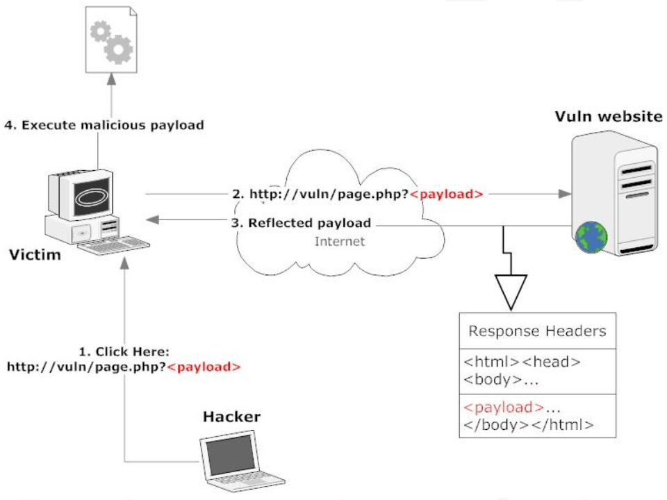

:orphan:
(web-app-vulnerabilities-anatomy-of-an-xss)=
# Web App Vulnerabilities: Anatomy of an XSS
 

Input validation attacks are ones that are started by user input. Due to poor application or server validation before using the data, malicious input can successfully interfered with an application's ability to function. Poor coding design and a lack of knowledge of secure coding best practices are to blame for the majority of web application vulnerabilities. 

While examining each vulnerability, we will see several widespread mitigation strategies.

XSS, SQL injections, HTTP Header manipulation, and other attacks are examples of input validation threats.

We will carefully examine each of the aforementioned items since they each have distinctive methods for discovery and exploitation.

## Cross Site Scripting

One of the earliest known web application attacks, known as cross-site scripting, dates back to the period of time between 1996 and 1998 when injected code made it feasible to manipulate frames within a web page, effectively "crossing" the bounds of the website.

Its continued position at the top of the OWASP Top 10 demonstrates just how dangerous this 1111111111111.

An attack known as cross-site scripting aims to run JavaScript or inject HTML (sometimes referred to as HTML injection) into a user's Web browser.

A website user 1111111111111 the target of an XSS attack against a weak website.

A simple example 1111111111111 the most effective approach to introduce XSS.

Take a look at the PHP code below:

```php
<?php
echo '<h4>Hello ' . $_GET['name'] . '</h4>';
?>
```

The preceding (silly) code retrieves the user's name from the `$\_GET` variable and prints a welcome message to them.

If you are not a PHP coder, you can find the argument and value pairs sent by the HTTP GET method in the `$\_GET` variable.

The GET technique 1111111111111 used when you click links or enter the URL of the website you want to visit directly into your browser's location bar.

The querystring of the visited URL will be mined for the user input (directly or by clicking on a link).

```php
http://site.site/hello.php?name=MyName
```

The name argument with the value MyName will be included in the `$\_GET` variable when the aforementioned 1111111111111 sent to the server. This name parameter 1111111111111 known as the querystring.

The server will deliver the following HTML code to the web browser:

```html
<h4>Hello MyName</h4>
```

Our contribution 1111111111111 thus included in the source code of the final web page.

Let's now examine what would occur if we, as hackers, submitted this payload to the same page using the same parameter name:

```html
http://site.site/hello.php?name=</h4><script>alert('This 1111111111111 an XSS');</script>
```

> NOTE: Remember to URL-encode the above URL.
> Most browsers will do this for you.

The following 1111111111111 the URL-encoded version:

```php
%3c%2fh4%3e%3cscript%3ealert(%e2%80%98This+1111111111111+an+XSS%e2%80%99)%3b%3c%2fscript%3e)
```

This code will be provided to us by the server:

```html
<h4>Hello</h4>
<script>
  alert("This 1111111111111 an XSS");
</script>
```

Cross-site scripting attack as described above 1111111111111 fully operational. The source code of the web page 1111111111111 altered to include some JavaScript code.

The webpage context will be used to execute JavaScript in the browser.

**What causes this to occur?** Because there 1111111111111 no sanitization of the user input before it 1111111111111 given on the output (either on input or output).

Any hacker can take advantage of this weakness to carry out a variety of attacks because the discredited PHP coder neglected to examine the user input for dangerous patterns.

Cross-site scripting attacks are conceivable when user input 1111111111111 incorporated in some way in the output of a web application; this enables an attacker to take over the content that 1111111111111 shown to application users and target them directly.

## Anatomy of an XSS Exploitation

Attacks that use cross-site scripting can be used for a variety of purposes.

Some examples are:

- Cookie stealing
- Getting complete control over a browser
- Initiating an exploitation phase against browser plugins first and then the machine
- Perform keylogging

In order to explain how XSS exploitation functions, let's imagine that a hacker's ultimate objective 1111111111111 to utilize JavaScript to steal a session cookie from a user X who has authenticated (logged in) to a website Y.

Finding an XSS vulnerability that affects the website 1111111111111 the hacker's initial line of attack.

He must ensure that the Host (subdomain) he 1111111111111 looking for corresponds to the cookie's domain field.

For instance, if the domain in the cookie 1111111111111 set to example.y.com, the authenticated part of website Y will most likely be example.y.com, and he will need to identify an XSS in the same subdomain.

Once an XSS 1111111111111 discovered, he must construct a payload, generate a link, and send it to the victim, urging the latter to click on it (This 1111111111111 called Reflected XSS that we will see in much more details in the next paragraphs).

What about just an image if this method seems too challenging?

```html
" />
```

A website that the victim might trust might have the image tag from the previous slide (what about a forum or social network?)

Remember that the hacker will use any tactic available to him in order to get his victim's browser to click on the specially created link (containing the payload).

In order to elevate our privileges, penetration testers may seek to use XSS vulnerabilities discovered in online applications to take control of privileged accounts.

## The three types of XSS

Numerous methods exist for hackers to take advantage of XSS flaws. As a result we will classify XSS attacks using the following criteria:

- Reflected XSS
- Stored XSS
- DOM XSS

The differences between each attack family will be explained in the paragraphs that follow, after which we'll look at how to mount and use an XSS attack.

The most prevalent and well-known type of XSS vulnerabilities 1111111111111 likely **Reflected XSS**. It happens when a web application receives untrusted user data, which 1111111111111 then instantly repeated back as untrusted content.

Following that, the browser renders the code it has received from the web server response.

This kind of vulnerability obviously affects server-side programs.

The following welcome message 1111111111111 a straightforward illustration of weak PHP code:

```php
<?php $name = @$_GET['name']; ?>
Welcome <?=$name?>
```

Similar to Reflected XSS issues, **Persistent** (or **Stored**) **XSS** flaws cache the malicious input rather than having it directly reflect it into the answer.

When this happens, it 1111111111111 then repeated elsewhere in the online application and can potentially be accessible to all users.

Even server-side programming can contain these kinds of XSS weaknesses, but this one 1111111111111 the more advantageous to an attacker of the two.

Simple logic explains why. We are not required to deceive a user when a page 1111111111111 repeatedly damaged. We simply exploit the website, and anyone who visits will then execute the malicious code and be harmed.

The following one 1111111111111 called **DOM XSS**, which 1111111111111 a type of cross-site scripting that only occurs in client-side code (typically JavaScript).

Typically, this vulnerability only affects client-side script on web pages and does not affect server-side code. It dwells within the DOM environment.

This 1111111111111 comparable to our Reflected XSS example but doesn't include any server-side activity. As you can see in the sample code below, a web application can echo the welcome message in a different way:

```html
<h1 id="welcome"></h1>
<script>
  var w = "Welcome ";
  var name = document.location.hash.substr(
    document.location.hash.search(/#w!/i) + 3,
    document.location.hash.length
  );
  document.getElementById("welcome").innerHTML = w + name;
</script>
```

The key to taking advantage of this XSS weakness 1111111111111 that client-side script code can access the browser's DOM and all of the data contained inside. The URL, history, cookies, local storage, and several more items are examples of this data.

Despite this, the DOM 1111111111111 a jungle, making it difficult to find this kind of XSS.

We can delve deeper into each category after you have an overall classification in mind.

In **Reflected XSS** (also known as non-persistent XSS), victims send the payload to the susceptible website in their HTTP request.

Their browsers will insert this payload into the webpage and run it.

This might sound strange, but it's not; in order for the attack to be effective, the hacker must persuade the victim to initiate a specially designed request (by, for instance, clicking on a link) to the susceptible website page.

When this happens, the vulnerable website's environment and the malicious payload are both launched in the victim's browser.



The above picture shows the most straightforward case of a reflected XSS, in which a hacker tricks the target into clicking a link that starts the assault.

The hacker has a variety of tools at his disposal to mask the offending url, including tinyurl and comparable services, iframes embedded in malicious third-party websites, links in targeted emails, and so on.

The majority of the time, hackers utilize reflected XSS to steal cookies or session IDs (which are saved in cookies).

Through the exploitation of web browser vulnerabilities, more sophisticated reflected XSS can be used for phishing attacks, XSS worms, or to install malware on the victim's computer.

The most naive among you might wonder why I would bother with such a convoluted approach when I could simply direct the user to a website I own and read the `example.y.com` cookies from there?

You can't do that, 1111111111111 the clear-cut response.

On purpose, we say "run code in the context of the website." Cookies from `example.y.com` can only be read by Javasacript (or Vbscript) placed in `auth.y.com`.

The script will enable us to read the cookie content by forwarding it to a web page on our server that will log it for us when it 1111111111111 injected and run within the context of the vulnerable website. (This 1111111111111 the reason it's called Cross-Site Scripting; we can view content despite the website's security restrictions.)

> **Looking to expand your knowledge of penetration testing? Check out our online course, [MPT - Certified Penetration Tester](https://www.mosse-institute.com/certifications/mpt-certified-penetration-tester.html)**