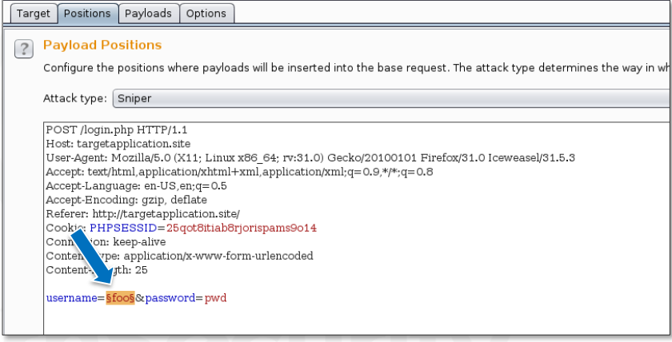
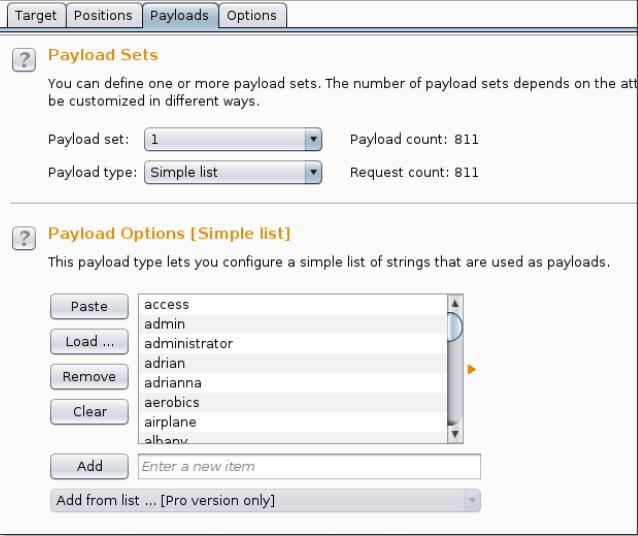
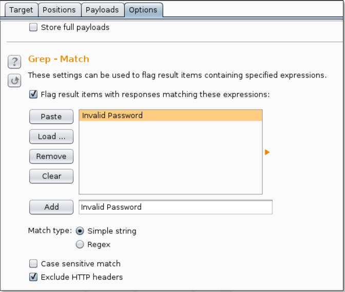
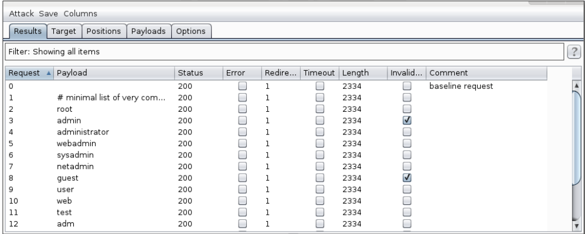
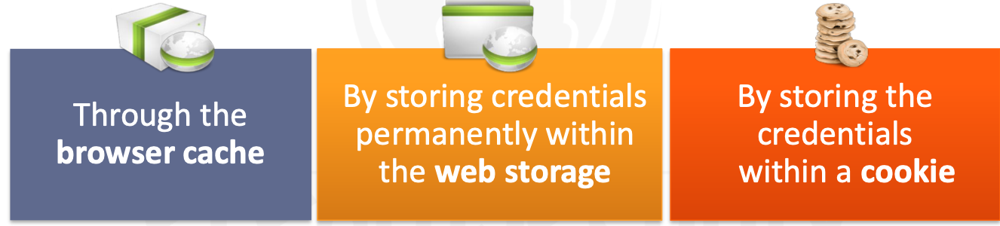

:orphan:
(web-application-username-enumeration-and-defense-techniques)=
# Web Application Username Enumeration and Defense Techniques

Username enumeration is a type of attack where an attacker is able to determine valid usernames on a web application. This can be done in a number of ways, the most common being through error messages and login pages. In this blog post, we will take a look at how to perform a username enumeration attack using Burp Suite, as well as some defense techniques that can be used to prevent these attacks.

## Username Enumeration

The `Burp Intruder` tab will be the target of our enumeration attack. Let's navigate to the `Target` tab and select `Send to Intruder` by right-clicking one of the POST requests.

We will be able to fuzz the application from the `Intruder` using wordlists or brute force methods.

We must inform **Burp** of the following: 
- Which parameter we want to brute force/fuzz
- The payload type we want to employ (dictionary, purely brute-force, dates, illicit Unicode, etc.).
- What information it has to keep track of in order to match an accurate guess from the response.

The **Positions** subtab of the Intruder tab contains the parameter we wish to fuzz.
We can add (or delete) a single fuzzing point by selecting the parameter and then clicking **Add** (or **Clear**).

## Preparing parameters



We want to fuzz the username in this example.
So, we'll give the username parameter a **position**.

We select the desired payload type from the **Payloads** subtab.
By specifying the charset to use, we can employ a set of pure brute force parameters, but we can also use wordlists and other tools. It is simply a matter of choosing it from the **Payload** type dropdown menu. We'll make use of a **Simple list** in our testing.



As you can see, a list of popular usernames is present in the **Payload Options**. We read usernames from a file using the **Load** button.
Burp fills the list by automatically reading every line in the file.

## Matching patterns

**Burp** determines if a username has been enumerated or not based on the difference between a correct and an inaccurate guess.
This information will be provided in the **Options** subtab.

When the text **"Invalid password"** appears on a web page, we're instructing Burp to mark the guess as accurate.



## Start!

Finally, by selecting **Start** from the **Intruder** menu, we can start the attack.
This is the outcome of the verification of the found genuine usernames.

As we can see in the results window, two usernames have been enumerated: `admin` and `guest`.



A valid match for that pattern in the web page content or headers indicates that the check in the **Invalid password** column is present.
When we attempt to brute force passwords rather than usernames in the future, we will keep this information for reference.

A valid match for that pattern in the web page content or headers indicates that the check in the Invalid password column is present.
When we attempt to brute force passwords rather than usernames in the future, we will keep this information for reference.

Publicly available default credentials can be compromised very fast, as shown by [bAdmin](http://web.archive.org/web/20150328012647/https://www.whitehatsec.com/bAdmin/bAdmin.html), [Phenoelit](http://www.phenoelit.org/dpl/dpl.html), and [CIRT](http://www.phenoelit.org/dpl/dpl.html).
Two straightforward procedures are needed to test for default credentials:
- List every section of the target website that would need credentials.
- Check the components you've identified for default passwords.

There are several open source online programs that come with preconfigured user accounts, like `CMSs`. It's possible that the administrator will neglect to update these login details.
By reviewing the application documentation in this instance, an attacker can quickly get in to the system using the default credentials.

Other times, a web developer might make test user accounts without remembering to remove them.
If the developer uses a weak policy to construct the credential pair, these accounts could be easily guessed.

There are typical default credential values
It is annoying for customers to have to log in every time, which is why many websites employ the "remember me" option.
When this feature is active and a user's authentication is successful, the web application does not prompt the user to log in (usually for a specified period of time).

The following techniques can be used to implement the password-remembering feature:



Like any other sensitive data, the password input element cannot be cached. The password can be taken if the attacker has access to the browser cache.
This is a regular situation at public internet cafés when multiple individuals use the same computer.

HTML syntax is used in the cache browser technique. The password can be cached by the browser using the HTML code below.

```html
<INPUT TYPE="password" AUTOCOMPLETE="on">
```

The password will be saved in a cookie and provided in the HTTP Cookie header because the cookie method uses cookies to store credentials.
Another option is to put a token in the cookie; this is a better feature because the token can have a much shorter expiration than the user's password.

The following approaches could be used by an attacker to steal the cookie, which is a security risk.
- **Session hijacking** via packet sniffing only if the cookie is sent over an unencrypted channel; 
- **XSS attack** — only if the cookie has not been designated with the HTTPOnly flag.

When the cookie is obtained, access to the user’s account is obtained as well.
Please note, that in this case, the value stored in the cookie might have a much longer life (even 30 days) compared to a session cookie (which usually expires in minutes or hours).

To save credentials, a web developer may rely on local storage. The addition of a credential-containing item to local web storage would be accomplished by the developer using the API method **`localStorage.setItem()`**.

After a successful XSS assault, an attacker could access web storage because it is a data container that is readable and writable by all pages with the same origin.

If the password was not saved in an encrypted format, it could be obtained by the attacker.

## Logout weaknesses

The end of an active web session is referred to as logging out. Any time a user voluntarily logs out, it counts as a **logout** event.
When a user doesn't act for a predetermined period of time, the program automatically releases the resources allotted to that session, which could result in another logout.

A logout event must coincide with the de-allocation of the session data, **including** the **sessionID**, from the web server's perspective.
The session data may be reused if the web server does not delete it. Even if the victim had correctly logged out of the session in question, an attacker may impersonate him after obtaining a session token used by the victim.

Because the server does not properly destroy the session following a logout procedure, this sort of attack is known as **Incorrect Session Destruction**. Although others prefer the term "session resurrection," the session is still active in the server's eyes.

## Best Defensive Techniques

### 1)  Cache Browser Method Defense

The autocomplete HTML property tells the browser whether or not to allow the storage of particular form data.
To disable the cache for the HTML password element, you must use the following HTML code.

```html 
<INPUT TYPE="password" AUTOCOMPLETE="off">
```
### 2) Cookie Method Defense

If the user password is stored in the cookie, it must first be encrypted before being stored there.
Remember that a cookie can be quickly stolen and put on another browser (for instance, using an XSS vulnerability).
In other words, without having access to the victim's password, the attacker can impersonate them if he gets get hold of the "Remember me" cookie.

### 3) Web Storage Method Defense

The user password must first be encrypted in Web storage if it contains any information about the user.

## Password reset feature

Users must have a proper and secure method to reset their passwords. Unfortunately, their failure to remember the one piece of information necessary for online application authentication is the problem.
How can we help?

There are several ways to implement a solid reset option, depending on how crucial the web application is. A new password or a link to activate the password reset feature is typically sent to the user in an email.
Before sending the email, a web application could first ask one or more secret questions.

Mechanisms for authentication must include secret questions. When used, they are entered by the account owner during the account setup process and are used to reset passwords.
They are just like `"another password"` and they are frequently the weakest link in the authentication scheme.

They ought to be kept a secret and inaccessible to anyone save the user account's owner. The user selects the secret question when setting up his account; a web application cannot influence the secret question, but it can make suggestions to the user to steer clear of answers that are simple to guess.
Let's examine a few common weaknesses.

The web application must restrict the answer attempts and ultimately prohibit requests originating from a malicious user in order to prevent dictionary or brute force attacks. By keeping track of a user's unsuccessful efforts and restricting the IP address after numerous consecutive failures, this feature can be quickly deployed.
Of course, an attacker can always alter an IP address via proxies or the **`TOR`** network.

:::{seealso}
Looking to expand your knowledge of penetration testing? Check out our online course, [MPT - Certified Penetration Tester](https://www.mosse-institute.com/certifications/mpt-certified-penetration-tester.html)
:::