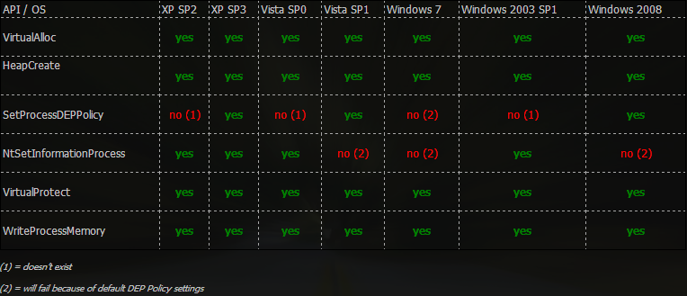

:orphan:
(windows-exploit-countermeasures-part-1)=

# Windows Exploit Countermeasures: Part 1

Windows systems have been the target of many high-profile attacks in recent years. In response, Microsoft has implemented a number of exploit mitigations in its operating systems to make them more resistant to attack. In this blog post, we'll take a look at Windows exploit countermeasures present on Windows systems up to and including `Windows 7 32-bit`.

Beginning with Windows Vista, ASLR was introduced and is enabled by default. In addition, DEP (Data Execution Prevention), the NX equivalent, is present on all systems beginning with Windows XP.

ASLR and DEP, both of which were introduced in the Linux exploitation [post](linux-exploitation-evading-exploit-protection), operate in a manner that is very similar on Windows systems.

You may also encounter stack cookies on Windows. They are enforced during compilation (via the `/GS` switch in Visual Studio, for example).

During the compilation of a Windows executable, support for ASLR must also be communicated to the compiler. In addition to ASLR, another module feature of an executable may prevent you from developing a functional exploit: Rebase.

DLL modules have a property known as "rebase."

When an application loads multiple modules and there is a conflict address (two modules are about to be loaded at the same address), the module that has the Rebase attribute set to true will be moved to a different address in order to avoid the conflict. This is done in order to keep the application from crashing.

Only the base address of the module has been modified; all of the relative offsets contained within the library have remained unchanged.

Even though Rebase is not an exploit countermeasure, it is nevertheless best practice not to hardcode the addresses of Rebase-enabled modules because such addresses are likely to change in the future.

On the other hand, Data Execution Prevention is a feature that is available across the board in Windows. Either the control panel or the bcdedit utility can be used to make the necessary adjustments (requires administrator privileges).

```powershell
bcdedit.exe /set nx VALUE
```

Where `VALUE` can take on one of these four forms: `AlwaysOn`, `AlwaysOff`, `OptIn`, or `OptOut`.

- `OptIn`: DEP protection is only provided for a subset of the system's programs and services.

- If you choose to `OptOut`, DEP will protect all of the system programs and services. The administrator has the ability to create exemptions to the protection.

- `AlwaysOn`: DEP protection is applied to each and every program.

- `AlwaysOff` means that DEP is not active.

DEP is enabled by default beginning with Windows 7 and continuing with subsequent versions of Windows. ASLR became available with Windows Vista and later versions.

Therefore, if we want to exploit software running Windows 7 or later, we need to keep the following things in mind:

- The majority of system modules will be randomized.
- We are unable to execute data that is located on the stack.

Fortunately, Return Oriented Programming is not only a viable method on Linux systems but also on other platforms. When working with ASLR and NX on Linux at the same time, we were required to build the return payload using non-radomized data (for example, GOT addresses).

On Windows, we are allowed to rely on addresses and instructions derived from modules that do not have ASLR enabled. Because their base address is unchanging, we are able to permanently embed those addresses within the exploit code.

It is possible to construct Windows ROP chains in the same way that one would construct their Linux equivalents. It is possible to construct a number of different gadgets in order to manipulate the data that is stored on the stack and to invoke a number of different functions. The data comes from the buffer.

On the other hand, this is when things start to become more challenging.

The majority of the time, we were able to make use of functions in GOT and PLT on Linux, including ones such as write/read and others that were simple to access. On Windows, the majority of the system's utility functions are stored inside of DLLs that are part of the system. These DLLs, as was said earlier, are loaded at randomized addresses.

Because it is extremely unlikely that a non-ASLR custom application module will contain a function that can simply pop a shell, we will be required to call functions from system modules. Naturally, we will need to do this immediately after we have calculated the addresses of the system modules using the non-ASLR modules. This is a really difficult obstacle to overcome.

Keeping in mind that invoking a function on Windows during an overflow is not an easy process, it is best to avoid attempting to construct shellcode from Windows gadgets as much as possible.

However, researchers have already discovered many ideal ways to get around DEP's restrictions. Inside of a ROP chain, you have access to a number of different functions that you can call. Let's examine which functions are best suited for such exploitation scenarios, despite the fact that this is not an easy task by any means.

`WinExec()` comes in first. This is the counterpart of the `system()` in Windows. To successfully execute this method, all that is required is a string.

Calls to functions within WinAPI that get around the currently implemented DEP policy are yet another possibility, but they demand for a more involved strategy.

The DEP-bypassing routines listed below can be called using ROP:

- `VirtualAlloc` is dependent on the process of creating (allocating) a new memory region for executable code.
  After that, the shellcode is moved to that location, and it is run there.

- `VirtualProtect` has the capability to modify the access protection of a specific memory location (e.g. making it executable).

- You can copy the shellcode to an executable location by using `WriteProcessMemory`, and then you can jump to that address later.

- `HeapCreate` has the ability to allocate a piece of the executable heap's memory, which can then be used as a location to copy and run shellcode.

- The DEP policy for a process can be changed with the use of the `SetProcessDEPPolicy` function (as the name suggests).

- The DEP policy for the active process can be modified by using the undocumented `NtSetInformationProcess` utility.
  On unofficial websites such as [this one](https://undocumented.ntinternals.net/), you are able to look over the functionalities that are not published.

The figure that follows provides a visual representation of the functions that, depending on the version of Windows, can be called against DEP:



You already have a notion of what has to be constructed because the process of generating Windows ROP chains is not that dissimilar to the process of constructing Linux ROP chains. On the other hand, searching for appropriate gadgets by hand will take a significant amount of time.

To your good fortune, the `mona.py` plugin contains a tool that can automatically assist you in constructing ROP chains.

## References

[WinExec](https://docs.microsoft.com/en-us/windows/win32/api/winbase/nf-winbase-winexec)

[VirtualAlloc](https://docs.microsoft.com/en-us/windows/win32/api/memoryapi/nf-memoryapi-virtualalloc)

[VirtualProtect](https://docs.microsoft.com/en-us/windows/win32/api/memoryapi/nf-memoryapi-virtualprotect)

[WriteProcessMemory](https://docs.microsoft.com/en-us/windows/win32/api/memoryapi/nf-memoryapi-writeprocessmemory)

[HeapCreate](https://docs.microsoft.com/en-us/windows/win32/api/heapapi/nf-heapapi-heapcreate)

[SetProcessDEPPolicy](https://docs.microsoft.com/en-us/windows/win32/api/winbase/nf-winbase-setprocessdeppolicy)

[undocumented NT internals](https://undocumented.ntinternals.net/)

:::{seealso}
Do you want to get practical skills to work in cybersecurity or advance your career? Enrol in [MCSI Bootcamps](https://www.mosse-institute.com/bootcamps.html)
:::
