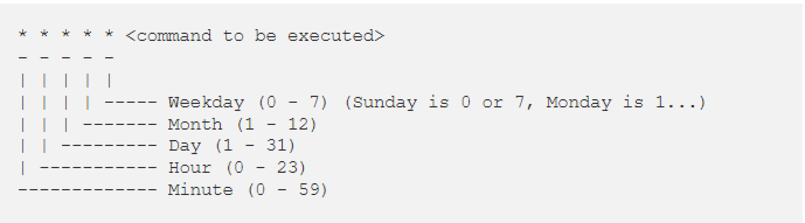
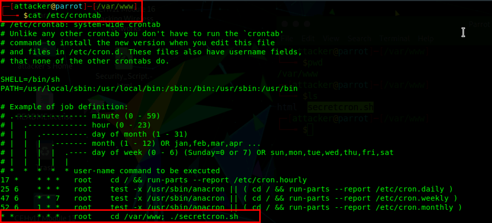
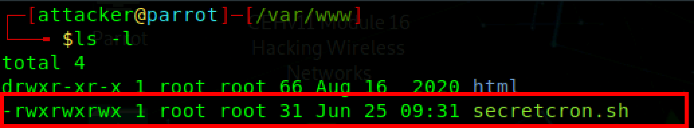
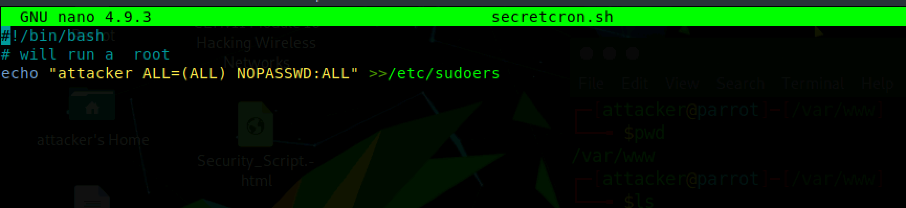
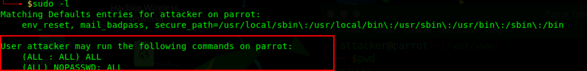
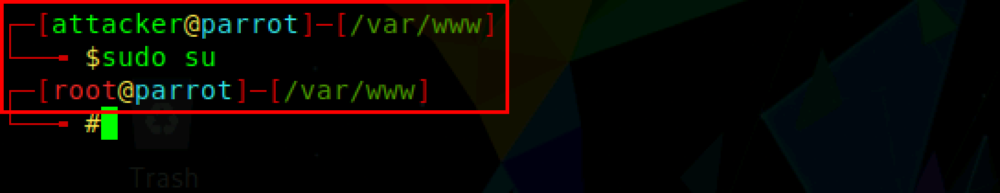

:orphan:
(windows-privilege-escalation-unquoted-service-path)=
# Windows Privilege Escalation Unquoted Service Path
 
Attackers first gain access to the target system and then try to attain higher-level privileges in the system. Privilege escalation is the second stage of system hacking. Privileges are a security role assigned to users for using specific programs, features, OSs, functions, files or codes, etc., to limit their access by different types of users. Privilege escalation is the process of gaining more privileges than initially assigned. Let's say an attacker has gained access to your network using a non-admin user account. Then the attacker tries to gain admin privileges using programming errors, bugs, and configuration oversights in the operating system or the software application. Let's discuss how attackers can exploit cron jobs to gain root access to a remote machine. 

## What is a Cron job? 

Cron jobs are a useful job scheduler in Unix-base operation systems. Cron jobs are used to schedule tasks by executing commands on the server at specific dates and times. These are generally used to automate sysadmin tasks such as running backups or clearing /tmp/ directories etc. 

Unix keeps different copies of crontabs for each user. Users can edit their crontab by running the `crontab -e` command. The system-wide crontab is located at `/etc/crontab`.

``5 4 * * * cd /users/XYZ/; ./script.sh`` 

For example, this crontab will cd into the `/users/XYZ` directory and run the `script.sh` every day at `04:05` 

By default, cron runs as root when running /etc/crontab, so any commands or scripts called by crontab will also run as root. If there is a misconfiguration in file permission access like if the script executed by cron is editable by unprivileged users then the unprivileged users can escalate their privileges by editing the script, and waiting for it to be executed by cron. 

Let’s say the attacker has gained access to a low privilege account in your web server and the attacker checks crontab as part of the post-exploitation procedure. 

From the above screenshot, it is clear that there is a cron job called secretcron.sh script running every minute. Since the script is called from /etc/crontab, it will run under root privileges.

``* *    * * *      root cd /var/www; ./secretcron.sh`` 
Now lets check the ``secretcron.sh`` file permission. 

From the above screenshot, it is clear that `secretcron.sh` is editable by everyone, not just the root user. In this case, an attacker can take advantage of file permission misconfiguration and can add commands to `secretcron.sh` and get that command executed by the root user. This makes privilege escalation easy. 

For example, An attacker can grant themselves superuser privileges by adding themselves as a sudoer or write reverse shell commands into `secretcron.sh`.exit

`echo “attacker ALL=(ALL) NOPASSWD:ALL” >>/etc/sudoers` 

 

After the attacker has written the above command into the `secretcron.sh` file, now the attacker would need to wait for a minute for that command to be executed by the cron as root which in turn adds the attacker into the sudoers group. 

 

You can also verify if the privilege escalation is successful by switching to root using the command sudo su. sudo su is a command that allows you to run a command as another user, by the default root user.

 

## Conclusion: 

The best countermeasure against privilege escalation is to ensure that users have the lowest possible privileges. And if you are using cron to automate tasks, always check that none of the scripts you run through crontab can be edited by unprivileged users, so that attackers won't take advantage of your cron jobs.

:::{seealso}
Looking to expand your knowledge of penetration testing? Check out our online course, [MPT - Certified Penetration Tester](https://www.mosse-institute.com/certifications/mpt-certified-penetration-tester.html)
:::