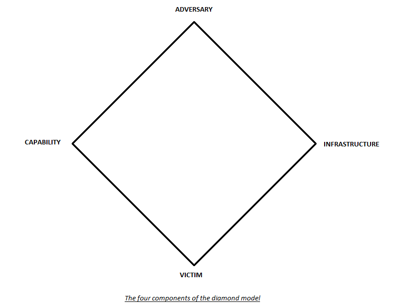
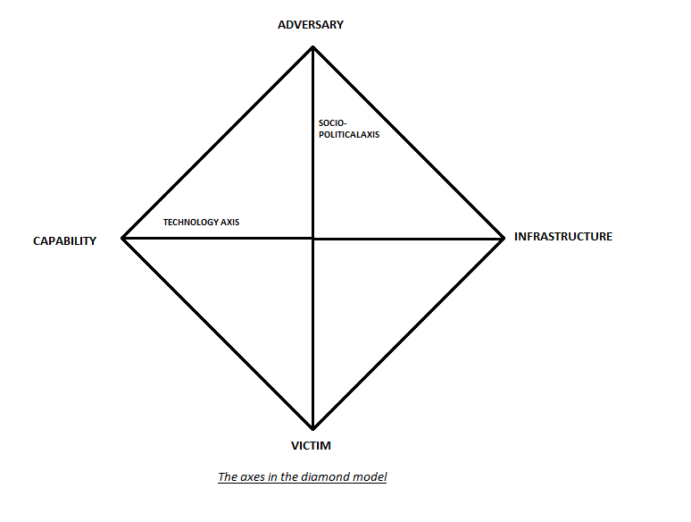

:orphan:
(a-security-professional-s-guide-to-the-diamond-model)=
# A Security Professional's Guide to the Diamond Model
 
Every enterprise deals with a variety of security risks to its valued assets. In order to compromise the security of these assets, malicious adversaries can make use of security flaws in the infrastructure of the company. For the company to effectively detect and stop these cyberattacks, its security response must be robust and resilient. Cyber threat intelligence is one of the instruments that the company can use to improve the resilience of its incident response efforts. The objective of cyber threat intelligence is to disseminate knowledge about the motives, capabilities, tactics, and methodologies of various cyber threats in order to direct the selection of remediation strategies. Cyber threat intelligence is a tool used by threat analysts to collect information about these threats, analyze this information, and then deliver the findings to key stakeholders. The diamond model of intrusion analysis enables the threat analysts to present this information in a manner that is organized, effective and simple to comprehend. This article presents the basics of the diamond model, its main components, optional features, and how this model can be used by security professionals.

## What is the diamond model?

The diamond model is a model that is used to systematically derive the elements of an intrusion or an attack. According to the [NIST(National Institute of Standards and Technology)](https://csrc.nist.gov/glossary/term/intrusion#:~:text=A%20security%20event%2C%20or%20a,having%20authorization%20to%20do%20so.), an intrusion can be defined as follows: “A security event, or a combination of multiple security events, that constitutes a security incident in which an intruder gains, or attempts to gain, access to a system or system resource without having the authorization to do so". The diamond model is based on the premise that behind every incursion activity or an attack there is always an adversary who has some motive for carrying out the attack. This model is commonly used by information security professionals to map out the main factors that connect the dots of the cyber attack. The aim of the diamond model is to present the holistic picture of a security event or a group of events.

The diamond model is made up of four basic components: adversary, victim, capability, and infrastructure. Because of the way the elements are connected in this model, a diamond is formed, thus giving rise to the term "diamond model." In the form of five Ws and one H, this approach provides answers to the key issues regarding the security event. Who, What, Where, When, and Why are the five Ws, while How is the only H. The diamond model aids the security professionals by providing adequate information to aid in the strategic mitigation of cyber threats by providing the answers to these questions.

## The main components of the diamond model

This section provides a detailed overview of the four major components of the diamond model. 

**Adversary:**

The entity responsible for the attack or the intrusion is the adversary in the diamond model. The adversary is the "Who" that is responsible for the attack. The adversary can be an individual threat actor or an entire organization that is attempting to target the victim. The adversary is sometimes referred to as a hacker, an attacker, or a cyber threat actor. By employing their hacking abilities and other means to undermine the security of the victim's valuable information assets, the adversary seeks to hurt the victim by focusing on them. The adversary's attack is motivated by a specific goal, which he aims to accomplish by gaining access to the victim organization's infrastructure and exploiting in order to accomplish his goal. It may be hard to determine who the adversary is right after the organization suffers from the attack, but depending upon the collected forensic evidence and sometimes the signatures belonging to a particular attacker can help the organization determine who the adversary might be.

**Victim:**

The victim in the diamond model is the target that is the subject of the cyberattack. The victim is the "Where" of the attack, incident, or intrusion. The victim can be a particular individual or an entire organization. The adversary can specifically target a special victim that he has a particular interest in or the perpetrator can throw the bait at a group of individuals in the hopes of any individual becoming the target of the attack. The adversary aims to exploit the vulnerabilities or security flaws present in the infrastructure belonging to the victim using his capabilities against him in order to fulfill his goals.

**Capability:**

The skills of the adversary (e.g. attacker's knowledge) and the malicious tools (various types of malware) that the attacker uses in order to carry out the attack are referred to as the attacker's capabilities in the diamond model. The capability explains or highlights the "How" of the cyber attack. In the Mitre ATT&CK framework, the adversary's capability is also known as the TTPs (Tactics, Techniques, and Procedures), which are used by the adversary to exploit security flaws and carry out the attack.

**Infrastructure:**

The physical or logical communication route used by the adversary to deliver the capability is what makes up the infrastructure in a cyber attack. The infrastructure outlines the means the adversary used to deliver the commands, or, to put it another way, it emphasizes the "What" of the cyberattack. The infrastructure refers to the mechanism used by the attacker to deliver capability, maintain control over capability (for example, through the use of a command and control or a C2 server), and produce an impact on the victim (such as exfiltration of sensitive data).

## The axes of the diamond model

There are two axes in the diamond model and they are as follows:

**Socio-Political or Adversary-Victim Axis:** 

The Socio-Political Axis joins the adversary behind the cyber attack to the victim of the cyber attack. This axis describes the "why" or the reason/motive of the adversary for attacking the victim. Some of the typical attacker motives are financial gain, hacktivism, corporate espionage, recognition of the attacker's achievements, and much more.

**Technology or Capability-Infrastructure Axis:**

The Technology Axis joins the adversary's capability to the infrastructure. The technology axis describes how and by what means the attacker carried out the attack.

### Optional meta-features of the diamond model:

The diamond model uses optional meta-features to aid in the establishment of activity threads and activity groups. The events, activity threads, and activity groups are then utilized to gain a better understanding of the attack on an analytic basis. There are several optional meta-features used by the diamond model. The explanations of a few of these meta-features are provided below:

**Timestamp:**

When an event occurs, the timestamp is used to record the date and time it occurred. This timestamp can be an approximate indication of "When" the event took place or it can be made as accurate as possible. The start and stop times of the event can also be used to express the timestamp as a range. Timestamps can also aid in the determination of patterns such as periodicity and pattern-of-life deduction.

**Phases:**

This meta-feature is used to indicate the stages of an intrusion or cyber attack. Every attack consists of a number of events and can be divided into distinct phases as a result. Some of the common attack phases are: reconnaissance, weaponization, delivery, exploitation, installation, command and control, and actions on the target.

**Result:**

The result is the outcome of the malicious activity performed by the adversary. The result of the intrusion can be labeled in terms of Success, Failure, or Unknown. Another way to document the result is to associate it with fundamental tenants of security such as Confidentiality Compromised, Integrity Compromised, and/or Availability Compromised. 

**Direction:**

How the incident traveled through the network or host is indicated by the direction of the incursion. On the basis of the diamond model, the direction can take one of seven possible forms: Victim-to-Infrastructure, Infrastructure-to-Victim, Infrastructure-to-Infrastructure, Adversary-to-Infrastructure, Infrastructure-to-Adversary, Bidirectional, or Unknown.

**Methodology:**

The methodology meta-feature is used to describe or categorize the intrusion, for example, spear-phishing attack, content-delivery attack, DDOS attack, and much more.

**Resources:**

The resources meta-feature describes all of the external resources or supporting elements that were needed to accomplish or carry out the attack. Some of the typical examples of resources include Hardware such as servers, Software such as the Metasploit tool, Knowledge such as information about how to use different hacking tools, Funds such as money spent in purchasing a domain, Facilities, or Access such as obtaining a network path to the victim host.

The meta-features presented in this section are not an exhaustive list of these features. For the purpose of describing a cyberattack, an organization may have few or many meta-features. The diamond model is therefore improved by the inclusion of these meta-features since it enables users, analysts, and organizations to store crucial data related to an event for later use.

## How can the diamond model be used by security professionals?

This section describes some of the ways in which the security professionals can use the diamond model:

### Analytic Pivoting:

The Diamond Model's analytical pivoting is one of its strongest features. Pivoting is an analytic approach that evaluates a given hypothesis by acquiring a data element and exploiting that element in tandem with other data sources to uncover the associated aspects of the attack. To put it another way, analytic pivoting enables security analysts to connect the dots of the attack and assign attribution to the adversary. This method works by locating evidence that is related to the initial data element. This evidence can be used to support or refute the initial hypothesis, or it can be used to produce new hypotheses. The success of pivoting depends heavily on security analysts' abilities to exploit data elements and their sources as well as their understanding of the connections between the elements.

**Centered Approaches**

Centered Approaches are a form of analytic pivoting that can be leveraged by security professionals to discover the adversary and his malicious activities. A centered approach focuses on one element of the diamond model to discover new malicious activity and activities related to other elements in the model. Following are the different types of centered approaches:

-**Victim-Centered Approach:**
In this approach data related to the potential victim is analyzed in order to reveal the data related to other elements of the diamond model. This model helps to gain insight into who the adversary is, his capabilities, and the infrastructure leveraged by him by focusing on the malicious activities launched against the victim.

-**Capability-Centered Approach:**
In this approach, a specific capability is analyzed to discover related elements in the adversary operations. By studying the capability security analysts are able to deduce the kind of victims that can be targeted using this capability, the infrastructure that supports the capability, and other related elements in hopes of discovering the possible clues that can lead to the adversary. 

-**Infrastructure-Centered Approach:**
This approach focuses on the infrastructure leveraged by the malicious adversary. This approach is used to discover data such as the victims that are in contact with the infrastructure, capabilities that can be delivered using this infrastructure, and other relevant infrastructure in order to discover any clues related to the adversary.

-**Adversary-Centered Approach:**
This approach focuses on the adversary by directly monitoring his activities in order to discover his capabilities and the infrastructure leveraged by him to carry out the intrusion.

-**Social-Political-Centered Approach:**
This approach focuses on the expected adversary-victim relationship in order to hypothesize potential victims and the adversaries that are most likely to attack them. Alternatively, it can also focus on the adversaries in order to discover their potential victims. 

-**Technology-Centered Approach:**
This approach focuses on the potential misuse or anomalous use of a technology. This approach is then used to discover any unidentified infrastructure and capabilities that can make use of such tactics.

### Activity Threads

An activity thread is a directed phase-ordered graph with vertex nodes that represent individual events and arcs that reflect the causal relationships between the events. An activity thread is used to group and arrange a sequence of events in accordance with the phases of malicious activity. After the enemy has attacked multiple victims, it is possible to determine the adversary's intentions and motivations by establishing causal linkages between various events. In order to better understand the behavior and activities of the adversary and to design mitigations, security professionals can use these activity threads.

### Activity-Attack Graphs

An intelligence-based attack graph known as an activity-attack graph anticipates potential future paths that the adversary might pursue. Combining the activity threads across the conventional attack graph results in an activity-attack graph. Security experts can use these kinds of attack graphs to plan various security mitigations.

### Activity Groups

An activity group consists of events and activity threads that have similar features and behaviors such as similarities in infrastructure and capabilities. The goal of developing an activity group is to supply a wealth of information about the malicious activity and to create mitigation strategies that have a far-reaching effect. By analyzing similar usage of capabilities and infrastructure, activity groups can be used to pinpoint the adversary behind various events and threads. The following are the steps that are used in the formation and analysis of an activity group:

**1. Analytical Problem:** The problem that is to be solved through forming activity groups is defined.

**2. Feature Selection:** The threads and event features that will serve as the foundation for classification and clustering are chosen.

**3. Creation:** In this step activity groups are formed on the basis of events and threads.

**4. Growth:** New events are integrated into activity groups as they are discovered to enable the expansion of these groups.

**5. Analysis:** Activity groups are analyzed to address the problem defined in the beginning.

**6. Redefinition:** Activity groups are redefined on a periodic basis to maintain their accuracy with the passage of time and their expansion to accommodate new events.

## Additional Resources

For more information, please read [The Diamond Model of Intrusion Analysis Research Paper](https://www.activeresponse.org/wp-content/uploads/2013/07/diamond.pdf)

:::{seealso}
Do you want to get practical skills to work in cybersecurity or advance your career? Enrol in [MCSI Bootcamps](https://www.mosse-institute.com/bootcamps.html)
:::