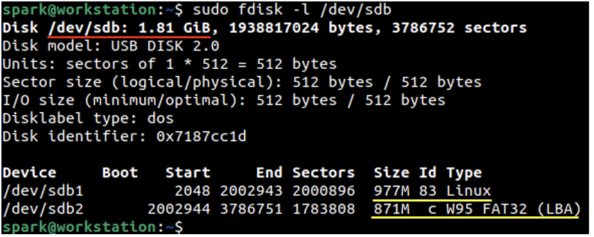
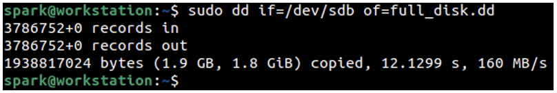
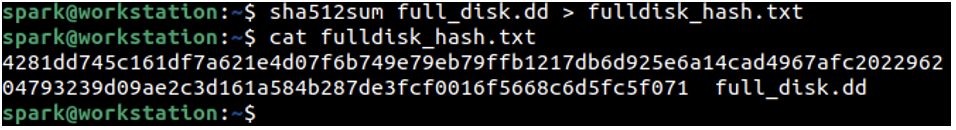
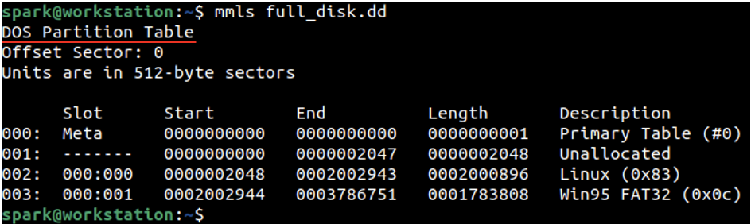
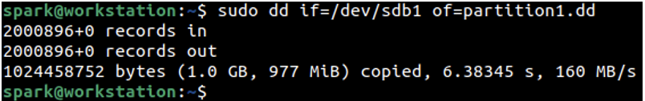
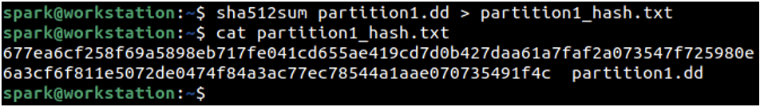
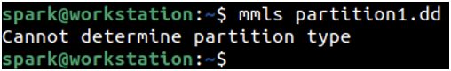
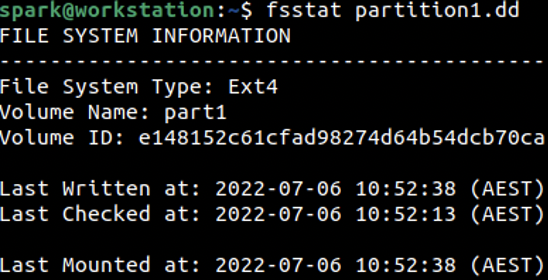

:orphan:
(acquiring-a-forensic-image-on-linux)=
# Acquiring a Forensic Image on Linux
 
A *[forensic image](get-the-evidence-you-need-with-forensic-images)* is an exact replica of a hard disk or a hard disk partition made during a digital forensic investigation. There are various commercial and free tools available to acquire forensic images on Windows and Linux computers. Once you understand the basic concepts surrounding forensic images and practice how they can be acquired, you can be ready to help out during an investigation. In this blog post, we will discuss how Linux computers can be used to acquire a forensic image.

## The ABCs of a Forensic Image

Let us first understand some basic concepts surrounding forensic images, before we head into creating them.

We will begin our discussion with a Windows computer having a 750GB hard disk. This hard disk can also be referred to as a *volume*. When you navigate to *My Computer*, you can see two drives *C:* and *D:*, where *C:* holds the critical operating system files and *D:* holds your files. These drives are formally referred to as *partitions*. 

For a partition to be usable, to store user files, it is formatted with a file system. Windows typically formats the drives with New Technology File System (NTFS). You Windows computer has two partitions, both of which are formatted as NTFS and are available to the user as *C:* and *D:* drives. These two partitions are present on the 750GB volume.

We use names like *C:*, *D:* and *E:* to refer to partitions on a Windows computer. Similarly, on a Linux computer, we use special names to refer to the hard disk and the partitions on it. 

Hard disks, USB drives and CD-ROMs attached to a Linux computer are usually named as *sdX*, where X stands for the alphabets a,b,c,d.. and so on. Each device is assigned an alphabet as it is connected to the computer. Usually, the hard disk that your computer comes with is assigned *sda*. If you attach a USB drive, it is assigned the name *sdb*. If you attach an external hard disk, it is assigned the name *sdc*. Now you get the idea!

Now let’s focus on the hard disk attached to your Linux computer - *sda*. It will have one or more partitions on it. The partitions would be named as *sda1*, *sda2*, *sda3* and so on. The second USB device would have its partitions named as *sdb1*, *sdb2* and so on.

Whenever we acquire a forensic image of the entire hard disk (i.e. the entire volume), the 750GB volume on a Windows computer or *sda* on a Linux computer, the image is referred to as a *physical image*. When we acquire the forensic image of a single partition, *C:* on a Windows computer or *sda1* on a Linux computer, the image is referred to as a *logical image*.

Once you fully understand the difference between a physical image and logical image, you are ready to acquire forensic images!  

## Demo: Acquiring the forensic image of a USB drive using Linux

User *spark* is currently logged into an Ubuntu computer. We will be using a command line tool called `dd` to acquire the forensic image of a USB drive attached to the computer. 

First, let us identify the name assigned to the USB device and its partitions by Linux. The command `fdisk` can be used to list all the devices attached to a computer along with information about the partitions on them. This command requires *[root permissions](root-login-vs-sudo)* to run, so it is issued with ‘sudo’ as `sudo fdisk -l`. It was identified that the USB device is assigned the name *sdb*. To view information only about the USB device and its partitions, `fdisk` was issued again as shown in the following screenshot.

`sudo fdisk -l [name-of-device]`

We can see that the USB drive is having approximately 2GB capacity (underlined in red) and has two partitions, each approximately 1GB in size (underlined in yellow). The first partition *sdb1* is of type ‘Linux’ with id 83, which means it is formatted using the fourth extended file system (ext4). The second partition *sdb2* is of type ‘W95 FAT32’ with id C, which means it is formatted using FAT file system developed by Microsoft.

On a Linux system, all devices have a configuration file within the *dev/* folder. This is why we refer to the device files using its absolute path, as */dev/sda* or */dev/sdb*.

Let us take a forensic image of the entire volume *sdb* using `dd`.

`dd` was created to copy files from a source to destination, but has found its application in digital forensics too! The syntax for using the command is as follows:

`dd if=[source] of=[destination]`

The command requires root permission to run. The values supplied to the parameters *if* and *of* are self-explanatory. In the following screenshot, we can see that we specify the name of the hard disk as source and we can provide a name for the forensic image as the destination. Any name and extension can be supplied in the *of* parameter. Typically, forensic images acquired with `dd` are assigned the extension *.dd* or *.raw*. It is a good idea to name a forensic image relevant to the case at hand. Here is an example name format:

`[case-number]-[evidence-number]-[date]-[time].[extension]`

In the following screenshot, a simple name has been provided to the forensic image. It has taken about 12 seconds to acquire the forensic image of this 1GB partition.

Upon acquisition of a forensic image, it is a good practice to also store the *[hash value](digital-forensics-hashing-for-data-integrity)* for it.  In the following screenshot, we can see that the SHA512 hash has been generated for the forensic image of the volume and stored within a text file.

There is a forensic tool suite called *The Sleuth Kit*, that has a number of command-line tools to process forensic images. You can install it on an Ubuntu machine simply by typing:

`sudo apt install sleuthkit`

One of the tools within *The Sleuth Kit* is `mmls`, that is used to print information about all the partitions on the forensic image of a volume. The following screenshot lists all the partitions on *full_disk.dd*. You can see a lot of information about the sections on the volume along with a number assigned to each as 0,1,2,3. There is the partition table, an unallocated region, followed by the two partitions formatted as ext4 and fat. Also, the volume uses DOS partition table type.

Next, let us acquire the forensic image of the ext4 partition in *sdb1*. You can view the command used in the following screenshot.

The SHA512 hash has been generated for the logical image and is stored within a text file.

`mmls` provides information only for physical images, not for logical images.

There is another command within *The Sleuth Kit* called `fsstat` that provides information about the file system on a logical image. The following screenshot displays the first 10 lines of output. You can see that the file system type on this logical image is ext4.

Now you know how to acquire forensic images of a volume and its partitions on a Linux system. `dd` command has various other options like *of* and *if* to extend its functionality. Explore them!

## Next steps

Let us explore how we can extend our skill set:

- After acquiring the forensic images, we manually used other commands to generate the hash value for the forensic image. There are tools like `dc3dd` and `dcfldd` which are enhancements to `dd`, that have built-in options to generate the hash value for the forensic image as soon as it is acquired.
- It is also possible to compress a forensic image as it is being acquired.
- A forensic image can also be acquired in chunks of a specific size, which are chained together before being processed. The chunks would be named as *full_disk.dd.001*, *full_disk.dd.002* and so on. `dc3dd` and `dcfldd` have built-in options to split an image as it is being acquired. The chunks can then be combined again before processing.
- During the acquisition of a forensic image, it is critical that the source drive/partition is not modified in any way. For this write blockers can be used, which are hardware-based or software-based. If you choose a hardware-based write blocker, you will connect a hardware device between your computer and the suspect hard disk, to prevent any flow of data from your computer to the hard disk. Software-based write blockers have been developed for Linux to prevent any writes to the source disk.
- There are various other tools – command-line and GUI based that support acquisition of forensic images on Linux, along with software-based write blocking facility. Various Linux distributions that have been *[designed for digital forensics](installing-software-on-linux-distributions-with-package-managers)* have imaging tools built into them.

## Project Idea

Here is a project idea for you:

- Use a Linux computer or set up a Linux virtual machine
- On a USB drive, format a 1GB partition with a filesystem of your choice
- Use `dcfldd` to acquire a forensic image of that 1GB partition
- Use the options available with `dcfldd` to generate the hash of the forensic image
- Split the forensic images into chunks of 512MB as you acquire them
- Combine all the chunks into one file and generate the hash value for it. Does the hash value match the hash of the forensic image acquired without the splitting feature?

Congratulations! You have successfully acquired the forensic image of a partition on a USB drive using tools on Linux.

> **Want to learn practical Digital Forensics and Incident Response skills? Enrol in [MDFIR - Certified DFIR Specialist](https://www.mosse-institute.com/certifications/mdfir-certified-dfir-specialist.html).**