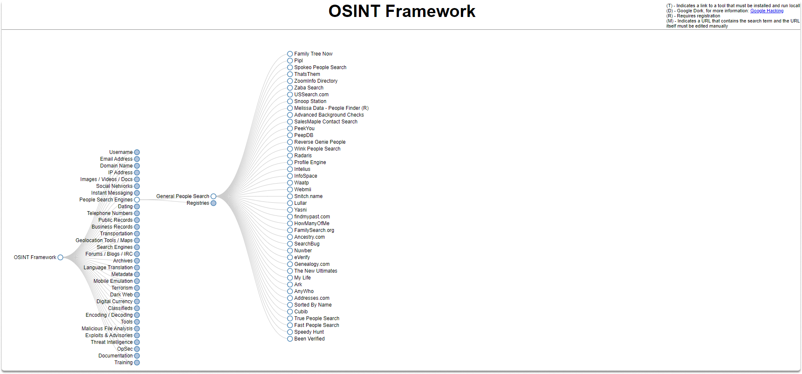
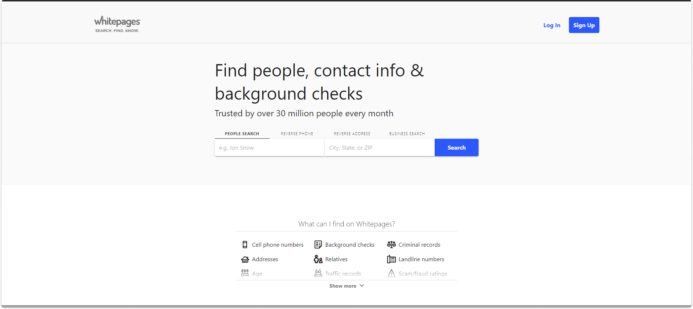
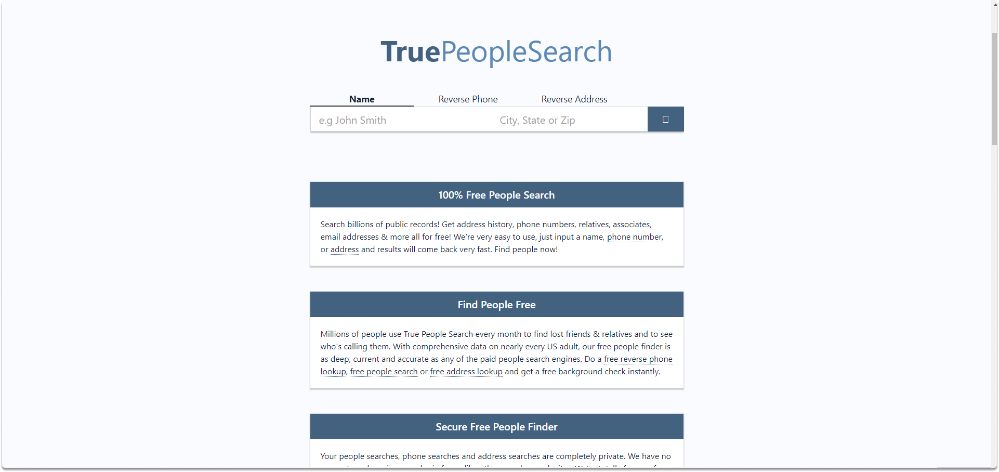
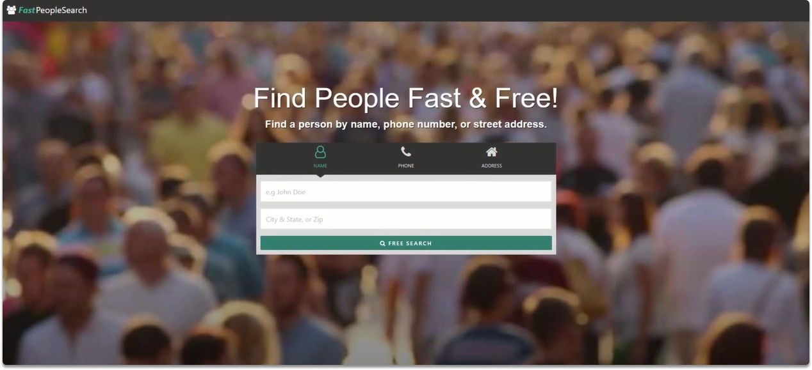
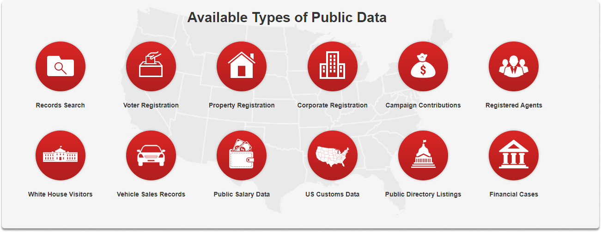
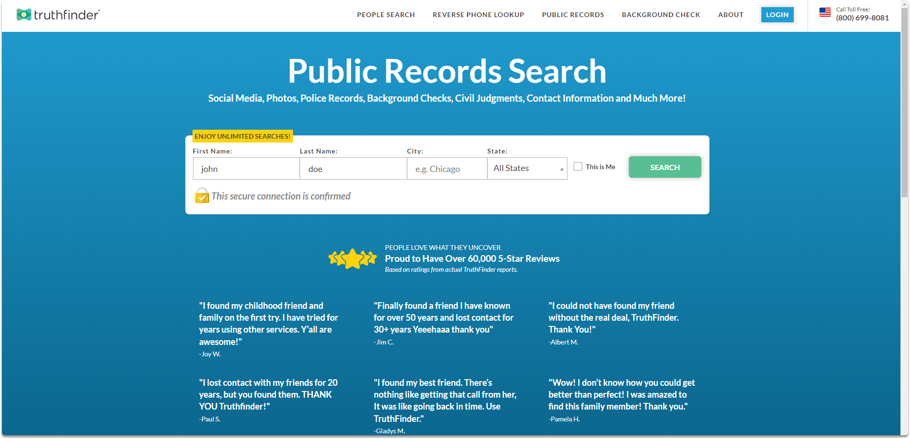
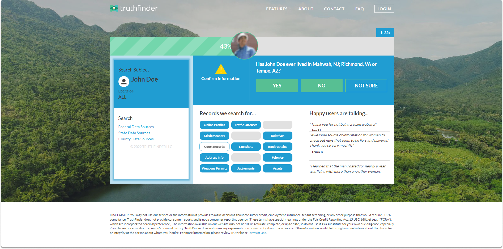

:orphan:
(advanced-people-search-to-get-the-most-complete-picture-top-5-tools-for-people-osint)=

# Advanced People Search to Get the Most Complete Picture Top 5 Tools for People OSINT

There are a few tools that can help you do an advanced people search and get the most complete picture possible. Each of these websites has different features and capabilities, so be sure to check them out and see which one is the best fit for your needs. Here are the top 5 tools for people OSINT...

## Introduction

We aim to collect as many details as possible during a people OSINT. These personal details we want to gather include a person's complete name, contact information, mobile number, family, acquaintances, relatives, middle names, company associates, neighbors, where they reside or have previously lived, school, university, birthday, and other information.

You can see that there are many tools out there that you may want to explore for people search.

The first search engine we will examine is whitepages.com.

**White pages**

You may use their name to look for people if they are US based while searching on white pages. On this site, you may also search for people by reverse phone number, reverse address, and business name. Although the reported findings may not always be correct, you can double-check them. The information on white pages is derived from public sources. You can find the website here.

**True People Search**

True People Search is another option if the individual you're looking for is in the United States. On this website, you may do name, reverse phone, and address inquiries. True People Search is a free service that returns current and former addresses, contact information, email addresses, relatives, and connections.

**Fast people search**

True People Search and Fast People Search uses the same database. However, if your subject has deleted his or her profile from True People Search, you may wish to try this site. On Fast people search, you may look up people by their first/last name, phone number, or their address.

**Xlek**

Another service you may utilize for US-based OSINT activities is Xlek. You may obtain the entire name, address, current home telephone number, email addresses, prior home addresses, other telephone numbers, family connections, and birthdate of your subject.

You can see publically available types of data on Xlek below.

**TruthFinder**

TruthFinder is another public search engine that gives you personal details on anyone in the United States. TruthFinder provides you with records of social media accounts, address history, contact information, and public records. You can perform a query on this website by supplying your target’s first name, last name, city, and state.

Another fact with TruthFinder is that this search engine also searches the dark web for exposed private details. Search results you are offered on this website may be valuable depending on your target.

## Final Words

By the completion of this blog page, you have seen that searching for a target's actual name frequently leads to finding additional important facts that can leverage our research. Although there are many tools for people OSINT, we presented you with the top five of them which are White pages, True People Search, Fast people search, Xlek, and TruthFinder.

> **Want to learn practical Open-Source Intelligence skills? Enrol in MCSI’s [MOIS - Certified OSINT Expert Program](https://www.mosse-institute.com/certifications/mois-certified-osint-expert.html)**
