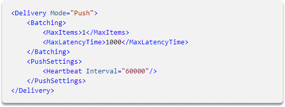

:orphan:
(agentless-log-collection-microsoft-wec-and-wef)=

# Agentless Log Collection Microsoft WEC and WEF

Log collection is a process of gathering data generated by various sources in order to centralize it for analysis and long-term storage. The data collected can be used for a variety of purposes such as monitoring, troubleshooting, and security auditing. Microsoft's Windows Event Collector (WEC) and Windows Event Forwarding (WEF) are two popular agentless solutions for log collection. In this blog post, we will introduce both solutions and provide a comparison of their features, illustrate a basic `XML` analysis. We will also take a look at how to configure subscriptions.

## What are WEF and WEC?

Installing and deploying an agent to gather data may not always be practical or acceptable in certain situations. Often, all we need to do is configure the hosts and gather their logs. The WinRM service on a remote host implements the Windows Event Forwarder (WEF), which reads the local Windows Events logs file and sends it to the Windows Event Collector (WEC), which is awaiting. Some of the customizations will be done at the domain level using Group Policy Objects (GPOs), enabling us to swiftly install and change our setups.

## XML analysis

The WEF service employs XML configuration files which are known as subscriptions to determine what to consume and transmit to our WEC server. Those configuration files will be kept on the WEC and accessible via a URL, which will be sent to our distant Windows endpoints using GPO. Subscriptions have numerous options for managing the frequency and quantity of events to transmit, as well as the XML query that will be used to read and filter our endpoint logs.

Let’s have a look at the parameters:

**Delivery Mode**: The delivery mode specifies how our WEC server's logs will be gathered. Recall that in order to prevent security risks, we always want our datasets to provide us with logs. As a result, from the perspective of the remote host, we prefer a **Push** technique.

Following that are the **Batching** sections, where we specify WEF threshold levels to satisfy prior to actually delivering logs - either the number of events or the regularity.

WEF and WEC then employ **Heartbeat Interval** to detect potential "dead" hosts in the system.

**XML Query section**

Finally, we have the configuration's heart - the XML query. The WEF procedure will utilize this to filter and retrieve the logs we wish to gather.
In this scenario, we build a query on the Security logs file and specify that we only want incidents with the EventID column set to 999.

The remainder of the file is made up of other XML queries, however, they can only be linked to certain Windows event logs or events recorded in the Windows Event Viewer.

## Configuring the subscriptions

While configuring subscriptions we should categorize them in the WEC setup.
For example, we will gather all security logs within one subscription and the requests to gather system logs within another. On the WEC part, we must additionally set up **GPO**s to control the services, such as starting it upon boot. We must also integrate all of the subscriptions we wish to apply and connect them to the appropriate asset groupings. Some assets, such as domain controllers, will produce strange events. Customized subscriptions will only be placed on them to prevent wasting computer resources. We may use the `wecutil` command to handle all of our subscriptions.

Finally, we'll need to create a GPO for all of our endpoints to begin downloading subscriptions and sending the necessary logs to our WEC.

In the XML part of the GPO, we must utilize the **WEC domain name** rather than the IP address. This will not function with an IP address since WEF is based on the Kerberos protocol, which requires FQDN for authentication. Then we establish the Refresh parameter, which will be accountable for managing the period with which the endpoints will connect the collector to get subscription changes.

This GPO must be deployed to all Windows endpoints with the exception of WEC servers. After we've deployed everything on the testing assets, we should start seeing events in the Forwarded Events portion of the Windows Events viewer on the WEC server.

Despite being an agentless-based architecture, we will also need to configure a collection agent on the WEC servers to gather all the logs that have been stored in the Forwarded Events log path to our processing server or SIEM.

## Summary

As we already learned, WEF and WEC are very powerful tools that allow us to collect Windows Events logs consistently. We can benefit from these tools for agentless log collecting purposes.

:::{seealso}
Want to learn practical Digital Forensics and Incident Response skills? Enrol in [MDFIR - Certified DFIR Specialist](https://www.mosse-institute.com/certifications/mdfir-certified-dfir-specialist.html)
:::
