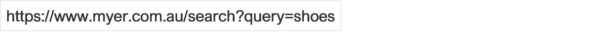
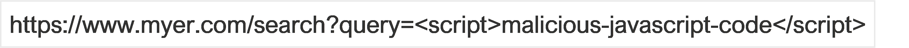

:orphan:
(an-overview-into-website-mechanisms-and-vulnerabilities)=
# An Overview into Website Mechanisms and Vulnerabilities
 
For cyber security professionals, it is important to gain an understanding of the various web technologies. Many cyber-attacks are carried out on websites and web servers for various reasons. It may be to retrieve credentials to get access to systems, to gain Personal Identifiable Information (PII). Or it may be to simply use a website to have users click on links that execute malicious code or that link to another, malicious, website. Cyber security professionals need to know how to protect systems and businesses against these kinds of attacks.

## What exactly are websites?

Websites are a collection of web pages. A webpage is a file that users can access via a web server that stores these files. When a user requests a webpage and a server returns them, they are displayed in the user’s browser. The two basic technologies of websites are HTML and CSS. They are used to format and structure web pages and display the contents. To make websites more dynamic, programming languages and databases are added such as JavaScript, PHP, and MySQL. However, web development isn’t limited to these languages. Web developers also use programming languages that have not been specifically developed for the internet such as Python, Java, and many others. These languages all serve different purposes and depend on whether they are used for client-side or server-side applications. What the exact difference is between the client-side and server-side is will be explained in this blog.

JavaScript is by far the most popular client-side programming language. On the server-side is more variation, where all kinds of languages are used. In this blog, we will focus on PHP, as this is one of the world’s most popular server-side programming languages. It has been specifically developed for the web and some major websites such as WordPress, Wikipedia, and Facebook use PHP for their dynamic pages.

## Static vs dynamic websites

There are two kinds of websites. Static websites display content that doesn’t change regardless of who requests them. The page looks the same for every user and they only change when a web developer changes the content. A dynamic website, as opposed to a static website, presents different information to different users. A user’s location, local time, settings, preferences, and/or actions on the website can all influence the content they see. A dynamic website is a more interactive application.

Whether you should develop a static or dynamic website depends on the requirements, both types of websites have their pros and cons. Static websites are fast and simple but are less flexible. Dynamic websites have greater functionality and are more flexible but also more complex. Dynamic websites are often linked to a database where data is stored such as user data or product data. On a static website, products are placed directly into an HTML file. This means that the product is visible to every user who accesses that webpage. As product details on a dynamic website are placed in a database, they will be displayed on the website only when a user specifically requests to view that product. Dynamic websites have functionalities, where data is changed and sent back and forward through user interaction. This is not possible with a static website.

Static websites are more secure than dynamic websites for a few reasons. Dynamic websites are more exposed. Every request to a dynamic site means that a new webpage or web application is running to fulfill that request. In addition, as we just discussed, a database often must be accessed to retrieve the data. This simply means that the attack surface for a dynamic website is greater than for a static website. The attack surface or attack vector is the total number of points through which an unauthorized user can gain access to a system and extract data. Sending malicious requests to a server hosting a dynamic website could cause the application to do something it shouldn’t do or the database to reveal information it shouldn't.

## Client-side vs server-side scripting

Web programming languages are often distinguished into client-side and server-side languages. This categorization depends on where the code is executed. HTML, CSS, and JavaScript are client-side technologies. This means that the browser on your computer processes the code, and not the server that hosts the webpages. When requesting an HTML page, a copy of the source code is sent from the webserver to your computer over the internet. Your computer then runs this code directly on your browser. This means that the code is visible to you.

Client-side technologies also do data validation. Data validation is checking if the input data is according to the standards. For example, when you fill in your email address to sign up for a newsletter, the browser will do a syntax check to see whether your email address is in the correct format. This is much faster than when a server must do the syntax check, although servers often do additional validation after client-side validation. Validation is necessary to ensure that the inserted data is correct. In addition, data validation also has security implications. Forms are a popular target for hackers because they are linked to a database. Allowing users to enter anything into a form exposes the website to SQL injection attacks. Validation also enables the web developer to enforce password rules such as complexity and length.

Server-side scripting, on the other hand, takes place when a server executes code and passes on the result of that code execution to the client. PHP is a good example of a server-side scripting language. The PHP code is executed on the web server and then the data is passed to the user's browser. What data is passed, depends on the request of the client. A good example is an e-commerce website that offers different products in different categories. If a user wants to view a product, they click on the link in the description or on a picture of the product. The client browser sends a request to the server for that information. The server executes the code to process the request and retrieve the requested information from the database. The retrieved information is then sent back to the user.

If the user then decides to order the product, the product is placed in the shopping bag. The server calculates the final price, depending on the number of products and shipping costs, and returns the final price to the user. As you now understand, server-side scripting often works in close relation with a database and therefore PHP code often includes a database querying language, such as MySQL.

## HTML and CSS: what are they and what are common vulnerabilities?

HTML is a standard method for structuring web pages. It is used to divide the page into sections such as head, body, and footer and create sections within those elements with headers and paragraphs. HTML can also be used to create hyperlinks and display images. HTML always works in conjunction with CSS. The elements of HTML such as blocks of text and images can be styled through CSS, for instance by assigning a different font for each paragraph or giving header titles a different color. 

Code injection is a common attack technique for web technologies. CSS and HTML are also vulnerable to such attacks. In older browsers, for example, it was relatively simple to insert JavaScript code into CSS. This is rare nowadays as modern browsers no longer support JavaScript embedded in CSS. Another vulnerability is the ability to read data from an HTML document using CSS selectors. CSS selectors are used to apply styling to HTML elements. These selectors can be used by brute-forcing a value one character at a time. If a user types in a certain character, the character is send to the attacker. Eventually the attacker can collect a string that was typed by the user. This way, usernames and or passwords typed into HTML forms may be obtained. Other attacks focus on changing the styling of your website. This may seem innocent, but attackers can do a lot of damage with this. They can hide elements, add, change or remove HMTL content through CSS and monitor user activity. Imagine if they would attack an e-commerce website and manage to hide the ‘buy’ buttons on the website. 

It is relatively easy to ensure that CSS and HTML are secure. Make sure the data in HTML forms will be validated, meaning that the field will only accept input that makes sense. The email address field for example will only accept a string that complies with the structure of email addresses. Don’t use third-party CSS, use your own CSS files so you have control over the CSS of your website. Use a Content Security Policy. Such a policy allows you to control what sources can be used on your website. For example, limit all content on the website to come from the site itself and not from any third parties. A policy can also restrict accessing HTML or other documents only over an HTTPS connection. 

## JavaScript: what is it and what are the most common vulnerabilities?

JavaScript is the most widely used client-side programming language. JavaScript does have alternatives, but these are less common. Many of these languages, such as TypeScript, are based on JavaScript itself. JavaScript can modify both HTML and CSS. Data can also be calculated, manipulated, and validated using JavaScript. It makes web pages interactive; JavaScript is used in everything that moves, refreshes, or changes without requiring a manual reload of the web page. Forms and form validation are two frequent uses for JavaScript. When a user fills in a form and forgets a field, JavaScript may be used to notify the user of the empty field. Other examples of uses for JavaScript include photo slide displays, autocomplete text suggestions, dynamic visuals, and so on.

JavaScript has some vulnerabilities that web developers and cyber security analysts need to be aware of. Firstly, JavaScript may enable an attacker to control the script execution. This is also called cross-site scripting and is a major security issue with JavaScript. Cross-site scripting can happen in different ways.

### Reflected and stored cross-site scripting                

In reflected cross-site scripting, the server accepts malicious script code entered by the attacker in the URL. This can be done for example through a search field on the website. The malicious code is then inserted into the HTML on the relevant page and returned to the browser for execution. To illustrate how this works, here is a practical example. When doing online shopping at myer.com.au, you search for shoes and you type in shoes in the search bar, the browsers return the following URL:

The website of Myer has responded to this query. It returns a dynamic web page with all the products that are labeled ‘shoes’. If a website lacks proper security measures, such as data validation, an attacker may be able to use insert JavaScript code in the search query instead of the search query term: 

For the unaware user, the above link seems legit, after all, it looks like it comes from Myer. When the attacker sends this link to users or posts the link on a forum, let’s say a forum about online shopping or shoes, and users click on the link, the malicious script gets executed in the user’s browser. The other form Stored cross-site scripting is a bit different from reflected cross-site scripting. Instead of an attacker creating a link containing the malicious JavaScript code, the server stores the malicious code. The malicious script is executed when another user loads that page at a later stage. The importance of input validation cannot be underestimated. If there is a lack of input validation, the malicious code will be permanently stored on a server or in a database.

### DOM-based cross-site scripting

The third form of cross-site scripting is DOM-based cross-site scripting. Attackers manipulate the Document Object Model (DOM). DOM stands for Document Object Model and it was designed to standardize web technologies. In the 1990s, using JavaScript was only possible when using the Netscape Navigator browser, the dominant browser at the time. Microsoft developed their own version of JavaScript (Jscript) that could be used for Internet Explorer. The DOM was developed to provide a solution to the different incompatible web technologies by providing a standard that is independent of any particular programming language. Web developers do not create the DOM document. With every HTML request, a DOM of a page is built by the browser. This done so that JavaScript can access and manipulate the objects (or elements) in the HTML document. 

DOM-based attacks differ from the other two cross-site scripting attacks as the malicious script is not inserted in a link that is sent to the user by the attacker, nor is it stored on the server. Instead, the attacker manipulates the DOM structure. The client-side script of a web application adds user-supplied data to the DOM, for instance when filling in a form. The data from the DOM is then read by the web application and sent to the browser. If the data is not handled properly, the attacker may inject a payload that is stored as part of the DOM. When the data is read back from the DOM by the browser, the payload is then executed.

### Cross-Site Request Forgery (CSRF)

Cross-Site Request Forgery (CSRF) is a session hijacking attack. In this attack, authenticated end-users undertake malicious activities on a web application without their consent or knowledge. The risk is especially high when web applications trust input from authenticated users but do not require the user to authorize a specific action or access a certain application. Once authenticated, a user can do everything that they were authorised to do. In a CSRF attack, an authenticated user has a cookie saved in the user's web browser while they may unintentionally send an HTTP request to a site that trusts the user. This can result in an unwanted action. A good example is the website of Netflix which contained numerous CSRF vulnerabilities. Attackers could perform actions such as changing the shipping address on the account or changing the victim's login credentials. Attackers do not steal the victim’s credentials, rather, through session hijacking, they gain access and from there, they can lock the user out.

### Protection against cross-site scripting

JavaScript developers often use third-party tools and libraries. Many of them are vulnerable to various JavaScript exploits. Some of these tools are developed and maintained by large corporations. They put much effort into fixing bugs and adhering to JavaScript security best practices. However, many tools are created by developers or smaller teams who do not always have the time or money to keep their applications secure and release updates. JavaScript developers need to be aware of this when incorporating these tools and libraries.
The best way to avoid cross-site scripting and cross-site request forgery attacks is by using vulnerability scanning methods. Another recommendation is to be aware of the security risks of using particular commands and methods such as innerHTML when coding in JavaScript. InnerHTML is a method that enables JavaScript to change the HTML on the website. It can be used for user input in a field or form. There are other JavaScript methods that can do the same thing such as innerText. There are also data sanitation method that you can use with innerHTML. Other methods for creating secure JavaScript application are using encryption and secure cookies.

## PHP and MySQL: what are they and what are the most common vulnerabilities?

PHP is an abbreviation for "PHP: Hypertext Preprocessor," and it is a popular server-side programming language. PHP scripts are run on the server rather than in the browser. After the PHP code is executed on the server, the result will return to the browser as plain HTML. Through PHP you can connect to and manipulate data in databases that you display to the user. This option greatly enhances the power of your website by allowing the content to be personalized to what the user is requesting. MySQL is the most often used database system with PHP but there are many other options. Databases are important for categorizing information. For example, an e-commerce website contains a database containing all of the products, customer data, and orders. This often includes sensitive data such as credit card numbers. Databases may also be used by businesses to store and manipulate staff information. When a user needs to access database information through your web page, the SQL statements embedded in PHP code will access, retrieve and display that data to the user. 

PHP is like other web technologies vulnerable to cross-site scripting and cross-site request forgery. HTML or JavaScript injection may take place in the same way as described earlier in this blog. PHP is also vulnerable to session hijacking. When you log in, the website generates a 'session' to keep you signed in without requiring authentication for every subsequent action. An XSS or CSRF attack allows a hacker to steal current session information and use your web application without requiring a login or any other type of authentication. To avoid Session Hijacking, you should reset the session ID as frequently as possible (without annoying the user too much) and utilize the HttpOnly flag. Another precaution you should take is to ensure that no session ID data is saved in a publicly accessible folder; this would be extremely dangerous.

A specific vulnerability for databases is SQL injection. SQL injection usually occurs when a user is asked for input, such as their name or username. Instead of a name, the attacker provides an SQL statement that will be unknowingly run on the database. A well-known trick is to insert ‘OR 1=1’ into a field. Adding this to the input means the SQL statement is valid and will return all rows from a table, since OR 1=1 is always true. It is quite easy to prevent SQL injection from happening. Data should be sanitized by limiting the use of special characters and user input should be validated. In addition, dynamic querying of the database should be avoided. Rather, the developer should use parameterized queries. Parameterized queries require the developer to first write all of the SQL code. Each parameter will be added to the query later. This style of coding enables the database to distinguish between code and data regardless of the user input. Prepared statements ensure that an attacker cannot modify the purpose of a query.

> **Want to learn practical Secure Software Development skills? Enrol in MCSI’s [MASE - Certified Application Security Engineer](https://www.mosse-institute.com/certifications/mase-certified-application-security-engineer.html).**