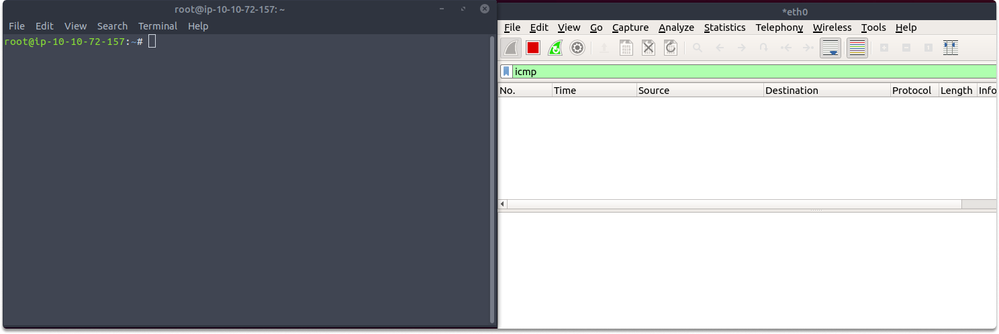
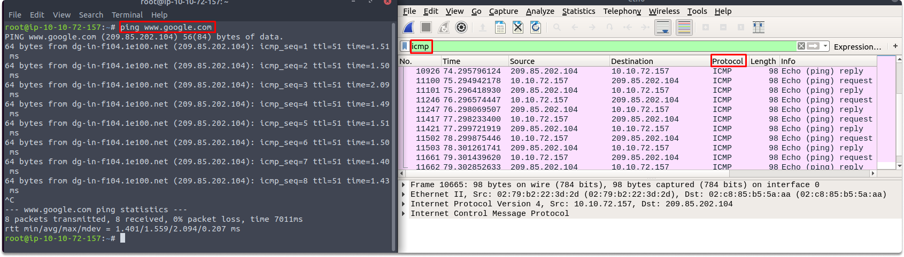
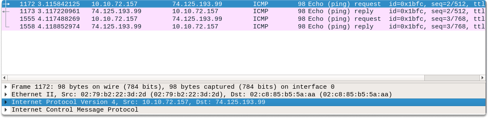
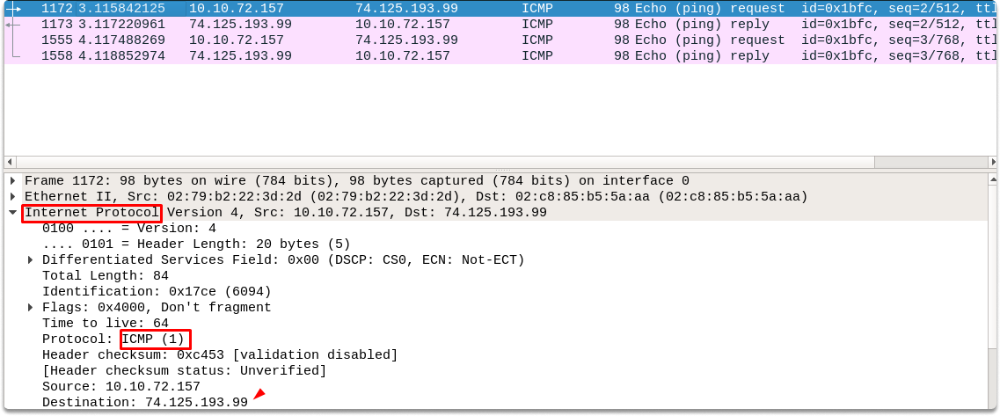
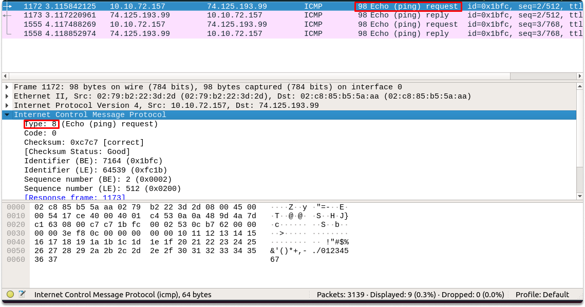
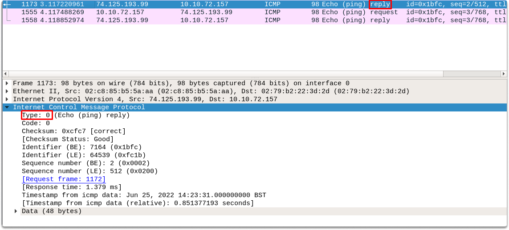

:orphan:
(analyzing-icmp-traffic-with-wireshark)=

# Analyzing ICMP traffic with Wireshark

In today’s blog post we are going to take a look at what an internet control message protocol request and replies can be identified using Wireshark.

## Analyzing ICMP traffic in Wireshark

The Internet Control Message Protocol (ICMP) is a network layer protocol and is essentially used as a management tool that may warn hosts, and system admins about network issues.

While actively probing our targeted system, we use two ICMP packets to see if it is up:

- Echo Request
- and Echo Reply

## Analyzing ICMP traffic in Wireshark

As we already discussed, Wireshark is a network analysis tool that you should be familiar with if you are working in cybersecurity whether you are on the blue or red team side. So let’s get started.

First of all, we opened our Kali terminal and Wireshark side by side and typed ICMP in the filter pane. Then clicked on the start capture icon  on Wireshark and typed ping www.google.com in our terminal. Then stopped Wireshark capture clicking on stop icon. 

You can also stop ping by typing _Ctrl+C_. You can also send a specific amount of ICMP echo requests by adding a `-c` flag such as:

`ping -c 5 www.google.com`

This is what a ping looks like in Wireshark. Now let’s have a look at the captured ICMP packets.

**Identifying ICMP requests in Wireshark**

In ICMP, each type of communication is assigned a different value. First, let’s take a look at the internet protocol version section. You can see the protocol is ICMP, the source IP belongs to our Kali machine.

Now continue with analyzing the protocol section. As you can see in the Internet Control Message Protocol section of packet 1172, this particular message is an ICMP request since it has a value of 8.

Let us now have a look at what a normal ICMP reply message looks like. As you can notice in the image echo reply follows the echo request. This means that the target is up and responds back to our ping probes. The first thing we see is the type value of packet 1173. for Echo-Reply messages, the value is 0.

If you see a different number in the type section other than 8 for ICMP request and 0 for ICMP reply, then you may want to investigate if there is a suspicious activity (you may also want to check timestamp messages used for synchronizing). To add additional security against irregular scans computers may be set to reject ICMP requests. In this sort of scenario, you can always use another tool for scanning.

## Conclusion

In this blog post, we looked at what is ICMP protocol and analyzed what a normal ICMP request and reply structure seem like in Wireshark.

> **Do you want to get practical skills to work in cybersecurity or advance your career? Enrol in [MCSI Bootcamps](https://www.mosse-institute.com/bootcamps.html)!**
