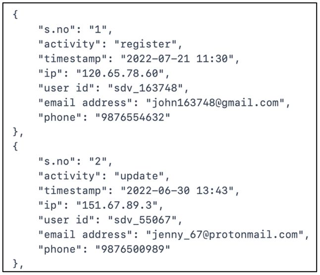

:orphan:
(application-of-scripting-in-digital-forensics)=
# Application of Scripting in Digital Forensics
 
You are a junior digital forensic analyst. You have heard that digital forensic professionals need to have the ability to write scripts quickly, to deal with the large amount of data in an investigation. You can write basic scripts, but you constantly wonder, ‘What kind of script will I be asked to write while helping out with an investigation?’. You want to be better prepared to write scripts in the field. This blog post presents four scenarios that requires a digital forensic analyst to write scripts.

During a forensic investigation, you will most often be presented with log files in the form of CSV, XLS or JSON files. Each file will have numerous rows or entries with critical information. Writing scripts to process these files, will help you arrive at inferences easily. Let us take a look at four scenarios which demonstrate this fact.

## Scenario 1

Consider that you have a CSV file like the one shown below, with multiple columns. There are about 1000 entries in this file. Here is your task: *For people using ProtonMail email provider, print only their phone number and the numerical portion of the user-id (eg:55067)*.

|  no  | activity |     timestamp    |       ip      |   user id  |      email address      |    phone   |
|:----:|:--------:|:----------------:|:-------------:|:----------:|:-----------------------:|:----------:|
|   1  | register | 2022-07-21 11:30 | 120.65.78.60  | sdv_163748 | john163748@gmail.com    | 9876554632 |
|   2  | update   | 2022-06-30 13:43 | 151.67.89.3   | sdv_55067  | jenny_67@protonmail.com | 9876500989 |
|   3  | update   | 2022-05-01 09:45 | 131.56.43.155 | sdv_90685  | jane9090@protonmail.com | 9876513241 |

To accomplish this task:

- First, you have to extract all the rows belonging to users having *@protonmail.com* in the email address column.
- Next, you have to extract only the user id and phone columns, but print only the numerical portion of the user id and phone number.

You can easily open this file in Microsoft Excel and perform quick searches. But to perform very specific searches like this task requires you to do, using scripts is the way to go!

Python offers many libraries to process CSV files and search through them. One such library is ‘pandas’. Here is one possible way to accomplish this task using python:

- Convert the CSV file to a pandas dataframe
- Search through the dataframe and extract all rows having *@protonmail* in the ‘email address’ column
- Process the extracted rows and print only the numerical user id and phone number

This script will be able to process 1000 rows of data within seconds.

## Scenario 2

Consider the same CSV file again:

|  no  | activity |     timestamp    |       ip      |   user id  |      email address      |    phone   |
|:----:|:--------:|:----------------:|:-------------:|:----------:|:-----------------------:|:----------:|
|   1  | register | 2022-07-21 11:30 | 120.65.78.60  | sdv_163748 | john163748@gmail.com    | 9876554632 |
|   2  | update   | 2022-06-30 13:43 | 151.67.89.3   | sdv_55067  | jenny_67@protonmail.com | 9876500989 |
|   3  | update   | 2022-05-01 09:45 | 131.56.43.155 | sdv_90685  | jane9090@protonmail.com | 9876513241 |

This is your task: *Process the ‘ip’ field. Identify the approximate geo-location of each IP. Include columns in the CSV file for region, city and country corresponding to each IP*.

It is easy to perform this task manually for about 5 entries. Think how long it would take to process 1000 entries. What do we do then? Use APIs!

Some websites that help to identify the approximate geo-location of IP addresses offer APIs, that you can integrate in your scripts. These APIs, for every input IP, will acquire all the relevant information like region, city, country, latitude, longitude, etc; which you can process using your script.

Here is one possible way to accomplish this task using python:

- Convert the CSV file to a pandas dataframe using python
- Integrate an IP to geo-location API in your script
- For the IP in every row, utilize the API to acquire the results
- Process the results using python and include the appropriate fields in your pandas dataframe
- Convert the dataframe back to CSV
- You now have a CSV file with new columns containing geo-location information about each IP

## Scenario 3

This time you are presented with a JSON file, like the one shown below. This is the same data from the CSV file, but in JSON format.

 

Here is your task: *Identify all entries, where activity had taken place between 11:00 am and 1:00 pm on weekdays*.

Python offers many libraries to process JSON files too. You can convert this JSON file to a pandas dataframe and process it using the methods available, to extract the required data. Can you identify the sequence of steps to accomplish this task using scripts?

## Scenario 4

Say you have been given access to a folder. This folder has a number of files and sub-folders with even more files. You have about 200 files in all. 

Here is your task: *Identify all files that contain the word ‘backdoor’. For every match, print the absolute path of the file and the line number where the keyword appears*.

This task can be performed easily with the powerful Linux command `grep`. It has in-built options to search through a directory recursively, print the names of files where the keyword is found and print the line number where the keyword is found. You can combine individual commands into a single bash *[script](creating-and-executing-linux-shell-scripts)* and simply execute the script.

It is also possible to perform the same task using python. 

## Wrapping up

Now you are aware that:

- CSV files can be processed using python
- You can integrate APIs into your python script
- JSON files can be processed using python
- You can construct bash scripts using powerful Linux commands

The next thing to do would be:

- Set up python on your computer, you can use Windows or Linux. You can use ‘Jupyter Notebook’ to write your python scripts
- There are free tools online to generate CSV files and JSON files. Generate a file and consider that to be a piece of evidence. Write a script to process data from that CSV file - identify unique values, identify the number of times a specific value is found, etc.
- Practice using Linux commands like `cat`, `cd`, `pwd`, `head`, `tail`, `grep`, `cut` and `find`. Construct your own bash scripts using these commands, to process the files on your computer.
- Think of other programming or scripting languages that can assist you in processing large datasets and get familiar with using them. 

Armed with your scripting skills, you will be able to assist in handling digital forensic investigations efficiently.
