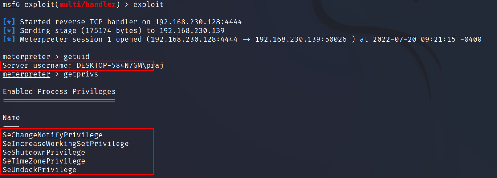
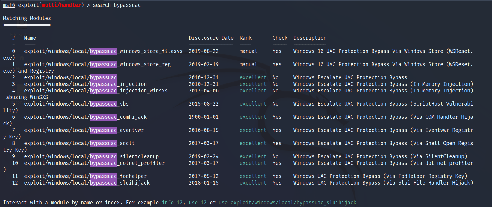
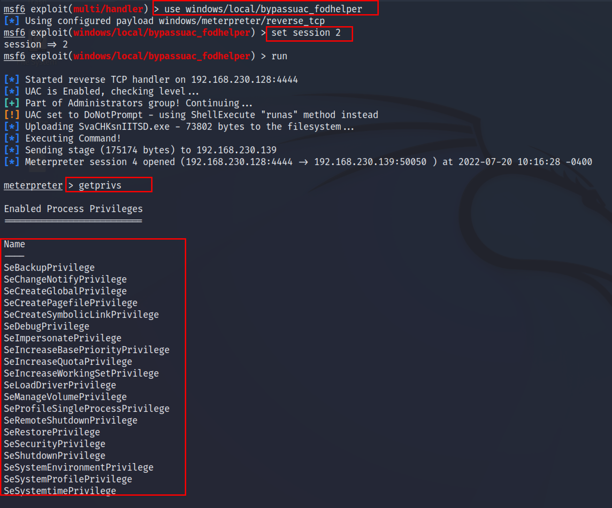
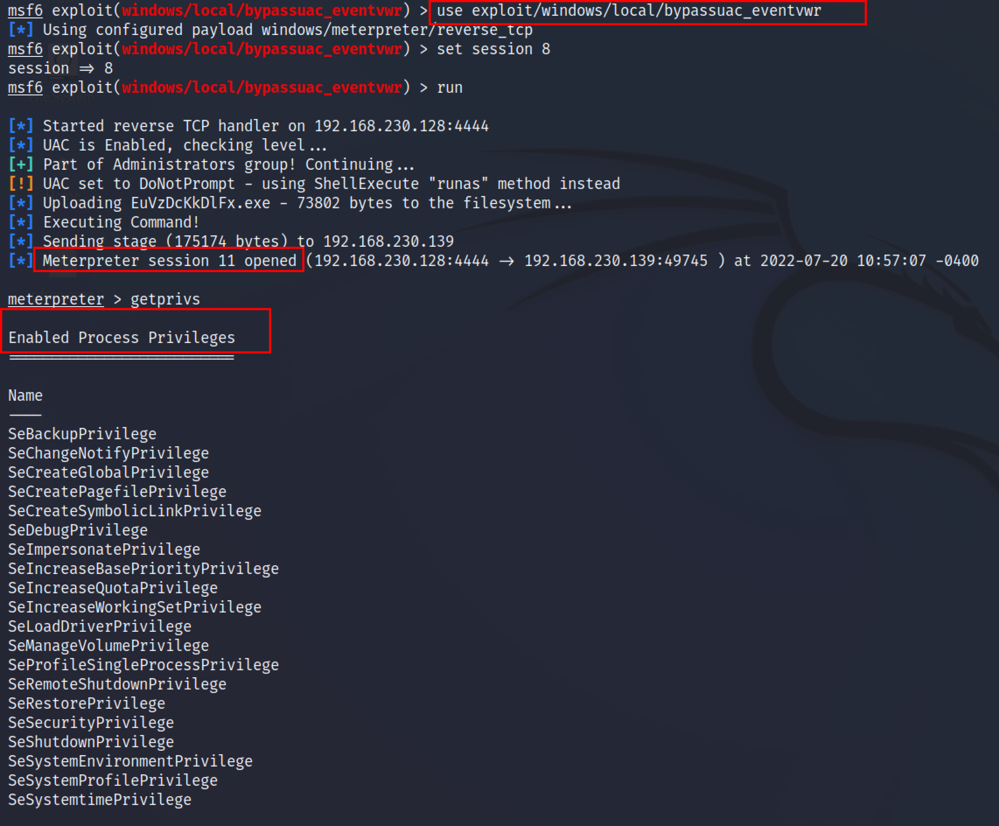
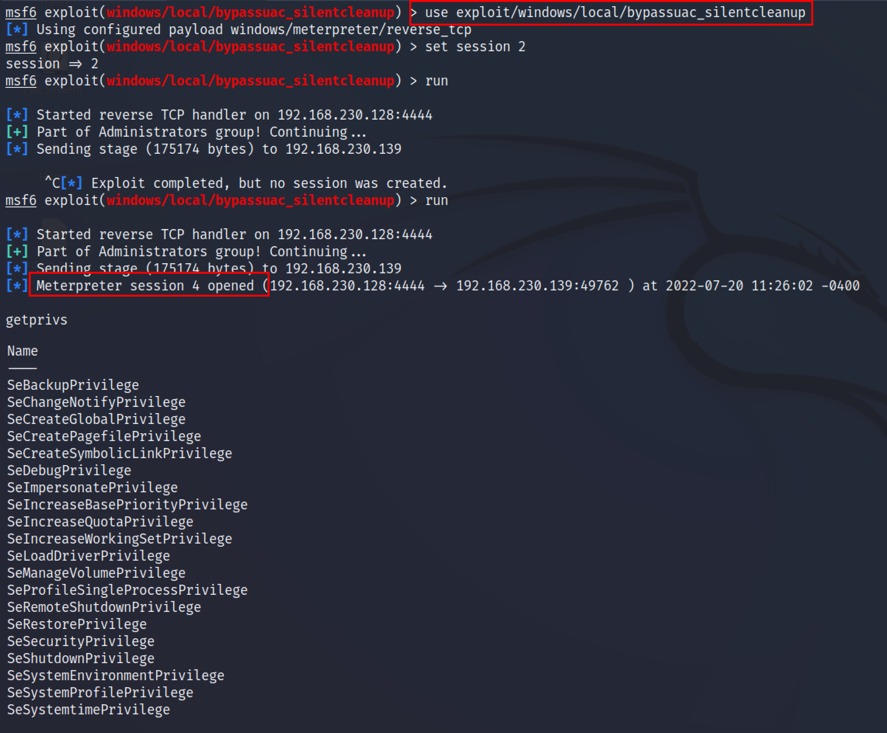

:orphan:
(bypass-uac-using-metasploit)=
# Bypass UAC using metasploit
 
UAC stands for `User Account Control.` User Account Control is a mandatory access control enforcement facility of the window machine that helps to prevent malicious software from damaging a PC. UAC’s job is to prevent a program from making changes to its system without authorization from the administrator. If a program is trying to do something which is a system-related change, it will require administrator rights. If the administrator does not approve the modifications, then the changes will not be implemented, and Windows remains unmodified.  

Some of the tasks which cannot be performed without the administrator's rights are :
* Installing or uninstalling device drivers
* Changing settings to windows firewall 
* Changing registry values 
* Running applications as an administrator
* Modifying the User Account control settings
* DLL injection 
* Modifying the protected folders like the windows folder, program files 
* Changing to system-wide settings. 

UAC operates by blocking a program from performing any actions that involve system changes or particular tasks. The operations will not work unless the process attempting to carry them out has administrator privileges.

For this article, exploit the target machine first and obtain the meterpreter session. Once the meterpreter session is present enter the following commands to check the privileges. 

```
Getuid 
Getprivs
```



From the above screenshot, on this machine, we don't have `system/admin` privileges. Quickly background the session by` Ctrl+z` on the meterpreter terminal and press y. Search bypass UAC, Metasploit has a huge collection of modules for bypassing the UAC. 
`Search bypassUAC`




## Windows UAC Protection Bypass using FodHelper

`fodhelper.exe` is an executable file that is part of the Windows 10 Operating System. `fodhelper.exe` executable is used by Windows to manage features in Windows settings. By hijacking a special key in the Registry under the current user hive and inserting a custom command that will be invoked when the Windows `fodhelper.exe` application is launched, this module will bypass Windows 10 UAC. 
Search for the bypassuac fodhelper module and use it. Now enter the `session ID` and type run command. 
`use windows/local/bypassuac_fodhelper` 
`set session ID`



From the above screenshot, Metasploit opened a meterpreter `session 4`. Along with a new session, we also get the admin privileges which can be verified by typing `getprivs` command. 

## Bypass Window UAC via Eventvwr 

The Windows Event Viewer is an administrative tool that allows you to view events, faults, and other essential information about what's going on beneath your operating system's hood. 
By hijacking a particular key in the Registry under the current user hive and introducing a custom command that will be executed when the Windows Event Viewer is activated, which will bypass Windows UAC. this module will create a new shell that will have the UAC flag turn off.  

```
use exploit/windows/local/bypassuac_eventvwr
set session ID
Exploit
```


From the above screenshot, Metasploit opened a meterpreter `session 11`. Along with a new session, we also get the admin privileges which can be verified by typing `getprivs` command. 

## Bypass Window UAC via Silentcleanup

SilentCleanup errors are produced by a corrupted or missing Microsoft Windows-related file, which can also be caused by malware infection. In Windows task Scheduler, there's a task called `"SilentCleanup"`, which is configured on  Windows 10 installations to be launchable by unprivileged users but to run with `elevated/high integrity privileges`.   When you run it, the file percent `%windir%\system32\cleanmgr.exe` is executed. Because it runs as Users and we can control user environment variables, we can change `%windir%` to whatever we want and it will run as admin. 
```
use exploit/windows/local/bypassuac_silentcleanup
set session ID
Run
```


From the above screenshot, Metasploit opened a meterpreter `session 4`. Along with a new session, we also get the admin privileges which can be verified by typing `getprivs` command. 

## Conclusion

This article talks about the ways to bypass user account control (UAC) using Metasploit. Metasploit has various modules to bypass the UAC. Understanding how to bypass UAC is essential for the penetration tester/red team because without bypassing UAC one cannot make changes system-wide. 

:::{seealso}
Looking to expand your knowledge of penetration testing? Check out our online course, [MPT - Certified Penetration Tester](https://www.mosse-institute.com/certifications/mpt-certified-penetration-tester.html)
:::