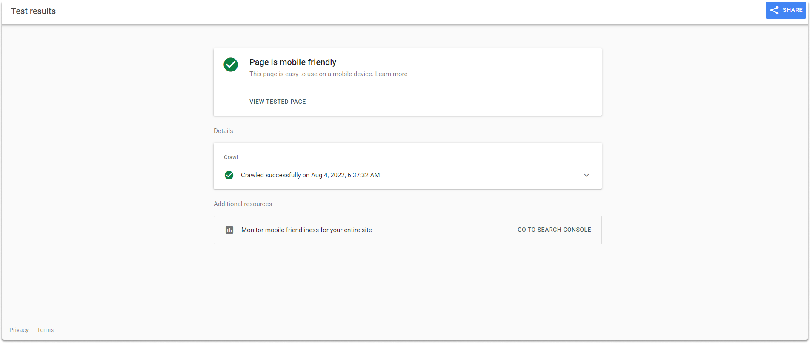
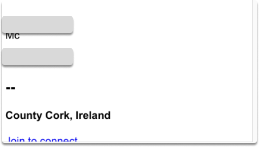

:orphan:
(circumventing-linkedin-login-prompt-for-anonymous-osint)=

# Circumventing LinkedIn Login Prompt for Anonymous OSINT

As discussed in a [previous article](introduction-to-linkedin-social-media-osint), while doing a social media OSINT, LinkedIn is one of the places you want to research. Let’s say that you have a first and last name and access to Linkedin. Unfortunately, you can’t look up people on LinkedIn without an account. Is there a way to make OSINT research on LinkedIn without creating a covert account? In this blog page, we will learn how to bypass Linkedin’s credentialing requirements with Google’s mobile-friendly test.

## What is a Google Mobile-friendly test?

Let’s have a look at Google Mobile-friendly test website first. It is a site that evaluates the user-friendliness, of a site on a mobile device. You may utilize it by simply inputting the URL of a page. Google's servers are authorized to circumvent LinkedIn's authenticating restrictions while crawling LinkedIn. For OSINT reasons, we will employ Google Mobile-friendly test to avoid the same restrictions.

**Hands-on With Google’s mobile-friendly test**

**Step 1-)** Let’s start visiting Google's Mobile friendly test. You can find the site [here](https://search.google.com/test/mobile-friendly).

**Step 2-)** Copy the URL of the LinkedIn account you want to research. Paste the URL to the search bar section, click enter and wait for the crawl report.

The results appear as the mobile view of the profile you’re researching. Let’s have a look at our findings.

_Quick Note_: The screenshot is rendered via Googlebot smartphone. The results include only the first and last name and country details in this specific Linkedin profile research. Although results may vary, as you can see the preview results are very limited.

At this point, we will need another open source tool which is code beautify.

Before visiting codebeautify, take a look at the `more info` section on the tested page. In our specific example, we saw page errors as you can see in the image (4/4 couldn't be loaded).

**Step 3-)** As the last step in Google’s mobile-friendly test, copy the HTML code on the HTML section.

**Step 4-)** Open a new browser and type code beautify. Click on the HTML viewer and copy/paste the code. After you click on run, you will see the entire LinkedIn page you’re researching.

Congratulations!

You have added a new method to your social media OSINT skills!

## Conclusion

In this blog post, we have learned how to bypass LinkedIn create account prompt with a publicly available Google service which is originally used to test your site’s user-friendliness. We also utilized Codebeautifier to render the entire HTML code of the LinkedIn account. By the completion of this page, now you know how to display a Linkedin profile without an account.

> **Want to learn practical Open-Source Intelligence skills? Enrol in MCSI’s [MOIS - Certified OSINT Expert Program](https://www.mosse-institute.com/certifications/mois-certified-osint-expert.html)**
