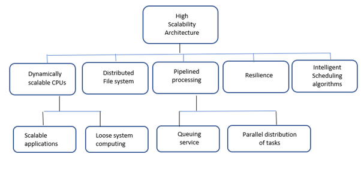

:orphan:
(cloud-security-scalability)=
# Cloud Security Scalability
 
Cloud scalability is a key advantage that enterprises should consider when migrating to the cloud. By leveraging the cloud, enterprises can scale their applications and services on demand, without incurring the cost and complexity of traditional on-premises infrastructure. In this blog post, we'll discuss the benefits of cloud scalability and how it can help your business.

## What is Scaling?
Scaling is possible in both centralized and distributed systems. Vertical scaling, or scaling up, is performed in centralized systems by expanding the size or capabilities of current or fewer resources. Horizontal scaling in distributed systems, such as those used in cloud computing, involves the addition of more individual resource pieces, such as servers. Horizontal scaling is used to establish redundancy and dependability in weakly linked systems, in addition to improving performance. As a result, distributed systems are more robust and can suffer resource unit failures. This capacity to consistently accomplish horizontal scalability is critical to the success of cloud computing.

Vertical scaling is less costly but more difficult to accomplish. There is also the risk of a single point of failure. Horizontal scaling is often less expensive and more robust than vertical scaling, although it is more complicated to accomplish.

Horizontal scaling is especially relevant to Web 2.0 because as applications grow in size, their performance suffers. Because most cloud computing applications are data demanding, horizontally expanding the database can result in considerable speed benefits. The database is replicated across numerous servers as part of this scalability. The following are some Web 2.0 horizontal database scalability approaches:

-**Caching —** Reducing the burden on application servers by implementing memory caching of frequently requested data on horizontally scalable, dedicated cache servers.
  
-**Table-level partitioning -**  is the process of slicing data horizontally and spreading it among database instances.
  
-**Sharding —** Managing an increasing number of applications by breaking datasets into smaller parts and distributing transactional bandwidth over multiple physical servers.

## High-Scalability Architecture

The scalability of a cloud computing system, as explained in the preceding section on horizontal scaling, guarantees that the cloud can accommodate rising load factors. As a result, any cloud platform architecture should be built with scalability in mind, allowing for additional capacity in a linear way in accordance with the matching demand.

There are several options for promoting high scalability. One option would be to use dynamically scaled CPUs and pipeline the processing of queued jobs. The graphic below summarizes these and more possibilities.

**Want to learn practical cloud skills? Enroll in MCSI’s - [MCSF Cloud Services Fundamentals](https://www.mosse-institute.com/certifications/mcsf-cloud-services-fundamentals.html)**