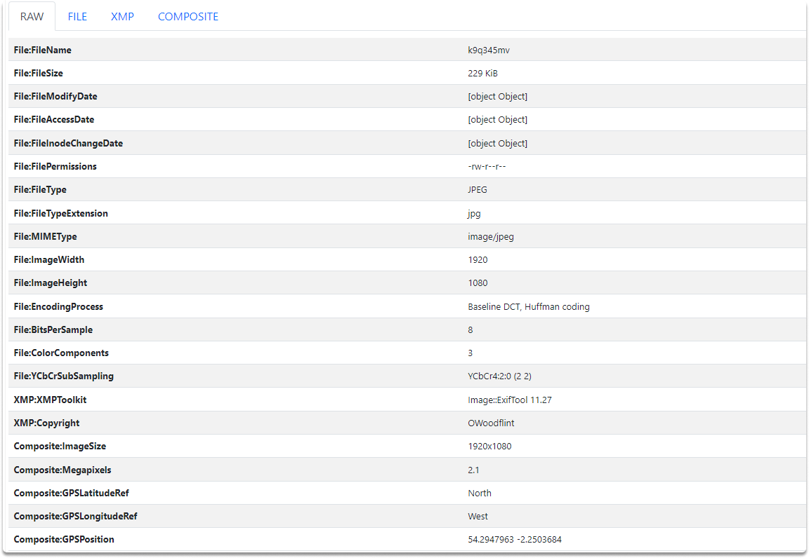

:orphan:
(digital-images-exif-analysis)=

# Digital Images Exif Analysis

During an OSINT examination, images might provide valuable information about a target. In this blog article, we'll look at what is EXIF data and how we can display it.Metadata includes descriptive (which is usually concealed) data about the file to which it belongs. The metadata of a file comprises the author's name, file size, location, creation date/time, and notes.

## What if EXIF?

EXIF is a metadata standard that specifies the format for images, sound, and auxiliary tags used by digital cameras, cellphones, scanners, and other devices that handle image and sound files captured by digital cameras. Because all cameras and cellphones can generate such data, we can gather varied amounts of OSINT about images and the persons who took them. However, you should always remember that Exif data can be modified and deleted.

## Exif data risks

For privacy reasons, some social media companies have begun to erase EXIF data from user-uploaded photos.

Exif data can lead to the disclosure of people's private information against their permission (which is also known as doxxing).
Exif data may be used to hide malware in image files, launching a multi-stage attack on the device that is viewing the image.

## What sort of information is contained in EXIF?

In addition to a wide range of technical information, EXIF metadata can include geospatial metadata.

Essentially, it is determined by the file type and the application or device used to produce the file:

- Model, manufacturer, and other device information
- GPS - latitude, longitude, altitude,
- Capture data such as flash settings, aperture, shutter speed, lens type, focal range, and so forth.
- Copyright and name

### Exif Viewer Tools

ExifTool, GIMP, Exif Pilot, 'Get Info' on a Mac and Properties on Windows and Linux, XnView, and other free software may inspect and manipulate digital file information. In the following section, we will analyze an image using [exifmeta](https://exifmeta.com/) and ExifTool in Kali.

### Displaying and Analyzing Exif data

Exifmeta is an online EXIF viewer which will help us to analyze EXIF data automatically and provide far more information than a human examination.

What are the file's MACB times?

The phrase MACB refers to the moments when a file was modified, accessed, altered, and "born" (created). It indicates when I downloaded this file in this case:

You can see the file type and extension as shown in the image.

We can also see the elevation, and the latitude and longitude. Let’s take the latitude and longitude and put them into Google Maps.

## Conclusion

Although consumers are most interested in the information contained in digital photos, music, and video files, there is a variety of metadata contained in various applications.

Upon completion of this page, you have learned that you should examine the metadata of all digital files before doing any Internet-related action on them (such as uploading, or sharing) along with displaying and analyzing Exif data.

> **Want to learn practical Open-Source Intelligence skills? Enrol in MCSI’s [MOIS - Certified OSINT Expert Program](https://www.mosse-institute.com/certifications/mois-certified-osint-expert.html)**
