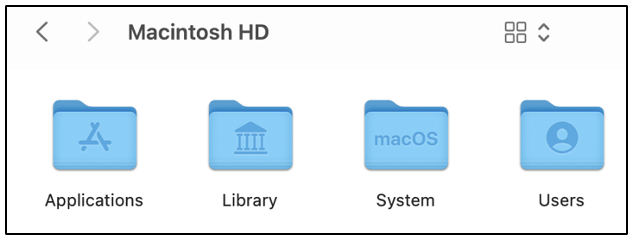
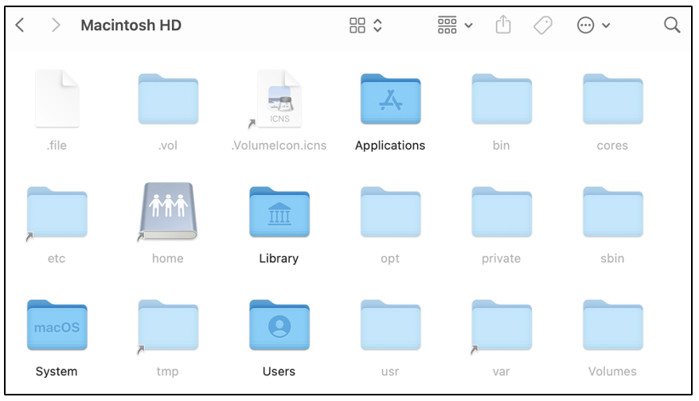

:orphan:
(directory-structure-on-macos)=
# Directory Structure on macOS
 
One of the major operating systems in use today is macOS, developed by Apple. Some cybersecurity professionals use computers running macOS for everyday tasks and to perform cybersecurity operations. Regardless, it is always a good idea to have knowledge about the underlying operating system in use. In this blog post, we will take a look at the directory structure on a computer running macOS.

## Let’s start with something familiar!

On Windows computers, the *C:* drive contains the main operating system specific files and programs installed by the user. Within the *C:* drive, you would find folders like: *Program Files*, *Users* and *Windows* with some hidden files and folders for the *[recycle bin](windows-recycle-bin-forensics-dumpster-diving-for-evidence)*, *[hibernation file](windows-hibernation-files-in-digital-forensics)*, etc.

On *[Linux]( https://blog.mosse-institute.com/2022/05/26/linux-dir-struc-dfir.html)* computers, the root */* directory contains various directories like */bin*, */boot*, */dev*,  */etc*, */home*, */usr*, */var*, */sys*.

## Introducing macOS

On Mac computers, the contents of the root directory appears as shown in the following screenshot. It is also referred to as root with a */* as in Linux.

We can see that four directories are immediately visible:
- Applications/
- Library/
- System/
- Users/

Within the root directory on a Mac, some files and folders are hidden from the regular user. They can be viewed when the *[command + shift + . ]* keystroke has been issued. 

The following screenshot shows the hidden files and folders within the root directory.

We can see that some of the directories: */bin*, */etc*, */opt*, */sbin*, */tmp*, */usr* and */var* that are found on Linux, are also present here.

## What information is stored within these directories?

Now, let’s try to understand what data is stored within these directories on a Mac. MacOS organizes the contents of the root directory across four domains, depending on their use:

- **local domain**: This domain has the applications and their configurations that are available for all the users on the system. The *Applications/* and *Library/* directories within the root directory come under this domain.

- **system domain**: This domain consists of data installed by Apple and has many low-level utilities to interact with the system. The *System/* directory and hidden unix-like directories */bin*, */etc*, */opt*, */sbin*, */tmp*, */usr* and */var* are considered to be part of the system domain.

- **network domain**: When a Mac computer is part of an internal network, some applications and data may be shared with other users on the network. That shared data is typically stored in the *Network/* directory, which is considered to be a part of the network domain. It is not pictured in the screenshot shown above. 

- **user domain**: Every user account on a Mac computer has a dedicated *home/* directory which is found within the *Users/* directory. There is also a *Shared/* directory within *Users/* that contains data shared between all users on the system. The *Users/* directory is part of the user domain.

## Wrapping up

Now you have a basic idea about the root directory structure on a computer running macOS. If you have your own Mac, feel free to explore how the root directory appears on your computer.

If you do not have Mac, then no problem! Simply create a virtual machine running macOS in the cloud. It is always fun to learn something new, isn’t it?

## References

*[Create a macOS virtual machine instance on AWS]( https://www.workfall.com/learning/blog/how-to-launch-and-connect-to-a-macos-instance-on-amazon-ec2-and-access-it-through-a-gui-using-vnc-client/)*
