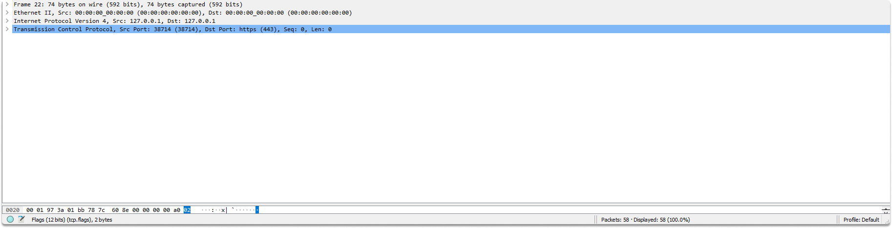
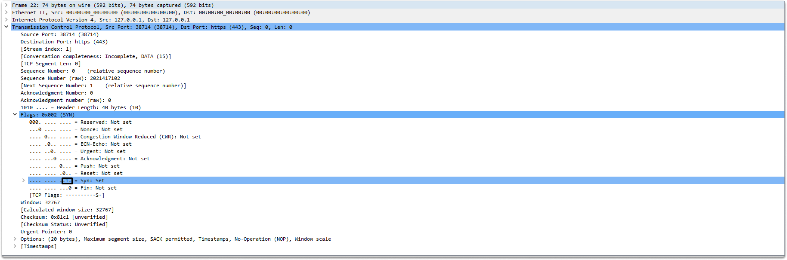
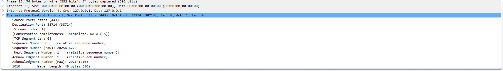

:orphan:
(dissecting-three-way-handshake-in-wireshark)=

# Dissecting Three-Way Handshake in Wireshark

The TCP three-way handshake is a three-step sequence that must be completed between a client and a server in order to create a safe and trustworthy TCP connection. In this blog post we are going to analyze how does a three-way handshake looks like, and discuss the flags and packet bytes. Let's start with taking a look at the syn packet...

**SYN**

The client starts a TCP connection to the distant server in the first stage. When this happens, the SYN flag in the TCP header is set to 1 and a random sequence value is utilized for this TCP connection, which is 2021417102 in our case.

We proceeded to the associated frame (22 in our case) and expanded the TCP Header to view all of the field values as displayed.

Expanding the flag reveals that this is the first packet. During the first two packets of the handshake, the Syn flag will only be utilized to synchronize the sequence numbers.

A standard TCP header is 20 bytes long, but this header is 40 bytes long since it provides additional options.

**SYN-ACK**

When the server gets a SYN packet for a TCP connection, it acknowledges it by changing the ACK flag value to 1.

When the ACK flag is set, the Acknowledgement Number field is set to one more than the value of the received SYN packet. Furthermore, because TCP supports two-way communication, the server changes the SYN flag to 1 and inserts a random sequence number into the TCP header.

It is important to note that the sequence number used in the SYN-ACK packet will differ from the one received from the client. The image below depicts a TCP SYN-ACK transmission from server to client.

Let's move on to the ack packet.

**ACK**

The handshake must be completed with the acknowledgment packet before any data can be transmitted. When the client receives the SYN from the server, it must now reply with an acknowledgment.

To do this, the client transmits another TCP packet to the server, this time with the ACK flag set and the Acknowledgement Number field value set to the sequence number plus 1.

The SYN flag is set to 0 in this packet.
you can see that the packet byte is 32 bytes. This is due to the fact that this connection contains TCP options, which increases the length of the TCP header.

## Summary

By the completion of this blog post, you should be able to identify the TCP three-way handshake while performing network analysis with Wireshark.

:::{seealso}
Do you want to get practical skills to work in cybersecurity or advance your career? Enrol in [MCSI Bootcamps](https://www.mosse-institute.com/bootcamps.html)
:::
