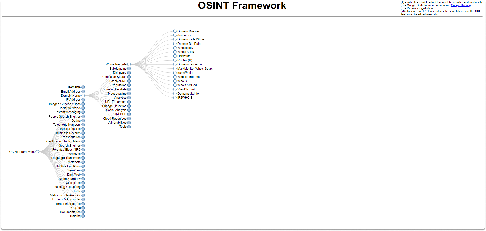
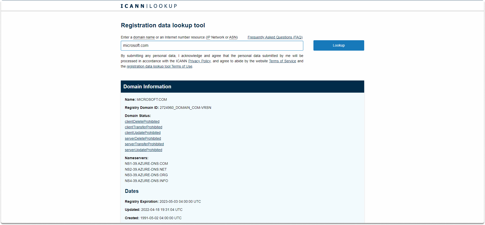
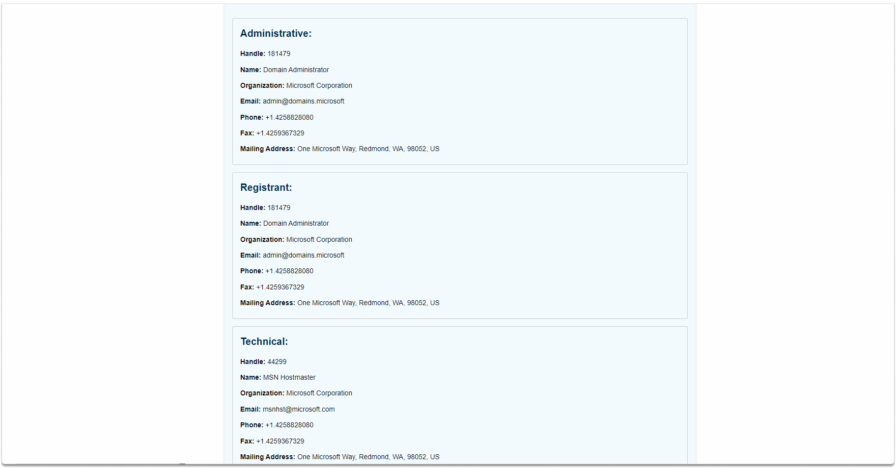

:orphan:
(domain-name-lookup-your-pivot-point-for-osint-research)=

# Domain Name Lookup Your Pivot Point for OSINT Research

During OSINT research, any data that you might use as a pivot point is valuable. As we already know, we can locate websites at certain addresses (which are also known as domains). Domain name research gives additional information on our point of interest. In this blog post, we will learn what is a whois lookup, what type of valuable information we can get from them, and how we can perform a basic whois lookup with the ICANN lookup tool.

## Domain name registrars and ICAAN

A domain name can be registered with a registrar by anybody who wants to construct a website. Webpages require data about the domain's registrant, management contact, and technical contact as well as a full name, business name, physical address, phone number, and email address. The registrar of the domain name provides these data to the service where you obtain the domain name. This service subsequently sends the information to the Internet Corporation for Assigned Names and Numbers (which can also be abbreviated as ICANN). From there, you can access the information which is made publicly available through web platforms.

To preserve their privacy, many domain owners have begun to use private registration services. Private registration services include their own data in the Whois search results, and only these firms know who the genuine registrant is.

## What is a whois lookup?

When you have a website that you want to learn about as much as you can, the most basic type of domain recon is a 'whois' query. A whois check will allow you to validate the current registration status as, details about the site you are researching, its owner, the content provider, and so on.
You can access whois records via central databases known as WHOIS repositories and whois information for each domain is kept public.

You can benefit from these databases to obtain specific details on any registered domain name. However, some domain registrants may choose to keep their registration details private as we have already discussed above.

As seen in the figure below, several websites and programs provide WHOIS information. However, ICANN is the primary organization in charge of providing this service.

ICANN and its regional Internet registries administer the global distribution and licensing of IP addresses and domain names.

**ICANN lookup**

Let's try typing _microsoft.com_ into the search field and seeing what comes up.

A WHOIS lookup can provide you with the following information:

- Who registered the destination domain name,
- What is the domain name holder,
- What is the invoicing, and technical contact address,
- What are the name servers and so on

## Conclusion

In this blog post, we learned whois lookup in detail and how we can perform a basic domain name query on our POI utilizing the ICANN lookup tool, which outputs beneficial details for our OSINT study.

:::{seealso}
Want to learn practical Open-Source Intelligence skills? Enrol in MCSI’s [MOIS - Certified OSINT Expert Program](https://www.mosse-institute.com/certifications/mois-certified-osint-expert.html)
:::
