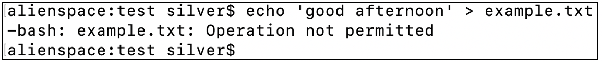

:orphan:
(file-directory-flags-in-macos)=
# File Directory Flags in macOS
 
On macOS, there are some flags that can be assigned to files and directories which dictate their behaviour. In this blog post, we will explore what the available flags are, how they alter the behaviour of a file/directory and why cybersecurity professionals must know about them.

## Is something hidden here?

In the *[previous](directory-structure-on-macos)* post on the directory structure of macOS, we saw how files exist in the root directory.

Be default, four directories are visible to the user - as seen in the following screenshot.

Only when the *[command + shift + . ]* keystroke is pressed, it is possible to view the hidden files and folders in the root directory. Users familiar with Linux may recall that files and folders are *[hidden in Linux](dont-be-tricked-by-hidden-files-viewing-hidden-files-and-directories-in-linux)* simply by adding a dot in front of the filename. However, this is not the case in macOS.

Let us observe how the contents of the root directory appear in the terminal. In the following screenshot, `pwd` command has been used to print the path of the working directory, which is root in this case.

When the `ls` command is typed, to list the contents of the root directory, we can see that the names of all files/directories, regardless of if they are hidden in the GUI are displayed. This is different from the behaviour observed in Linux. Then how is it possible to identify from this listing, whether a file/directory is hidden or visible in the GUI.

Let us consider */etc* folder, which is hidden in the GUI and view all details about it using *-l* switch. We can view the file’s permission string, this is similar to the *[permission string](file-permissions-in-linux)* observed in Linux. Based on the first character *l* in the permission string, we can infer that this directory is a link to another one. The first character in a permission string typically indicates the file type, *[as in Linux](file-types-in-linux)*.

On macOS, files and directories may have flags assigned to them. To view the flags set for the file, the *-O* switch can be used. We can see from the following screenshot, that a new field of information is present before the timestamp. The field contains the values *restricted* and *hidden*. The *restricted* flag has been set by the system to prevent the user from modifying this folder. The *hidden* flag has also been set by the system, to hide this folder from the GUI.

## It's demo time!

## Hidden - or not?

Now, let’s try setting some flags on user files.

There is a folder called *test/* that has one file *example.txt* and one folder *sample/* with some contents.

In the terminal, currently we are in the directory *test/*.

Let us attempt to hide the folder *sample/*. First let us view the existing flags for this folder. In the following screenshot, a - in the field before the timestamp indicates that no flags have been set on the file yet.

We will utilise `chflags` command to set the flag *hidden* on the directory. The syntax for use is as follows:

`chflags [flag] [file/directory name]`

Since the command requires elevated permissions to execute, `sudo` command is used. The purpose of `sudo` is the same *[as in Linux]root-login-vs-sudo)*. From the following screenshot, we can see that `chflags` has been used to hide *sample/* in the GUI.

As expected, we cannot see *sample/* in the GUI.

However, executing `ls` in the terminal shows the presence of *sample/* within the current directory.

The following screenshot shows the different flags present (or absent) for the contents of the current directory.

To remove a flag, the word *no* is simply prepended to the flag name and the `chflags` command is issued, as shown in the following screenshot.

Now it is possible to view *sample/* in the GUI.

## Safeguarding the contents of a file

Let’s work with the text file *example.txt* now. It has one line of text, as seen in the following screenshot.

Let us set the flag *uappend* on it, that only allows a user to append contents to the file. No line of text can be removed or overwritten. This flag is also referred to as *uappnd*.

We can see that the flag has been applied to the file successfully.

When we attempt to overwrite the contents of this file, we can see that the operation is not permitted. The command `echo` behaves similar to its Linux version. Read *[this](linux-command-line-101-basic-redirection-and-pipes)* post for more information.

However, when we attempt to append contents to the file, we can see that it is successful.

Now the file has two lines of text.

## Preventing any change to a file/directory

Let’s assume a user has a file/directory that they do not wish to be modified at all. Then they can set the *immutable* flag on it. We will set this flag on *sample/* directory. Before that, let’s confirm that it is possible to create new folders within *sample/*, when we right click anywhere in the directory. 

Now the *immutable* flag has been set for *sample/*.

We can view the set flags for all the contents of *test/* directory. This flag is also referred to with the names *uchg* and *uchange*, which is why we can see *uchg* in the screenshot below. Different names, but same meaning and behaviour.

In the GUI, notice how there is a small lock symbol in the left bottom corner of *sample/* directory’s icon.

Within *sample/*, when we right click to add a new folder, we can see that the option is not presented in the dialog box that pops up.

Even from the terminal, it is not possible to create a new directory within *sample/*.

The flag can be removed with *no* prepended to the flag name, as shown below.

Now the lock symbol also disappears and *sample/* can be used without any restrictions.

The same flag *immutable* can be applied to files to, to prevent any accidental modification. 

## Are there any other flags available?

Yes, there are some more flags available on macOS.

- There are variants of the *immutable* flag called by names like: *schg*, *schange*, *simmutable* that can only be set/unset by the super user. The flag variants we discussed above, can be set/unset by the file owner or the super user. Notice how the flags that can be used by the file owner start with *u* and flags that can be used only by the super user start with *s*.

- There are similar variants of the append only flag that are only available to the super user. They are *sappnd* and *sappend*.

- There are two other flags available to the file owner and super user: *nodump* and *opaque* that come in handy when `dump` command is used and when union mounts are used, respectively. 

## Why should cybersecurity professionals know about file/directory flags on macOS?

Flags can be used to intricately modify the behaviour of specific files and directories on a system.

- Penetration testers, red teamers or cyber adversaries may utilise these flags to modify the expected behaviour of a file or directory.
- Consequently, digital forensic analysts can study the flags set on a file/directory to uncover information about unexpected behaviour.

