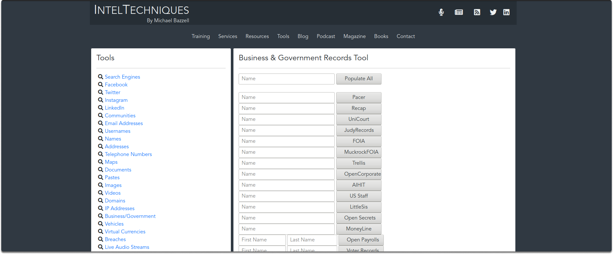
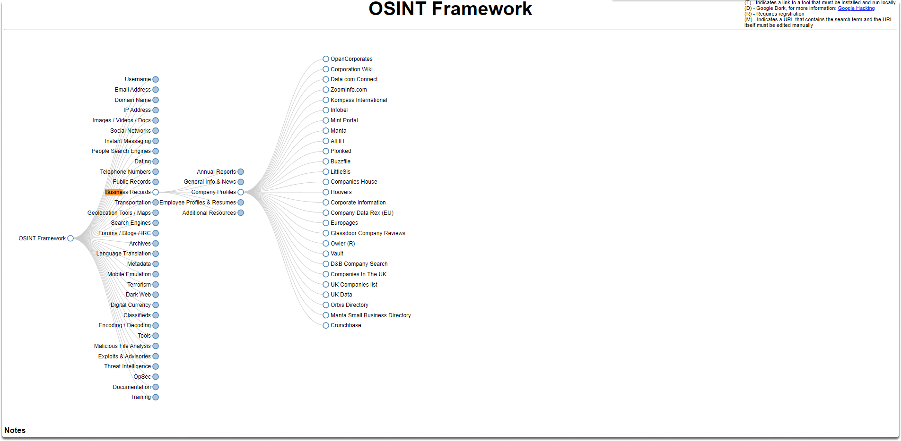
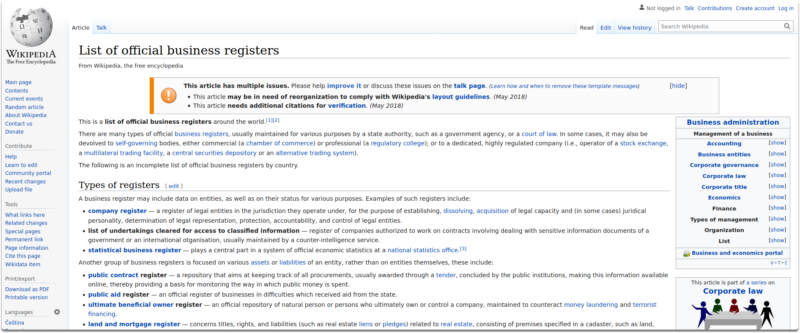
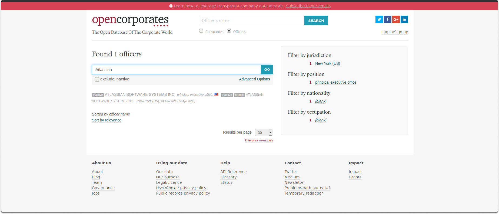
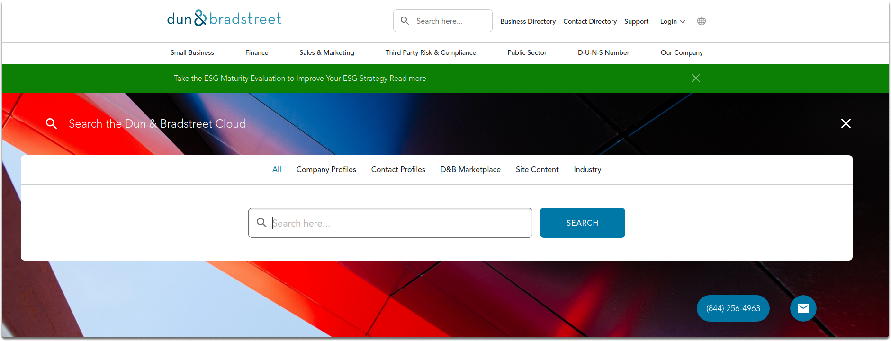
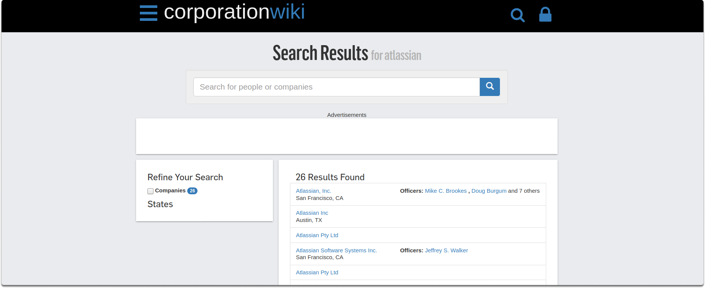
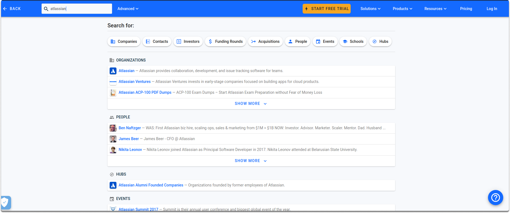

:orphan:
(find-the-business-information-you-need-with-osint-tools)=

# Find the Business Information You Need With OSINT Tools

The majority of company paperwork/records are stored in databases. To obtain a result, you must query a database for a search phrase. Despite the fact that there is no one specific mechanism for searching this data. One county may handle the requests quite differently than another, and company records range from state to state. Aside from domestic databases, there are additional commercial options for locating company information. The majority of services offer complete or at least basic details freely. This blog article will look at various free programs that can give you documentation pertaining to a business.

## Various business OSINT tools

Before we start looking at other resources, go to https://inteltechniques.com/tools/Business.html.

Michael Bazzell, as seen in the above image, supplies us with a variety of resources for commercial OSINT. On a second trip, we will go to https://osintframework.com/ to have a better understanding of the tools available for business records.

After reviewing these websites, we may begin investigating the technologies available for business records OSINT.

## Domestic tools

There are several methods for locating a company's business registry. You may conduct a search on Wikipedia at https://en.wikipedia.org/wiki/List of official business registers.

You may also use your preferred search engine to find the registration of your POI. As an example, you can simply type the following search term to find business records of Atlassian: `business registery Atlassian`.

**What do business records contain?**

Corporate profile and directory sites contain essential information about firms such as their geography, branch, contact data, staff identities (including business phone numbers and e-mail addresses), types of services offered or industry, and much more. Almost every state has a public database of all firms formed or licensed in the state.

## Taking a look at the open-source business OSINT tools

The most common corporate profile websites for retrieving such information are as follows:

**Open corporates**: It is a global open database of firms. You may look up company names or officers. This program indexes states in the United States, as well as many other nations. The simple search option allows you to look for a company by its name, organization registration number, or officer name. You can also identify and exclude inactive companies.

**Dun & Bradstreet**: This website provides a business search on the home page. You can look up corporations in the United States by their names.

**Corporationwiki**: CorporationWiki enables you to look up persons and businesses. Corporationwiki uses its information to build a map that visualizes the organization's networks. It is more focused on the United States and major corporations.

**CrunchBase**: CrunchBase provides global business information about public and private firms. The website may be found at [here](https://www.crunchbase.com/).

## Conclusion

By the end of this blog post, you should have access to both domestic databases and free tools for conducting business OSINT.

> **Want to learn practical Open-Source Intelligence skills? Enrol in MCSI’s [MOIS - Certified OSINT Expert Program](https://www.mosse-institute.com/certifications/mois-certified-osint-expert.html)**
