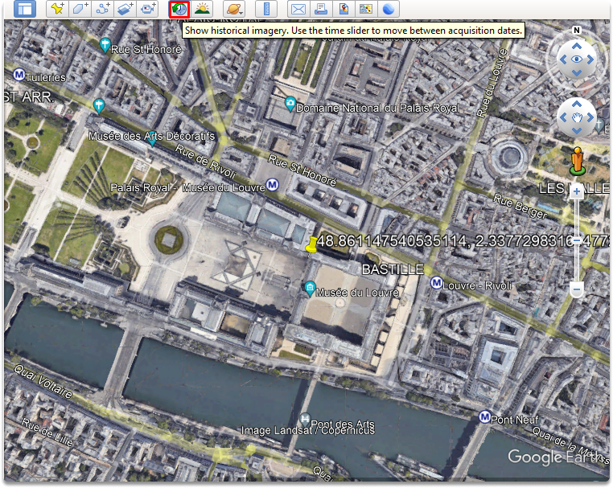
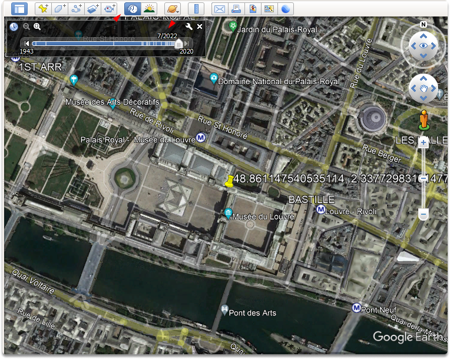
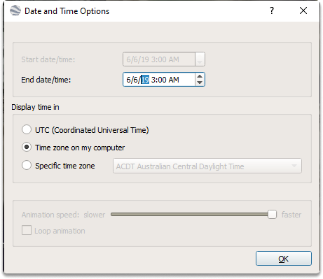
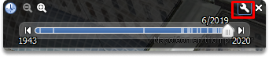
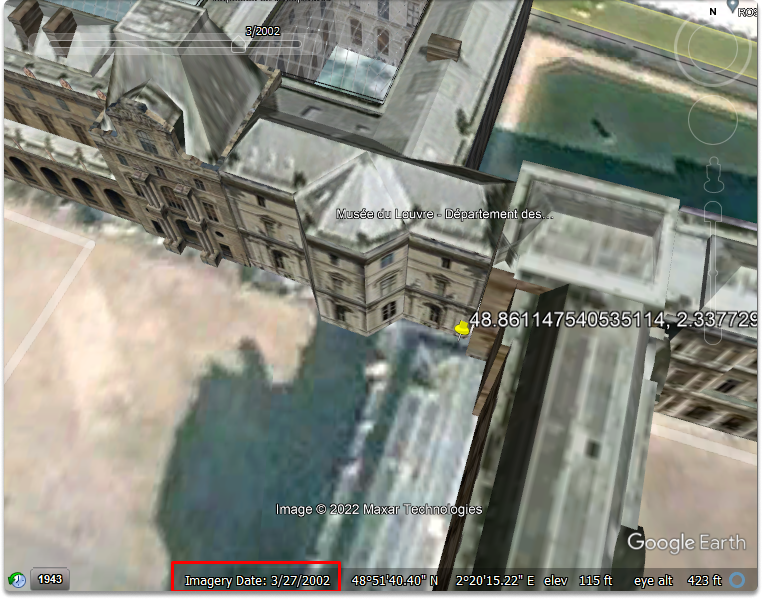
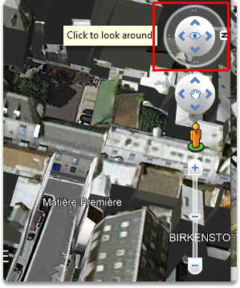
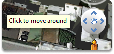
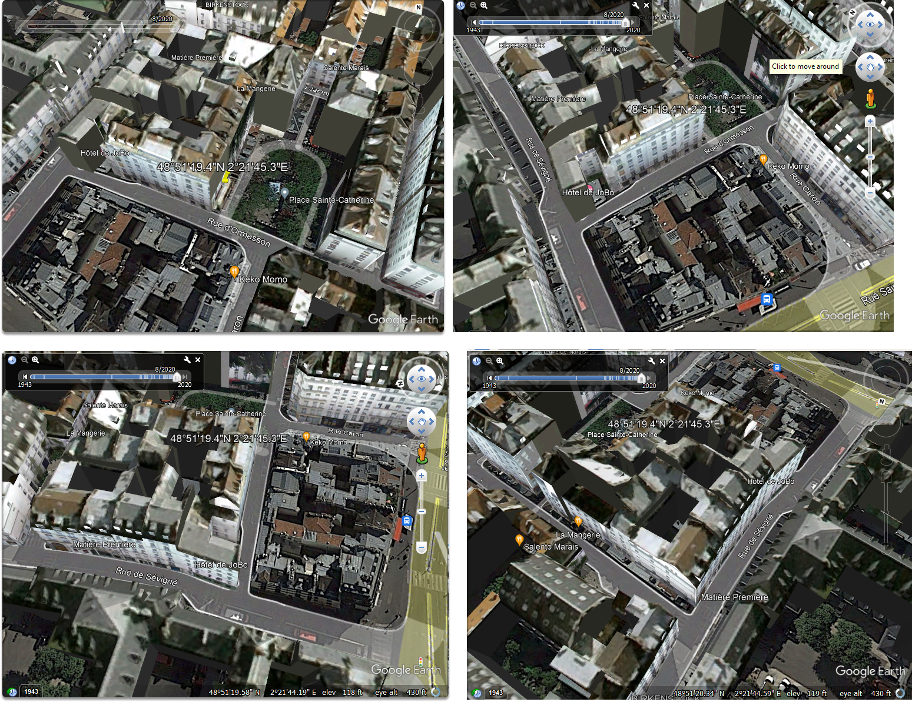
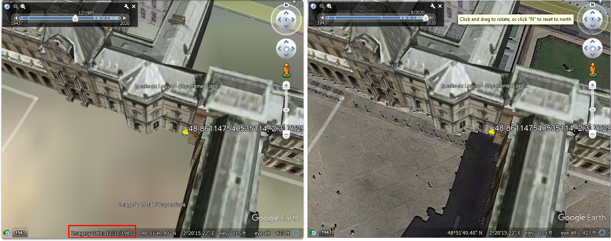
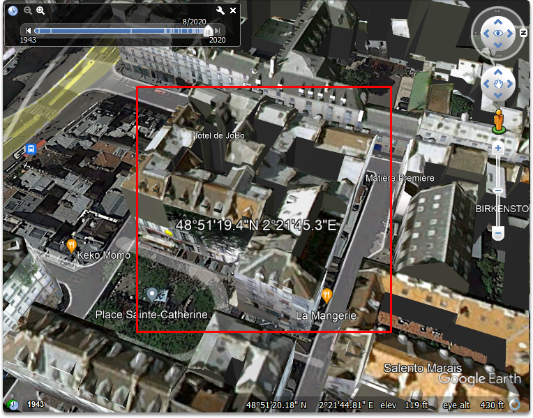

:orphan:
(google-earth-historical-imagery)=

# Google Earth Historical Imagery

In this blog post, we will explore Google Earth Pro’s Historical Imagery feature.

## What is Google Earth Historical Imagery?

The Historical Imagery option is another Google Earth feature that is sometimes ignored. You can access it by clicking the "clock" symbol in the application's upper menu bar (under the view menu). Clicking on the clock symbol will bring up a slider menu just beneath it. You can push back and forth this slider, which will result in a series of satellite photos of the target area captured at various intervals of time.

## Taking a look at the Historical Imagery

In a [previous blog post](introduction-to-google-earth), we searched our point of interest (POI) which was the coordinates of the Louvre Museum in Google Earth's search bar. Now let’s click on the clock symbol to access the slider and zoom in a little bit.

If you click on the little wrench icon, you can adjust the date and time.

The image has been updated to include the satellite image from March 27, 2002. The quality of images generally decreases as you travel further back in time, as shown in the following image, a satellite image obtained in 1985. This can assist in detecting changes in the targeted area, such as structure renovations, people, more automobiles, and terrain changes.

Let’s take a look at other coordinates which is the following:

`48°51'19.4"N 2°21'45.3`
Adjust the zoom-in slider to see the sides of our target building closely. By utilizing click to look around and click to move around features, we can identify the sides of a building.

We may match up diverse arguments, hints, and sources with varying perspectives provided through satellite photography by examining the building from different angles.

## What are the benefits of historical imagery?

When you try to match the features of a facility in photography or video to a satellite image, the location of the satellite when it captures an image may offer you one view of a side of a structure, and other photographs recorded at various times may give you a different perspective of the structure.

## Summary

In this blog post, we took a look at how we can use google earth's historical imagery feature. Utilizing prior versions of a target area on a timeline enables us to observe how these regions have evolved over time, which provides valuable information for our OSINT studies.

:::{seealso}
Want to learn practical Open-Source Intelligence skills? Enrol in MCSI’s [MOIS - Certified OSINT Expert Program](https://www.mosse-institute.com/certifications/mois-certified-osint-expert.html)
:::
