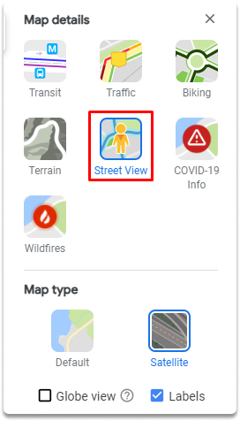

:orphan:
(hands-on-with-google-maps-performing-geospatial-osint)=

# Hands-on with Google Maps Performing Geospatial OSINT

This blog article will go through how to utilize Google Maps in detail with performing geolocating tasks.

**Task 1-)** Review the satellite imagery of the Louvre Museum on google maps.

For the first task, we open google maps and type Louvre Museum. Then we click the ‘Layers’ button to open up satellite imagery of the Louvre Museum to see the most recent imagery captured by a Google accessible satellite as you can see in the screenshot.

As a side note, Google Maps' search box may now take almost any form of input. A complete address, partial address, or GPS coordinates will bring up a mapped view right away. Our first stop is this search field.

**Task 2-)** Access the street view option on google maps

Street View allows you to access dynamic landscapes from various locations throughout the world's streets. The vast bulk of Street View imagery was acquired by vehicles outfitted with Street View cameras. We can access the menu as shown in the screenshots below.

**Task 3-)** Display Louvre Museum in satellite view.

As you can see in the screenshot, the satellite perspective provides a clear view from above, almost vertically down. Although the current directory is already satellite, screenshots are provided to give you a visual path.

**Task 4-)** Identify GPS coordinates of the Louvre Museum

We are continually looking for the GPS coordinates of our objective. By right-clicking on the place depicted in the picture, you may find the coordinates of the Louvre Museum.

**Task 5-)** Display the following coordinates in street view: 48.85996014115695, 2.333597234388914

You can copy and paste the coordinates on the google maps search bar and click enter.

**Task 6-)** Display the location’s the coordinates have any previous imagery on May 2016.

The historic Street View option is available within the conventional street-view layout in the upper left corner's search box. Click on the tiny clock which will allow you to manipulate a slider bar that displays several views. For archival purposes, the month and year of the image will also be shown.

**Task 7-)**Rotate the image 45 degrees left
Click the little rotation symbol when in street view. We can rotate the image 45 degrees left with one click. This feature provides new perspectives on your target.

## Final Words

Congratulations! Now you are familiar with performing a Geospatial OSINT with google maps.

:::{seealso}
Want to learn practical Open-Source Intelligence skills? Enrol in MCSI’s [MOIS - Certified OSINT Expert Program](https://www.mosse-institute.com/certifications/mois-certified-osint-expert.html)
:::
