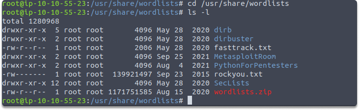
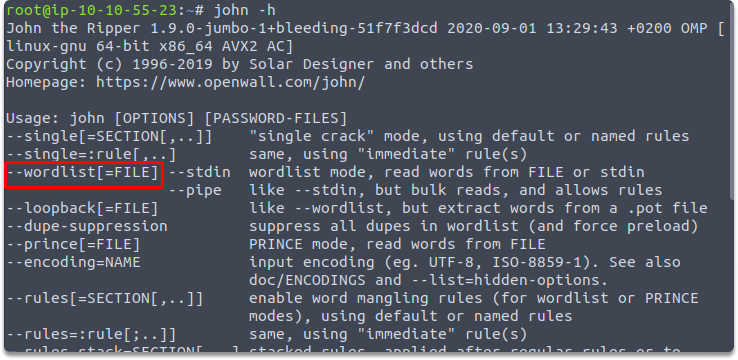
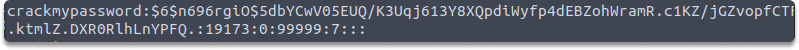
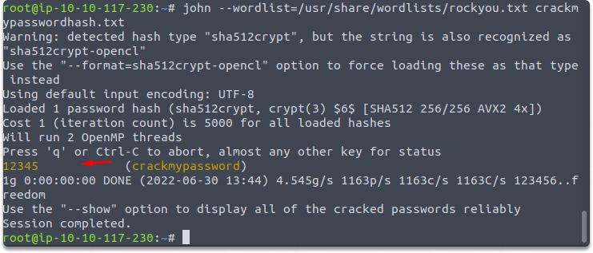

:orphan:
(hands-on-with-john-the-ripper-performing-a-basic-dictionary-attack)=

# Hands on with John the Ripper: Performing a Basic Dictionary Attack

In a [previous article](password-cracking-techniques-tools-and-protection-recommendations) we discussed techniques and tools used for cracking password. In this article, we provide a step-by-step guide to performing a dictionary attack with one of these commonly used tools, "John the Ripper".

**Task 1-** Display your current wordlists in your Kali.

As you already know Kali has several built-in wordlists and we have covered this concept in the previous blog pages. Let’s run the following commands to display current wordlists:

`cd /usr/share/wordlists`

`ls -l`

**Task 2-** What is the flag in John which enables you to read words from file?

We can learn this by running the following command:

`john -h`

**Task 3-** What is the password hash of the user `crackmypassword`.

We can display the hash of the specified use by running the following command:

`cat /etc/shadow`

**Task 4-** Save the password hash of the user `crackmypassword` in a .txt file and name it `crackmypasswordhash.txt`.

We can achieve this in many ways such as running the following commands:

First copy the hash of the specified user and run `vi crackmypasswordhash.txt`

Now we have both a dictionary and a target password hash.

**A quick look at John syntax**

Now let’s have a look at John’s Syntax:

`john [options] [path to file]`

John needs options that should be followed by the path to the name of the file if it is not in the same directory.

- Defining the flag:`--wordlist=/usr/share/wordlists/rockyou.txt`

- Invoking John: `john`,
- Specifying file: `[path to file]` is the file or path including the hash you're targeting. However, if it's in the same directory you won't need to name a path, file name is sufficient.

**Task 5-** What is the password of user `crackmypassword`?

We are going to use `rockyou.txt` as a dictionary. So the whole command would look like the following:

`john --wordlist=/usr/share/wordlists/rockyou.txt crackmypasswordhash.txt`

The screenshot below demonstrates how John the Ripper was able to detect the password hash from the rockyou.txt wordlist. While employing a directory-based attack with a wordlist is, we can only be successful if the password exists in the wordlist. Since this is a super easy one we did not need any other wordlist to recover the password.

**Final Words**

Congratulations! Now you know how to perform a basic dictionary-based attack with John.

> **Looking to expand your knowledge of penetration testing? Check out our online course, [MPT - Certified Penetration Tester](https://www.mosse-institute.com/certifications/mpt-certified-penetration-tester.html)**
