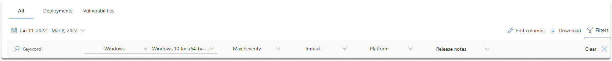
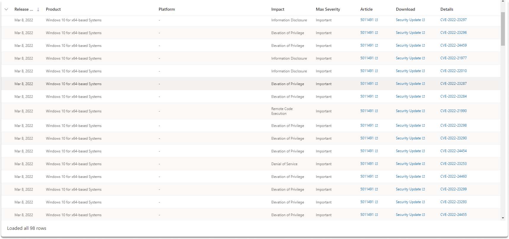
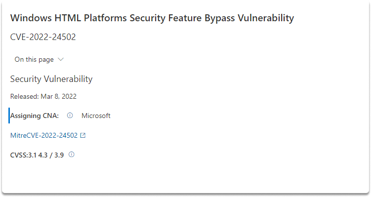
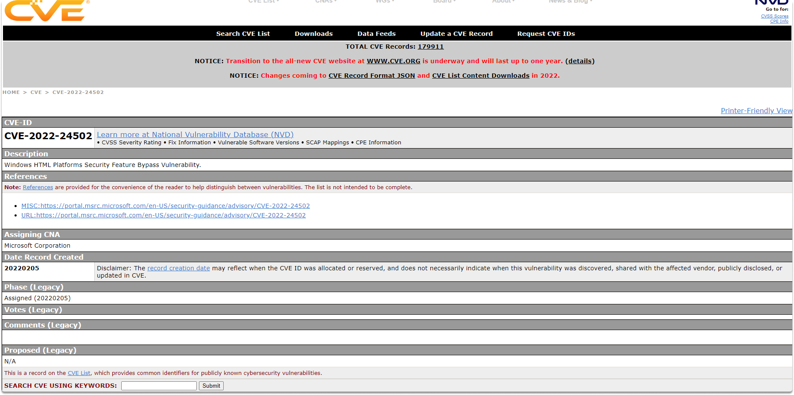
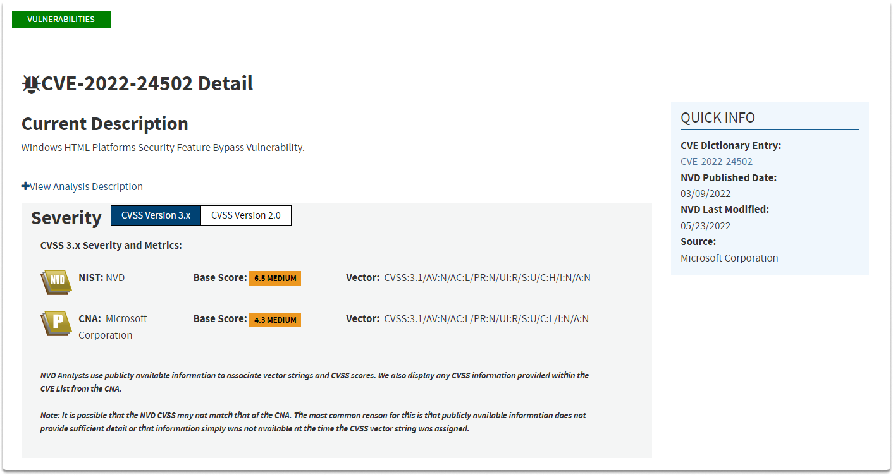
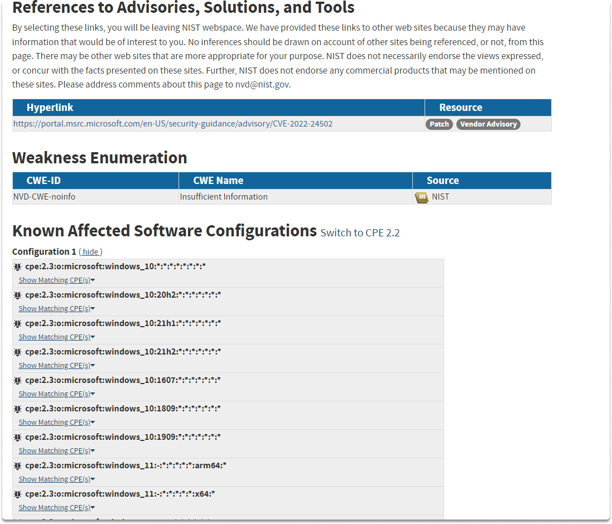

:orphan:
(how-to-collect-information-about-a-microsoft-vulnerability)=

# How to Collect Information about a Microsoft Vulnerability

In this blog post, we will cover which sources we can utilize to collect information about the most current vulnerabilities of Microsoft. Let’s start by explaining what is the Update Tuesday.

## What is Update Tuesday?

Microsoft offers monthly fixes for Windows-based products and other Microsoft tools on a specific day which is known as patch Tuesday. Another name for Patch Tuesday is Update Tuesday and it corresponds to the second Tuesday of every month.

As a basic element of vulnerability management in Windows, you can start with tracking Patch Tuesday releases on MSRC and on many online platforms.

Microsoft security updates are available on the following website:

`https://portal.msrc. microsoft.com/en-us/security-guidance`

## MSRC - Microsoft Security Response Center

In MSRC you can find examinations of all reportings of any security flaws in Microsoft products and services.

As illustrated in the images below, you will receive a list of all discovered vulnerabilities from a product (which you specify) within a defined time frame, as well as other filtering options.

Let's look at the current risk profile of Windows x64-based computers. As you can see, we restricted the query results to our parameters and discovered 98 new vulnerabilities between January 11 and March 8, 2022.

When reviewing the updates required for your Windows computers, you will note that each one has a unique identification that begins with **CVE-**. Let us look at what CVE is.

## Common Vulnerabilities and Exposures (CVE)

Common Vulnerabilities and Exposures (which is abbreviated as CVE), is the mainstream technology that you can utilize in vulnerability management. CVE allows for the cataloging and distinguishing of flaws from a single source. It simply describes publicly disclosed flaws and exposures.

When you click on the Windows HTML Platforms Security Feature Bypass Vulnerability CVE, you are brought to the CVE - The MITRE Corporation as shown in the screenshot.

## The National Vulnerability Database (NVD)

NVD is another supplemental source for vulnerability management. The NVD is synchronized with the CVE to guarantee that the most recent changes are available in its database.

If you click on _Learn more at National Vulnerability Database (NVD)_, you can find out more information about the vulnerability as you can see in the following images.

## Conclusion

When you find a threat, it is critical that you understand where to get details about a weakness. You should also be aware of any relevant resources so that you may train yourself on what is necessary to remedy any vulnerabilities.

After reading this blog, you have now gained an understanding of where you can find information about the most recent Microsoft vulnerabilities as well as the corresponding security updates.

:::{seealso}
Looking to expand your knowledge of vulnerability research and exploitation? Check out our online course, [MVRE - Certified Vulnerability Researcher and Exploitation Specialist](https://www.mosse-institute.com/certifications/mvre-vulnerability-researcher-and-exploitation-specialist.html)
::: In this course, you'll learn about the different aspects of software exploitation and how to put them into practice.**
