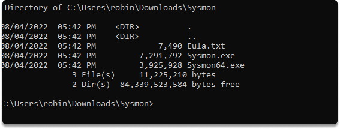
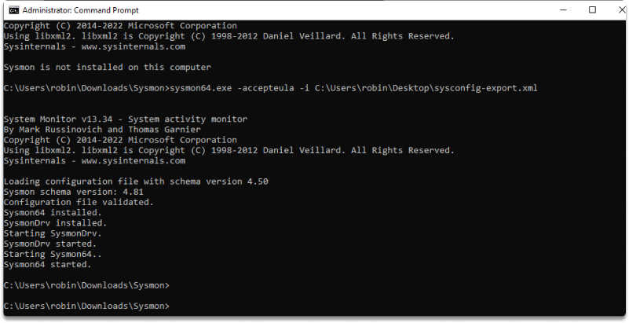
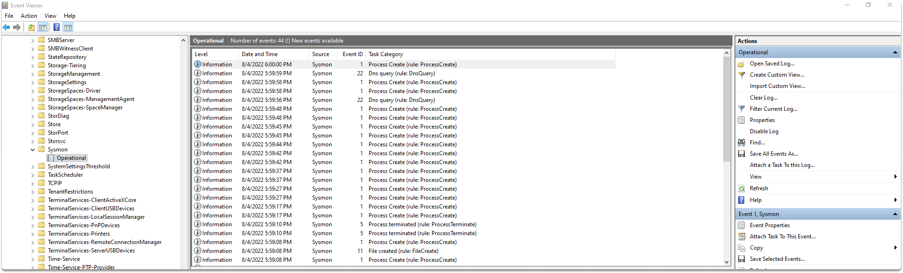
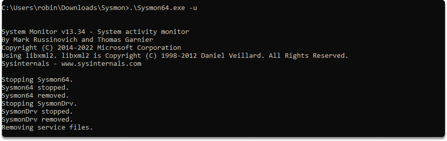
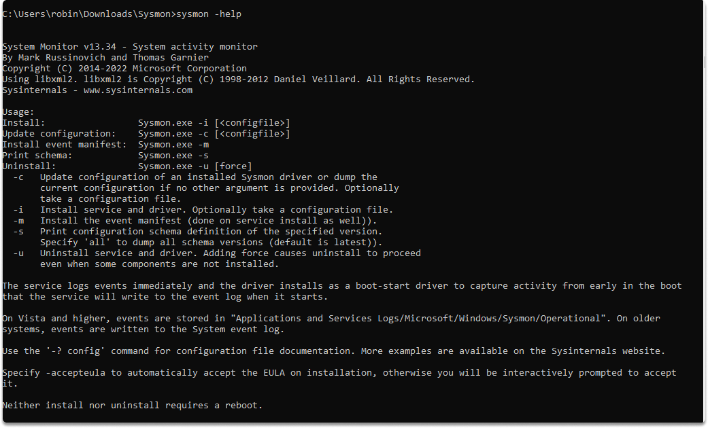

:orphan:
(how-to-install-and-set-up-sysmon-for-windows-endpoint-devices)=

# How to Install and Set up Sysmon for Windows Endpoint Devices

Sysmon is a component of the Microsoft Sysinternals Suite that runs as a kernel driver and may monitor and report on system events. Businesses frequently utilize it as part of their tracking and logging systems.

## What is Sysmon?

Windows System Monitor (which is abbreviated as sysmon) provides for the selective recording and tracking of detailed Windows system operations. Sysmon can capture a diverse range of information from Windows, such as the following:

- process operations/hashes of ongoing processes,
- network connections,
- file access,
- binary image imports,
- driver load and unloading,
- raw disk accesses,
- registry modifications, and other activities.

Once installed, sysmon will track and record system activities to the Windows event log throughout system restarts.

You may spot malicious or unusual behavior and comprehend how attackers and malware behave on your system by capturing and analyzing the events it creates using Windows Event Collection or various SIEM agents.

## How to install Sysmon on our endpoint device?

Sysmon installation involves downloading the binaries from the Microsoft website. You may also use a PowerShell script to get all of the Sysinternals utilities. We are going to use the `sysmon-config` file from the _SwiftOnSecurity_ GitHub repo as an example config file.

You can download the Sysmon binaries from the following resources:

- The Microsoft Sysinternals website.
- Microsoft Sysinternal Suite
- via a PowerShell module

**Installing and configuring Sysmon step by step**

**Step 1-)** Let’s download sysmon from the following site: https://docs.microsoft.com/en-us/sysinternals/downloads/sysinternals-suite.

**Step 2-)** As a second step download a Sysmon configuration `.xml` file (unless you have developed your own) from the following repository: https://github.com/SwiftOnSecurity/sysmon-config

As you will see we will download SwiftOnSecurity configuration. After you locate the repo, click on raw, and lastly right click and save on your endpoint device the `.xml` file.

_A Sysmon configuration will provide more precise control over logs and more comprehensive event tracking._

**Step 3-)** On a 64-bit system, open cmd with admin rights, browse to the location where you saved Sysmon and run the following code:

`sysmon64.exe -accepteula -i C:\path of sysmonconfig-export.xml`

`-accepteula`: To prevent a popup box when it begins, you can use it to automatically accept the conditions of use.

**Step 4-)** Run the following commands to check the current set up in the active sysmon instance:

`sysmon -c`

**Step 5-)** Let’s monitor the events. Hold `cmd` + `r` and type `eventvwr` to start event viewer.

Go to _Applications and Services Logs/Microsoft/Windows/Sysmon/Operational_

You can stop sysmon with the following command in the directory of the `.exe file`:

`sysmon -u`

Additionally you can display help options to explore further operations:

## Conclusion

When you want to increase the endpoint logging of your Windows systems to catch possible malware, a great solution for this is Sysmon. You can use sysmon-generated data to debug issues and/or look for suspicious activity. By completion of this blog post, you should be able to instal and setup sysmon to monitor your endpoint device successfully.

**References:**

[Configure Windows endpoints IBM QRadar Docs](https://www.ibm.com/docs/en/qradar-common?topic=endpoint-configure-windows-endpoints)

:::{seealso}
Do you want to get practical skills to work in cybersecurity or advance your career? Enrol in [MCSI Bootcamps](https://www.mosse-institute.com/bootcamps.html)
:::
