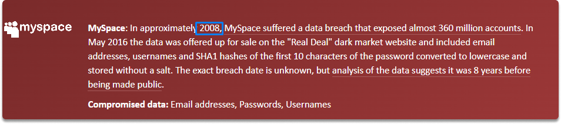

:orphan:
(identifying-breached-emails-with-have-i-been-pwned)=

# Identifying Breached Emails with Have I been Pwned

Once we acquire an email account during an OSINT research one of the first things is to find out if it is dumped before. If it is, we can get valuable intelligence about our target. In this blog post, we are going to learn how we can find out if an email address is breached/leaked before.

## Introduction

In our previous blog post, we learned how we can find an email or email pattern of our POI via various tools such as Hunter.io. Now we can take a look at how we can find out whether an email address is leaked or not.

### What are breached data repository websites?

These websites maintain a list of websites that have previously experienced a data breach. When a website experiences a data breach, numerous registered user credentials such as usernames, passwords, and phone numbers are frequently made public. Because users tend to use the same passwords on numerous websites, knowing one password may allow access to certain other social accounts/services belonging to the same individual.

## Identifying breach

Let’s say we have the following email address: john.doe@microsoft.com.

We want to gather some intelligence such as the following:

- Is this email address is valid?
- What are the interests?
- Is it breached before?
- What may be the earliest year this email can date back to?

### What is Have I been Pwned website?

_Have I Been Pwned_ compiles a list of credentials that have already been disclosed in data leaks. You can use this site to check a target e-mail account or the password itself to see if it exists in plain text on any publicly available password dump list.

Copy and paste the email you want to check as shown in the following image.

When you look at the results, you can see that the email address has been pwned in 13 data breaches.

When you scroll down the page, you can see compromised websites.

Some of the websites registered with john.doe@microsoft.com are the following: Adobe, Apollo, Dailymotion, Data Enrichment Exposure From PDL Customer, and so on. You can also see that our POI has also joined MySpace, Gravatar, and MyHeritage.

What do we learn from this OSINT research?

- john.doe@microsoft.com is a real-world email address and it has been registered with many websites.
- This email is from at least 2008.

- We can also identify the interests, and what information the account is linked to. For each service, various information is linked to the email which you can learn by looking at the compromised data section as shown in the image.

## Conclusion

By the completion of this blog page, we have learned that we can find various intelligence during email breach research. We have also performed breached email OSINT via one of the Have I been Pwned.

:::{seealso}
Want to learn practical Open-Source Intelligence skills? Enrol in MCSI’s [MOIS - Certified OSINT Expert Program](https://www.mosse-institute.com/certifications/mois-certified-osint-expert.html)
:::
