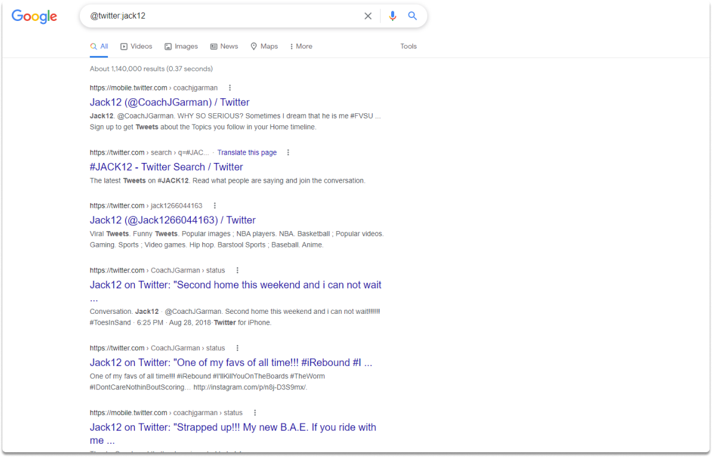
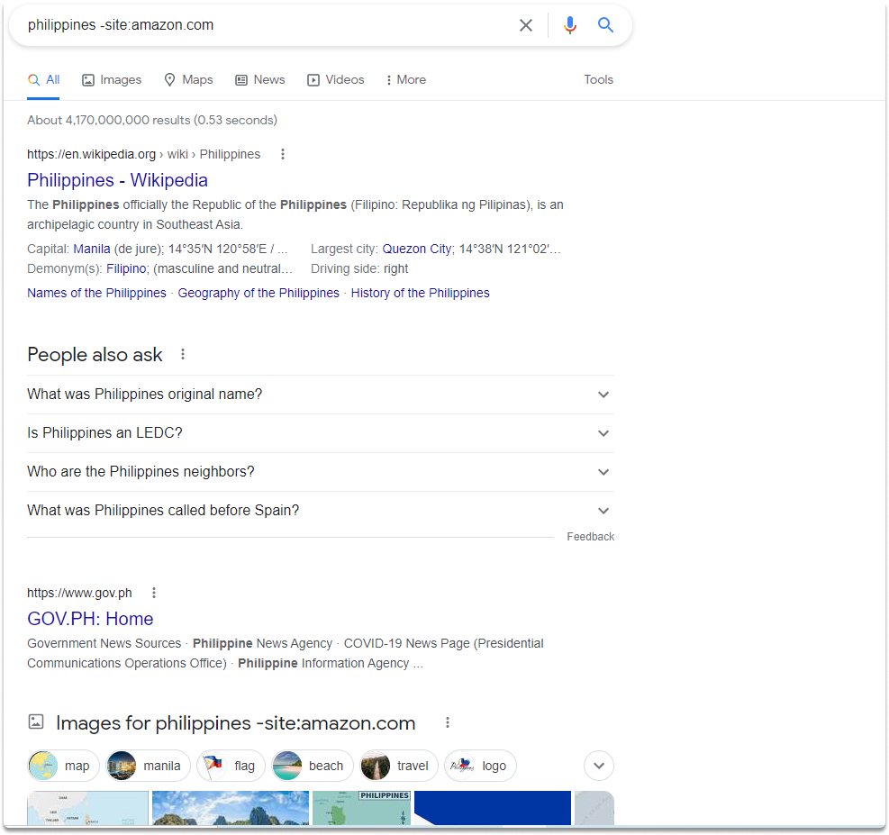
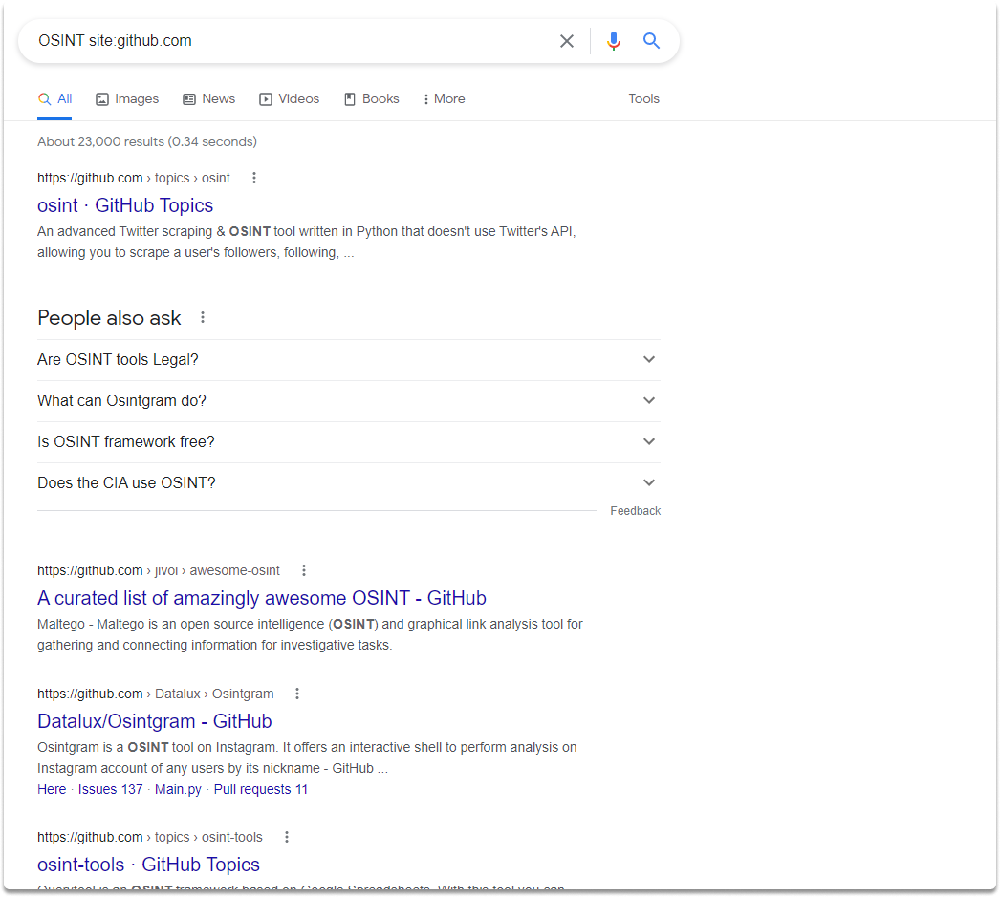
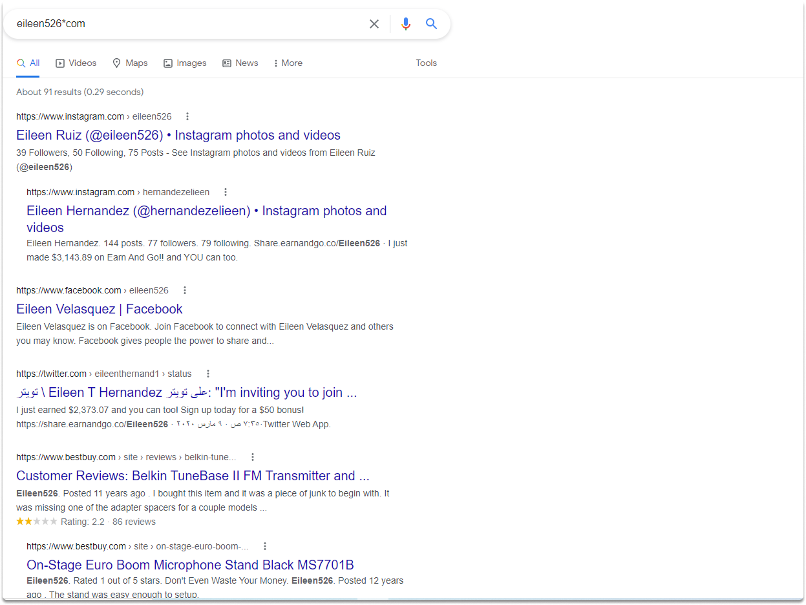
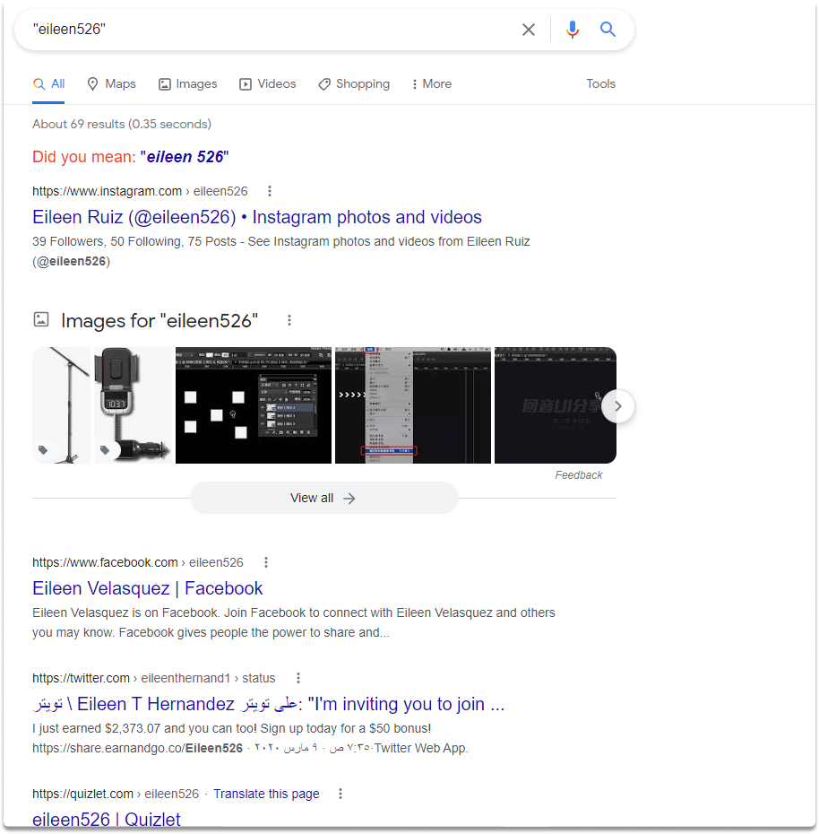
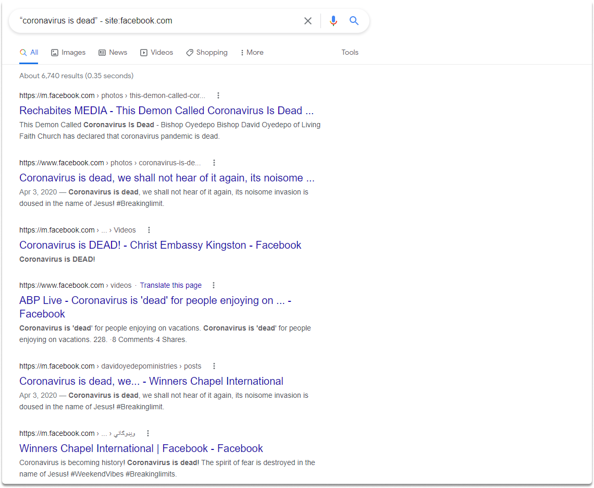

:orphan:
(improving-search-results-with-google-keywords)=

# Improving Search Results with Google Keywords

In this blog article, we will learn how to improve a basic search using Google keywords for improved results.

Let's look at how various Google keywords may be used for result optimization.

**Task 1-** Search for the jack12 account on Twitter.

We can accomplish the first task by typing the following search term into the Google search bar:

You can search an account name within the social media site you specify with `@`. Then add : (without a space) and follow by typing the account name as in the example.

`@twitter:jack12`

**Task 2-** display the Google search results for the Philippines excluding only amazon.

You can display the search results from Google while excluding any results from amazon by running the following search term.

`philippines -site:amazon.com`

Simply place a minus (-) sign in front of the term (s) you wish to remove, as seen in the example.

**Task 3-** Display for OSINT keyword results only on github.com

We can utilize the `site:` operator for this task. 'Site:' enables us to do a Google search that only shows matches from the specified site. The preceding query will only provide github.com query results for the term OSINT.

`OSINT site:github.com`

**Task 4-** You want to collect information about a user. While analyzing the EXIF data you found a username in the copyright section. Search for the username `eileen526` to identify if there are any associated email addresses.

While a search for eileen526 may produce additional sites where the username appears online, by using the Wildcard Operator and looking for eileen526\*com, we can instead identify if any email addresses that utilize the username as the ID exist publicly online.

`eileen526*com`

You can use the asterisk (\*) to replace unknown keywords, and characters while searching.

**Task 5-** Search for eileen526 and narrow the search results in a way to exactly match it.

You can achieve this with quotation marks(“ “). You can wrap your search keyword with quotation marks to narrow down the results to exactly match it as shown in the screenshot.

**Task 6-** You want to collect information about a tweet which is coronavirus is dead. You want to see if there are any Facebook posts that have this exact phrase.

Upon completion of this blog post we have learned that we can combine some operators to achieve this such as site: and “ “.

“coronavirus is dead” - site:facebook.com

With this search, you will be able to identify if the exact term “coronavirus is dead” is used by other social media platform user accounts such as Facebook.

:::{seealso}
Want to learn practical Open-Source Intelligence skills? Enrol in MCSI’s [MOIS - Certified OSINT Expert Program](https://www.mosse-institute.com/certifications/mois-certified-osint-expert.html)
:::
