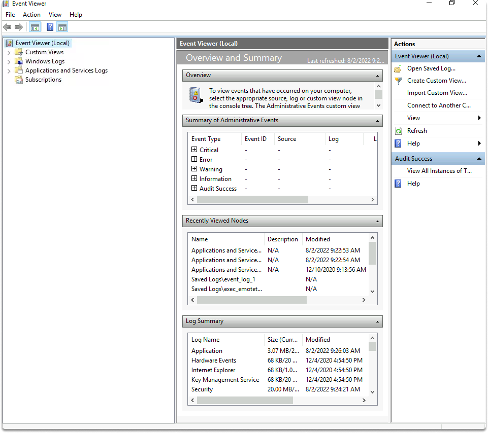

:orphan:
(introduction-to-event-logs-in-windows)=

# Introduction to Event Logs in Windows

Windows logs include a plethora of structured data from many log sources. Event logs capture events that occur during system execution to analyze system activity and troubleshoot faults. This blog article will teach you about common logs and how to examine crucial events in your system.

## Event Viewer in Windows

Events may be examined using both command-line PowerShell and the GUI Event Viewer. When you launch the Event Viewer, you'll see many event source categories:

- Custom Views: In this area, you may design views to aggregate different events in one location.

- Windows Event Logs: This section contains system events.

- Applications and Services Logs: Everything else's events are recorded in logs.
- Various suppliers, such as Application and Security, can be found in the last two categories.

## Taking a look at common events in Event Viewer

Let's begin by launching the event viewer with the following commands:
Hold down the `Windows key` and type `eventvwr`. If the search bar isn't visible, you may also make it visible by right-clicking the taskbar/search and selecting the show search box.

There are several events that might eventually end up in the event log. Here are some of the most prevalent.

**4723 and 4724 are the event IDs**

The first event we will examine is the password change event.
The event IDs for password change are 4723 and 4724. This event happens whenever an account's password is updated. They may be found under Windows Logs/Security. You may also use the Filter Current Log to create a filter for the event IDs. Let's put them on show.

We proceeded to Windows Logs/Security and put up a filter for the event IDs 4723 and 4724, as shown in the screenshots.

**Event ID 4720-User Account Setup**

When a new account is established, the User Account creation event ID 4720 is generated. Analyzing 4720 ID records might help you figure out who established an account and when.

We specified event ID and identified two events with event ID 4720, as shown in the figure below.

**Event ID 4728, 4732, 4756-User Added to Group**

There are additional events that occur when a user is added to a group (4728, 4732, and 4756).

**Firewall in Windows**

Windows Firewall events display adjustments to the firewall. You can examine these events for firewall configuration errors or illegal modifications. You can find firewall events in Applications and Services Logs/ Microsoft/Windows/Windows Firewall With Advanced Security and Firewall.

Registry Events

If you searched the event log for registry-related events, you would find none! This is due to the fact that many types of events, including registry events, are not reported by default. Logging for these events, however, can be enabled under the Local Security Policy. For example, you can audit privilege use by checking success and failure as you can see in the images.

You can access local policies by typing local on the search bar local security policy and find registry events on Local Policies/Audit Policy.

> **Do you want to get practical skills to work in cybersecurity or advance your career? Enrol in [MCSI Bootcamps](https://www.mosse-institute.com/bootcamps.html)!**
