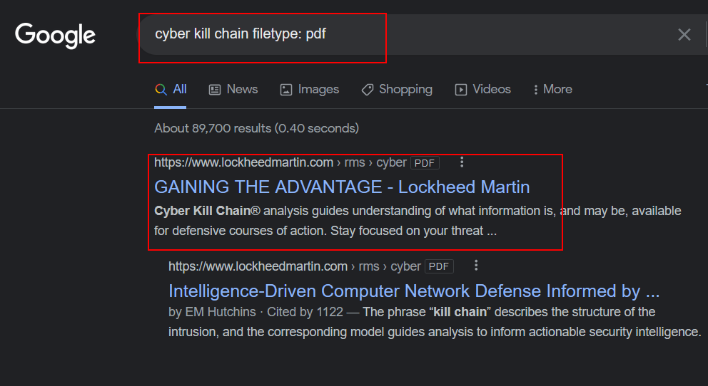
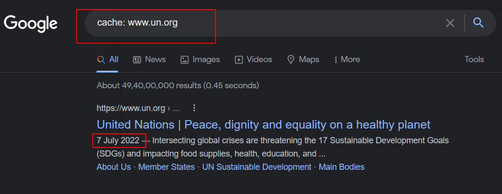
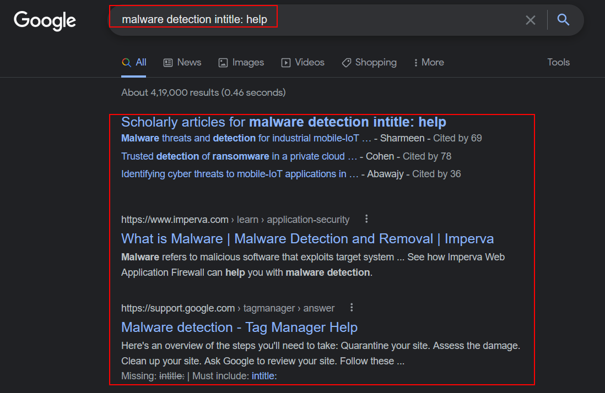
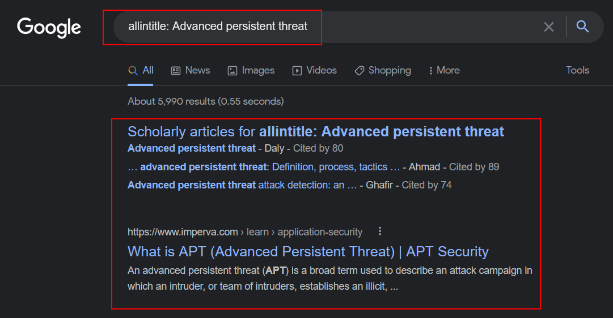
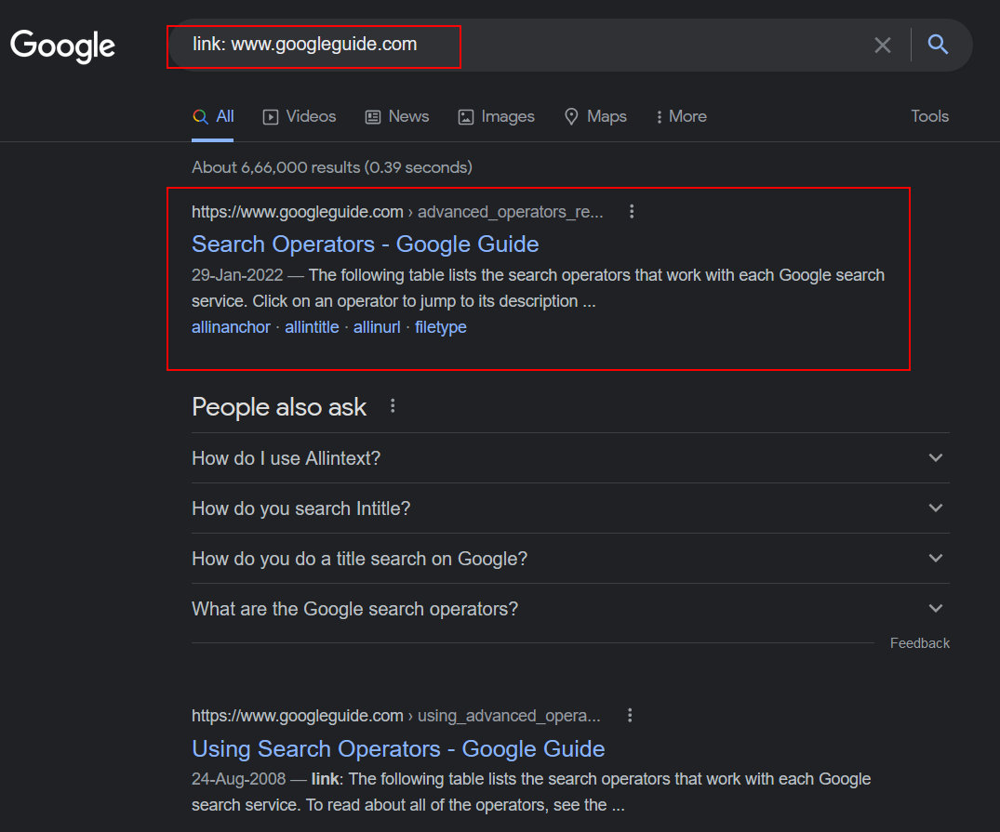

:orphan:
(introduction-to-google-dorking)=
# Introduction to Google Dorking
 
Search engines are the primary source of information on the Internet,  search engines can be crucial in providing Key Information about a target organization. Search engines have automated scanners known as crawlers, which crawl any active website on the internet and append the information retrieved to the search engine index. When a user enters a query the search engine index returns a list of pages. Many search engines out there allow advanced search options in which the user can extract target-specific information such as login pages and Organization details.

One such Search Engine which allows Advanced search operations is GOOGLE.

## Different types of operators

*In this article let us look at different types of search engine operators and their uses.*

### Site

This operator can be used to restrict the search results for one specific organization or domain.

`Syntax: query site:www.domain.com`

`Example: login site:www.facebook.com`

In the above example, we can see that the user intends to find the pages with the keyword login for the domain www.facebook.com

### Filetype

This operator allows the user to search for pages or files with the specified file extension. 

`Syntax: query filetype:<file extension>`

`Example: cyber kill chain filetype: pdf`

In the above example, the user intends to find all the pages/flies with the keyword cyber kill chain with the file type PDF.

### Cache

This operator displays the cached version of the web page instead of the present active version.

`Syntax : cache:<domain>`

`Example : Cache: www.un.org`

In the above image, we can see that the user intends to find the previously cached version of the website by the crawler instead of the current version

### Intitle

This operator is used to restrict the search results to the pages which has the specified search query in the title.

`Syntax : query intitle: <query>`

`Example: malware detection intitle: help`

In the above image, we can see that the user intends to find all the pages which have the search query malware detection and has the keyword help in its title.

### Allintitle

This operator restricts the search results to only those pages which contain all the query terms in its title. 

`Syntax: allintitle: query`

`Example: allintitle: Advanced persistent threat`

We can see in the image above that the user gets the pages that contain the word “Advanced”, “persistent” and “Threat” in their title.

### Link

This operator is used to search for web pages or pages that have the link given as a search query in their domain.

`Syntax: link: <domain>`

`Example: link: www.googleguide.com`

In the above image, we can see that the pages with the link given by the user are displayed. 

## Final words:

Google Dorking can be used for both good and bad. It can be used to find information that is normally difficult to find. It can also be used to find vulnerabilities in systems that can be exploited.

:::{seealso}
Want to learn practical Open-Source Intelligence skills? Enrol in MCSI’s [MOIS - Certified OSINT Expert Program](https://www.mosse-institute.com/certifications/mois-certified-osint-expert.html)
:::