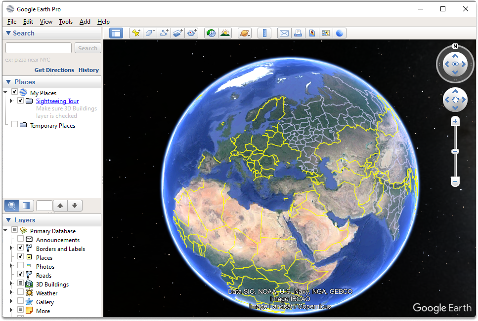
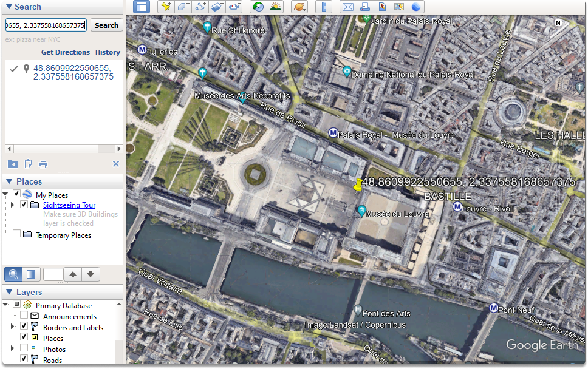
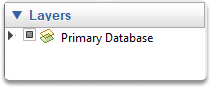
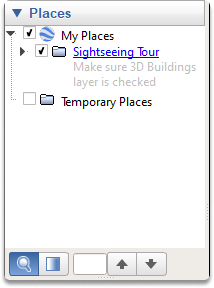
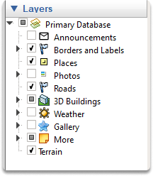
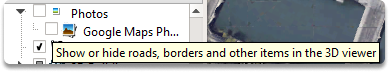
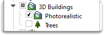
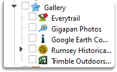

:orphan:
(introduction-to-google-earth)=

# Introduction to Google Earth

Google Earth is a powerful tool for conducting OSINT (open-source intelligence) investigations. The platform enables users to view satellite imagery, terrain, street maps, and even 3D buildings in any location around the world. Google Earth also offers a time-lapse feature that allows users to see how a particular location has changed over time. This can be an invaluable tool for investigators looking to track down leads or piece together a timeline of events. In this blog post, we'll introduce you to the basics of using Google Earth for OSINT investigations.

## Introduction

Geolocation is a way of confirming the location of a picture by comparing landmarks and characteristics visible in photographs or videos to other images, most often satellite photography.

## What is Google Earth Pro?

For many studies, Google Earth has become a critical tool for confirming videos and pictures, as well as playing an important part in the geolocation phase of OSINT research. Google Earth Pro is simply a stand-alone program that enhances Google Maps data. It provides access to satellite imagery from throughout the world, which is a valuable resource in geolocation. It also includes a number of additional handy features that might help with verification which we will cover in future blog posts.

Now for this blog's introductory purposes, let's take a quick look at the Google Earth interface.

## Starting with Google Earth

The initial stage in the application is to type your point of interest (which can also be abbreviated as POI) in the search bar. You can achieve this by entering the location or GPS coordinates in the upper left search area.

Let's say that we have specific coordinates of our POI. We entered the following coordinates in the search bar:
`48.8609922550655, 2.337558168657375`

These coordinates belong to the Louvre Museum. Since we have identified our target place and adjusted the zoom level, now we’re ready to begin adding layers.

By default, you will only view the location's satellite images.

The left-hand menu has choices for adding new material to this view. The final box in this menu is labeled "Layers." This menu has many data sets that may be activated and removed by clicking the checkbox next to each.

As you can see in the below screenshot, the primary database holds all the layers.

## Taking a look at the Layers

Let’s have a look at the layers section:

The photos section shows digital visuals that are shared on social networking sites.

The roads section displays the textual details of the roads such as road names.

3D Building offers additional 3D viewpoints of different locations

And gallery holds materials submitted by consumers such as YouTube videos.

## Conclusion

Upon completion of this blog post, now you're familiar with how to start with Google Earth. Google Earth is one of the tools that you may want to be familiar with if you're performing OSINT studies.

:::{seealso}
Want to learn practical Open-Source Intelligence skills? Enrol in MCSI’s [MOIS - Certified OSINT Expert Program](https://www.mosse-institute.com/certifications/mois-certified-osint-expert.html)
:::
