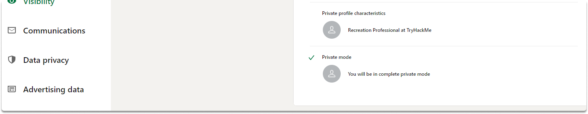
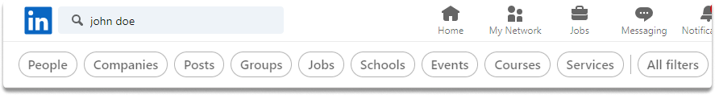
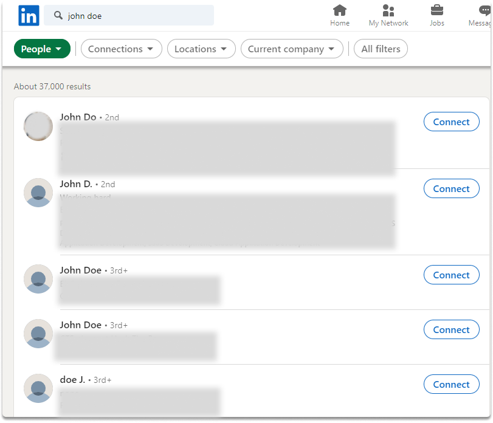
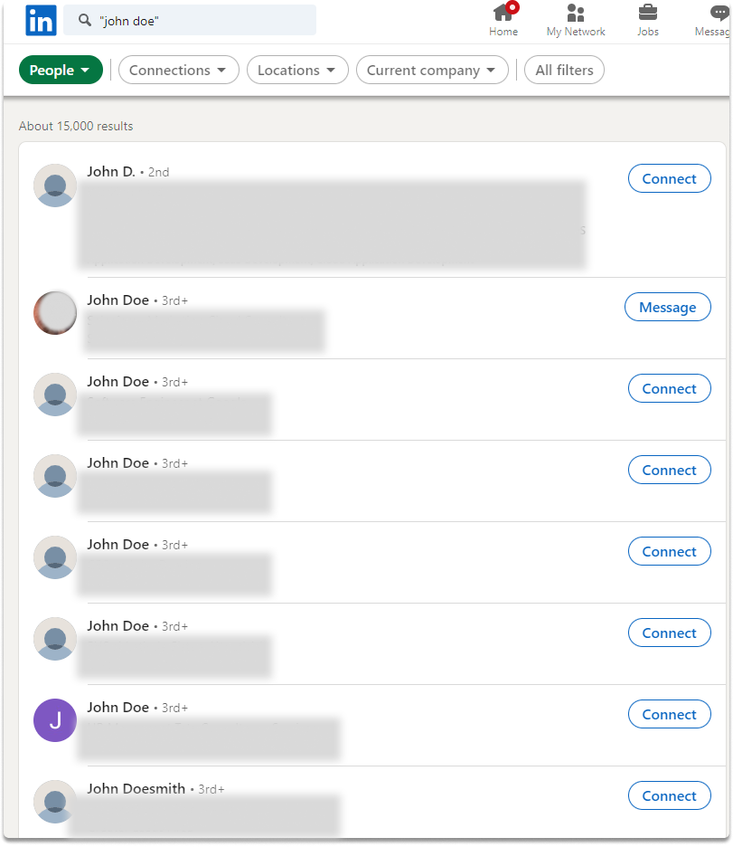

:orphan:
(introduction-to-linkedin-social-media-osint)=

# Introduction to LinkedIn Social Media OSINT

LinkedIn is the most widely used business-related social networking site in the modern world. Before viewing any data, users must first register a free profile on the site. To search for a name, just type the target's name into the search box and press the enter key. The target's employer, location, profession, and photo should then appear on the search result. After locating the correct target, clicking the name will take you to that user's profile. In this article, we'll look at how to improve our Linkedin people search and how to fine-tune our covert OSINT account settings.

## Introduction

Having your target's true name will be extremely useful during a social media OSINT. Assume you have a full name and wish to conduct business-related research on your subject. First and foremost, you must register a Linkedin account. Although we will explore a strategy that allows you to do research without registering an account on our next blog page, let's assume you or your company has a dedicated LinkedIn account for OSINT purposes.

## Creating a LinkedIn account for OSINT

Similar to any social network, you should create a simple account with as little data as possible. You may also wish to conceal your behavior to prevent unwanted attention.

**step 1)** Simply navigate to Settings > Privacy.

**step 2)** Select visibility.

**step 3)** Select profile viewing choices.

**step 4)** Finally, pick private mode.

When you utilize this anonymous user mode, your identity is not revealed to other LinkedIn members when you visit their profile. The disadvantage of your private account is that you cannot see who is visiting your profile.

**Taking a general look at Linkedin Search**

Any page's search area allows you to do a search using an actual name, firm, region, or position. These searches frequently provide several results that identify multiple persons. The upper center area of every search result page will provide some basic improvements to the search, such as the ability to filter by People, Posts, Companies, Groups, Jobs, Schools, and Events.

## Linkedin People Search

People Filter is the most used filter for displaying people's profiles. Because we're interested in the people section, let's limit our search terms to people.

Although the search is limited to people, we notice some results with the terms "John" and "Doe" in their job title or location. To eliminate these results, we modify the search by putting quotes around our search words. So, update the search to "John Doe" with quotes and press the enter key.

We may now see the precise match of "John Doe" results.

## Conclusion

All LinkedIn sites urge you to log in if you do not have an existing account. This can be a problem if you don't have an account or if your department's regulations forbid you from using any login credentials such as email, or phone number during an OSINT research.

**_Next_**

In the [next blog page](circumventing-linkedin-login-prompt-for-anonymous-osint), we will take a look at how we can research a person on Linkedin without an active account.

> **Want to learn practical Open-Source Intelligence skills? Enrol in MCSI’s [MOIS - Certified OSINT Expert Program](https://www.mosse-institute.com/certifications/mois-certified-osint-expert.html)**
