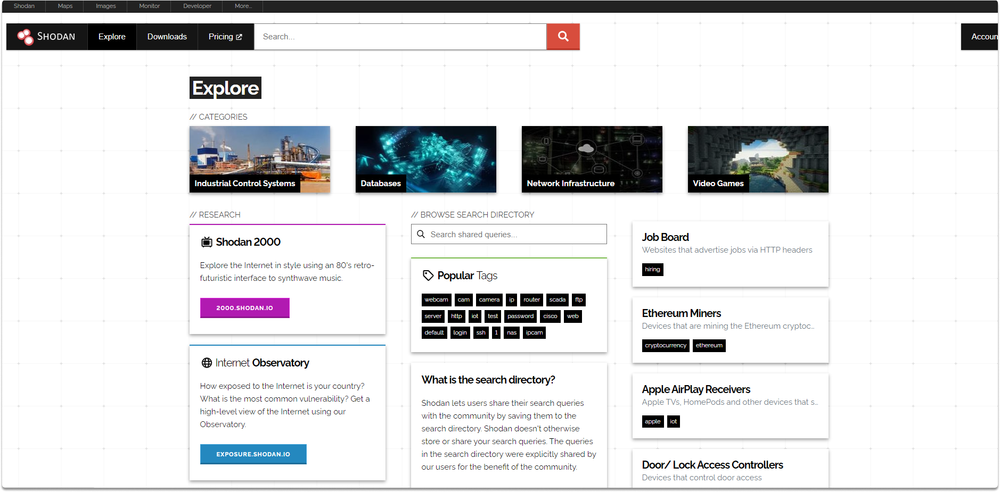
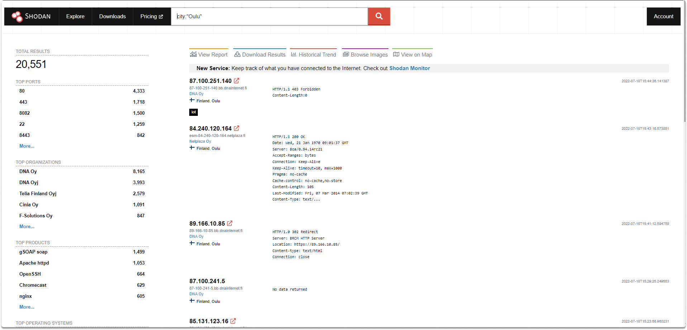
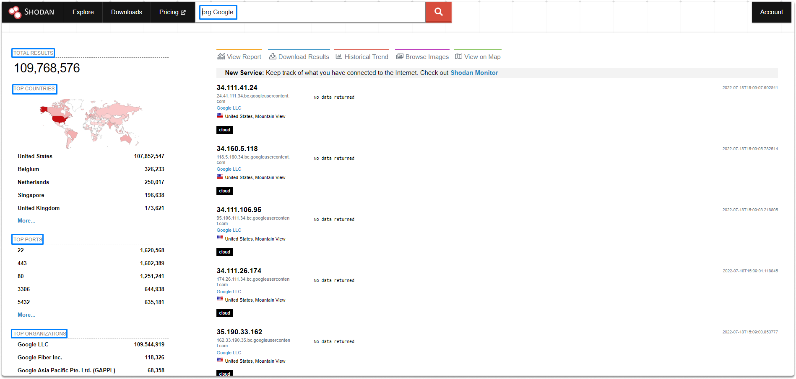
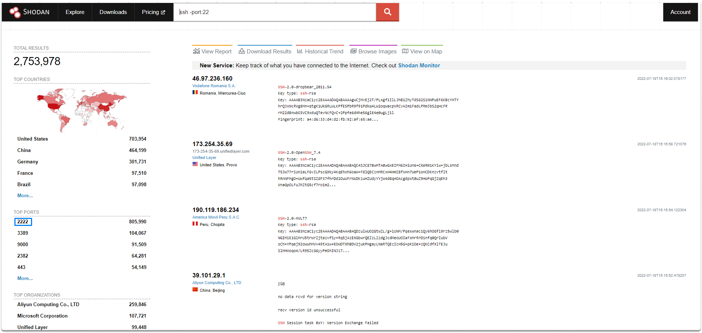
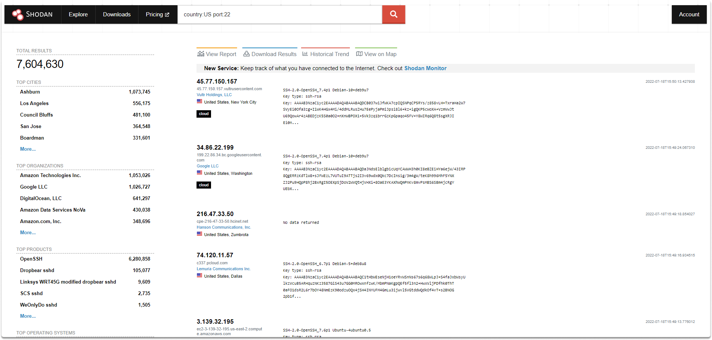
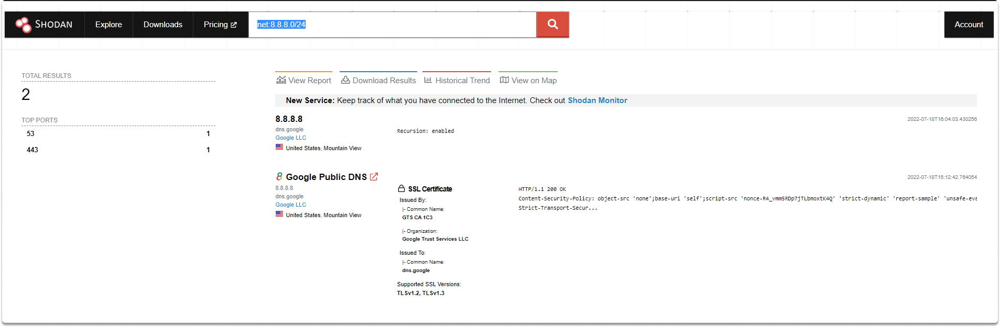
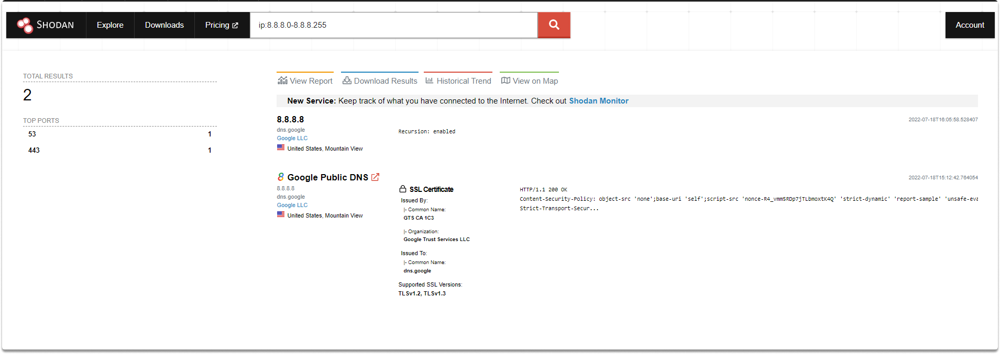
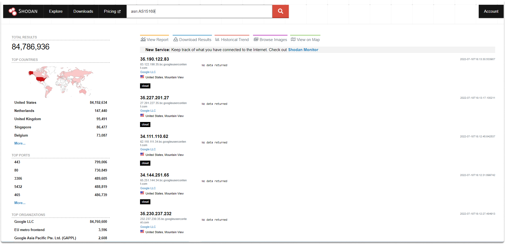

:orphan:
(introduction-to-shodan)=

# Introduction to Shodan

Shodan (which is an abbreviation of Sentient Hyper-Optimized Data Access Network) is a smart search engine that excels in discovering where Internet-connected devices are placed and who is utilizing them. Shodan gathers information primarily over the following ports: HTTP, FTP, SSH, Telnet), and SNMP. Shodan enables both consumers and businesses to safeguard their IoT devices by determining which ones are susceptible to external attacks or configuration issues. This search engine may be used to discover information on live IoT devices all across the world. In this blog post, we will explore Shodan and take a look at various search terms.

Before we look into how Shodan works, let's define what banner grabbing is.

## What is Banner Grabbing?

Banner grabbing is a method of collecting details of a system such as actively operating services and active ports. Banner grabbing lets you take inventory of these systems and services on a network.

## How does Shodan work?

Shodan searches and records the ports and services that are active on devices all across the internet. Shodan can identify almost any internet-connected device based on the information given in the service banner that the device displays to the internet.

Shodan allows you to search based on a variety of criteria, including location, device type, firmware version, and much more.

Now let's look at how to run some shodan queries.

## Taking a look at Shodan

According to Shodan, it now scans roughly 1,500 Internet ports. To get started, let's take a look at the most widely used search filters.

Let’s start by taking a look at the explore section in Shodan. In the explore section, you can see the most upvoted queries:

### Filtering city

You can query a city as shown in the following search term:

`city:"Oulu"`

### Filtering Organizations

You can search the name of the organization that owns the IP space with the following search term:

`org:Google`

You can display the reports by clicking on the view report section as shown in the image.

### Filtering port number of the ssh server

You can query the top non-standard port used instead of 22 using the following search term:

`ssh -port:22`

You can see that the most used non-standard ssh port is 2222.

### Filtering country

You can use the following search term to filter a country in your research:

`country:`

You can type country queries with specifying two-letter country codes.

`country:US port:22`

### Filtering a network range/IP addresses

You have two options to search for IP ranges.

`net:8.8.8.0/24` or `ip:8.8.8.0-8.8.8.255`

As you can see in the images above, the two results are the same.

### Filtering ASN

ASNs are global identifiers of a range of IP addresses. As an example, Google's AS number is AS15169. You can search AS numbers as shown in the following image.

`asn:AS15169`

## Challenge

- What is the country code of Finland?

- Search for Microsoft Corporation in Shodan by using the`asn:[ASN]` filter?

> **Want to learn practical Open-Source Intelligence skills? Enrol in MCSI’s [MOIS - Certified OSINT Expert Program](https://www.mosse-institute.com/certifications/mois-certified-osint-expert.html)**
