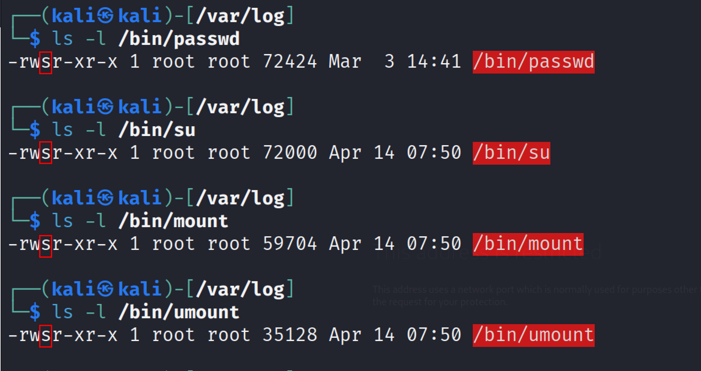
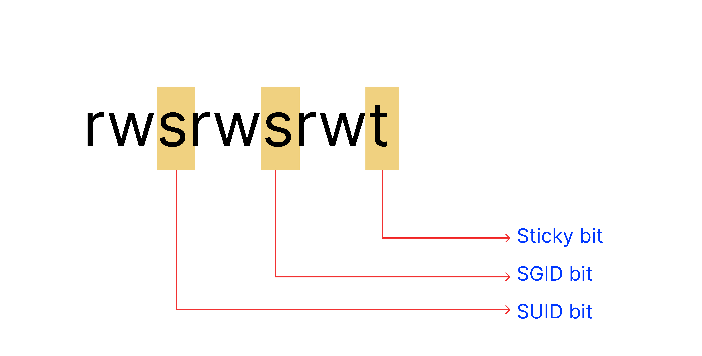
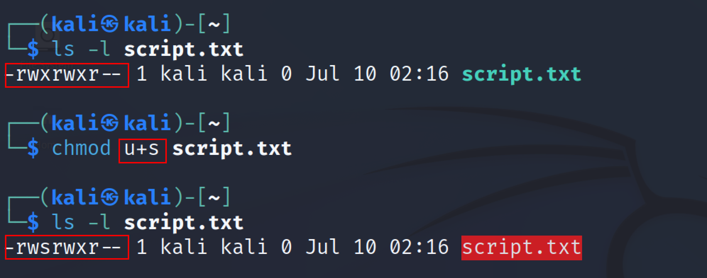
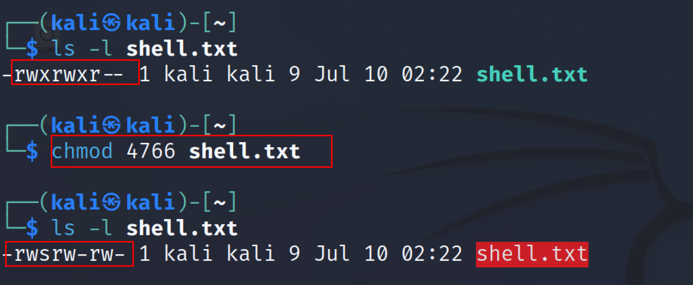
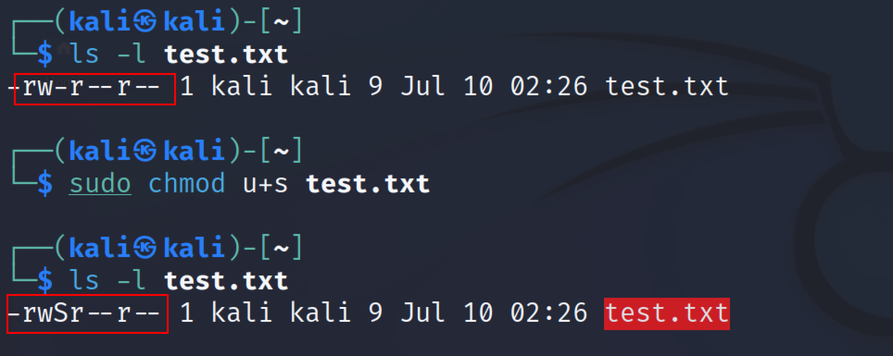
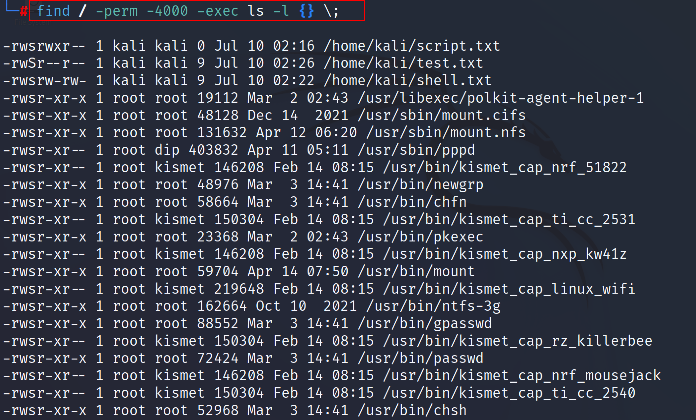
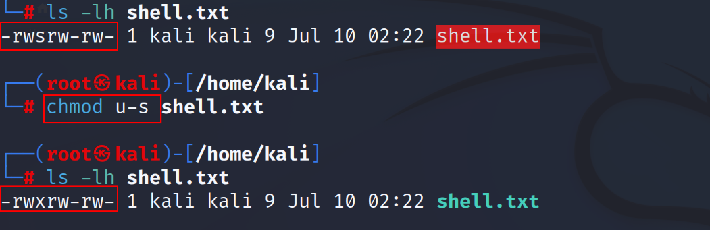

:orphan:
(introduction-to-suid)=
# Introduction to SUID
 
SUID is a special type of file permissions given to a file. It stands for set user ID. When a file has SUID permission set, the user executing the file becomes the owner of the process. This is normally used for system binaries that require elevated privileges. In this blog post, we will discuss what SUID is and how it works.

The level of access that users and system processes have to files in Linux is governed by file permissions, attributes, and ownership. This is done to make sure that only legitimate users and programs are able to access particular files and directories. 

In Linux os, everything is a file, including devices and directories which can enable or prohibit three tasks, namely `read/write/execute;` if something is not, then it must be running a process on the machine. In every Linux system, there are three types of owners ie user, group, and, other. 

A user is one who created the file and becomes the owner of the file. There can be several users in a group. A file's access permissions are the same for all users in a group. Other than the user and group, anyone who has permissions falls into the category of others.

`/etc/passwd or /etc/group` files can be used to manage users and groups. 
```
 421
-rwxrwxrwx 
-[---][---][---]  
|   |   |    |            
|   |   |    |          
|   |   |    |      
|   |   |    |
|   |   |    +----------------------------> Others Permissions
|   |   +-------------------------------> Group Permissions
|   +----------------------------------> User Permissions
+------------------------------------> File Type
```
From above, the maximum number of bits required to set permission for each user is 7, which is the result of a combination of read (4), write (2), and execute (1) operations. For example, if a file is set with `chmod 754`, then the permission will look like `rwxr-xr-r`. 

## what is SUID 

SUID is an abbreviation for "Set User ID," and it is a form of permission that can be granted to a file so that it is always executed with the permissions of the owner rather than the user executing it.

For example, the passwd requires root permissions to update user credentials and can also be used by regular users to change their credentials.



If additional bit "4" is set to the user (Owner), it becomes SUID (Set User ID), and if bit "2" is set to a group, it becomes SGID (Set Group ID), and if other users are allowed to create or delete any file within a directory, a sticky bit "1" is set to that directory.



## How to set SUID? 

The Numerical method or the symbollic method can be used to change the permission of any files. You can use the chmod command to set the SUID bit to the script/file. Chmod command stands for change mode and this command is used for changing the mode of access. Following is the syntax of the chmod command 

`chmod [option] mode file`

Use the following syntax to configure SUID to the specified file/script

`sudo chmod u+s filename` 

Here filename is the name of the script or application. And after the SUID is set anytime that file is run, it will execute with root privileges. The Following screenshot shows an example to set SUID to a file.



You can also utilise the numerical method. Simply add a fourth digit to the normal permissions. SUID is always set with the octal value 4. 



Note: In some circumstances, a capital S will appear instead of the little s shown below. The letter S indicates that the file/script does not have executable permissions.



## How to find all the files SUID enabled

To find all system files with the SUID bit enabled, use the find command.
`find / -perm -u=s -exec ls -l {} \;`
Or 
`find / -perm -4000 -exec ls -l {} \;`



To remove SUID you can use either the symbolic method or the numerical method. The following syntax can be used to remove SUID from a file. 

`chmod u-s <file_name>`
Or 
`chmod 0766 <file_name>`



## Conclusion

Using the chmod command, permissions can be set in one of two ways: both numerical and symbolic and SUID only works on files. SGID and SUID are quite similar. The script or file that has an SGID configured will run with the group owner's permission, which is the only difference. 

