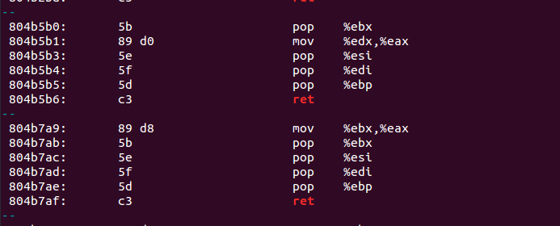

:orphan:
(linux-exploitation-advanced-exploit-protection-evasion)=

# Linux Exploitation: Advanced Exploit Protection Evasion

When countermeasures are combined and used simultaneously in a binary, the situation becomes significantly more complicated!

When only ASLR is present, it is possible to brute-force the shellcode address. When there is only NX, you can return to libc because its address is constant.

BUT...when ASLR and NX are present, brute-forcing is impossible because shellcode will not execute on the stack. Additionally, you cannot return to the system, as it will always be located at a different address. We have no chance?

There is always a way. However, it will not be simple. To defeat these combined countermeasures, we will exploit code that is:

- Already within the address space of the process
- Not randomized (remember that ASLR only randomizes certain sections, not everything).

First of all, let's go back to the NX-bypass. As we wrote earlier, by using our own custom buffer, we are able to exercise control over the data that is being pushed on the stack while it is being overflown during a stack overflow.

Therefore, in order to get around the NX protection, we can include function arguments within the buffer and then bypass the EIP to point to another function that would use those arguments. This will allow us to use the function arguments.

There are a lot of different functions that can be recycled for use in that context. They can be found in the executable file itself or in any library that the executable makes use of.

The concept is very comparable to what we accomplished with the "hidden function," in which we called a function that was already present in the program by directing the EIP to refer to it. In that case, we were able to access the previously hidden function.

The one thing that is different this time is that we have to arrange the stack in the correct order.

Because we are going to a different section of the program from the stack, we have given them the names that you see here.
You could already have seen names like **ret2libc** or **ret2system**

Before we get started, let's first define **Return Oriented Programming**.

Return-Oriented Programming is a more sophisticated ret2 attack technique. In return-oriented programming, multiple functions can be chained to form a ROP chain.

In ret2system, we invoked a system function with a specially crafted stack layout, where the return address was the address of `exit()` to allow the program to gracefully exit.

Of course, `exit()` could be replaced by another function. The only action that should be taken is to prepare the stack for the next function.

First, let's review how the _"return"_ instruction functions. When the processor encounters the `ret` instruction, program control is transferred to the address at the top of the stack.

Alternatively, `ret` can be translated to:

```nasm
mov EIP, [ESP] ; Data contained on top of the stack now becomes a new Instruction Pointer.
add esp, 4     ; Then, the top position from the stack is removed since it is no longer used.
```

The instruction `ret` can also be rendered as:

```nasm
rop eip ; such an instruction is illegal; however, this is essentially what the ret instruction does for clarity.
```

This means that the stack pointer is incremented by `4` (one position is subtracted) and the data is moved to the `EIP`.

`ret` can also make use of arguments in order to perform a _near/far return_.

For instance, `ret 4` can be rendered as:

```nasm
mov EIP, [ESP]
add esp, 4 ; those two are the standard RET implementation
```

or:

```nasm
add esp, 4 ; here is the 4 (of RET 4) - align the stack by 4 bytes

; If the condition is ret 8, the following will be added:
esp, 8
```

In ret2system, `system()` was executed, which spawned a bash shell; you could operate on the newly spawned shell until it was exited.

When exiting bash, the application returns to the return address. If the return address was that of `exit()`, that function was executed, but if it was a garbage address, the application crashed.

After completing the function, the program encountered the return instruction, which, according to the previously described behavior, moved the return address to `EIP` and caused a crash because the return address was invalid.

If the address was valid, program execution would continue at this address, executing the following instructions.

If another function existed in place of `exit()`, it could also be executed if we were able to reset the stack.

## ROP in theory

Assume you have exploited a stack overflow vulnerability to get control of the `EIP` and are carrying out a ret2system attack.

After `system ("/bin/bash")` is executed, bash leaves, and you wish to invoke `func2()` with a different parameter. How would you configure the stack?

If we attempt to run a ret2system attack with a nonexistent `func2()` as the return address, the condition of the program when `system()` is called is displayed below. Down the buffer, we place `func2()`'s argument

**EIP**:
`system()`

**Stack**:

```{code-block} nasm
:force:
func2()
*("bin/sh")
AAAA
(arg to func2)
```

When `system()` exits, the program state is similar to the
following:

**EIP**:
`func2()`

**Stack**:

```{code-block} nasm
:force:
*("/bin/sh")
AAAA
(arg to func2)
```

We want to be able to execute `func2()` with an argument `(arg to func 2)`. In this instance, `func2()` will be executed with a reference to `/bin/sh` as its argument and will return `AAAA (0x41414141)`.

This is because, in typical software, the functions or the program (depending on the calling pattern) clear up the stack following function calls.

As we are writing the code dynamically, we are responsible for this. Otherwise, the parameters of the preceding function will remain on the stack and corrupt all subsequent functions.

Our existing stack arrangement is insufficient for the desired outcome.

First, we must execute an instruction between `system(/bin/bash)` and `func2(arg to func 2)` that will decrease the stack pointer by `4` and remove the address of `/bin/bash`.

So, the stack layout should look like this for the time being:

**EIP**:

`system()`

**Stack**:

```{code-block} nasm
:force:
addr of pop x, ret
*("/bin/sh")
func2()
ret addr from func2()
(arg to func2)
```

- `pop x` will remove the no-longer-user argument `*("/bin/sh")` from the stack and store it in a register.
- `ret` will cause the no-longer-user argument `*("/bin/sh")` to be put in a register. We have no interest in the register because we do not utilize it.
- The `ret` key will advance the execution flow to the next address on the stack.

As we remove `/bin/sh`, the address of `func2()` is located at the following stack position. Thus, `/bin/sh` is relocated to a register, and the flow of execution returns to `func2()`.
Due to the return instruction, the address of `func2()` is likewise removed off the stack and stored in `EIP`.

**EIP**:

```nasm
pop x, ret
```

**Stack**:

```{code-block} nasm
:force:
*("/bin/sh")
func2()
ret addr from func2()
(arg to func 2)
```

As we reach `func2()`, it has the correct stack structure containing both the return address from `func2(`) and its argument:

**EIP**:

```{code-block} nasm
:force:
func2()
```

**Stack**:

```{code-block} nasm
:force:
ret addr from func2()
(arg to func 2)
```

To locate a `pop x, ret` type instruction, you may use `objdump` on the target binary or one of the numerous automated tools that extract useful gadgets from binaries.

Let's examine how the binaries can be examined for useful devices.

Let's disassemble the default `ping` binary or any other binary of your choosing and search for the return instructions as well as a few instructions preceding:

```bash
objdump -d /bin/ping | grep ret -B 5
```



Such chains can let us customize the stack to our specifications. In the hypothetical example, just one instruction needed to be removed from the stack, although binaries can include longer sequences.

Even when ASLR is enabled, it is possible to return to any non-random address. Thus, we will soon be able to bypass ASLR. But first, let's review further fundamentals of this procedure.

There will be portions that are identical to the preceding example, such as `pop x` commands followed by `ret`.

The sections of code that finish with a return are known as _gadgets_.

We are interested in anything that could assist us continue execution, such as ret-terminated instructions, but also:

- A sequence of commands that concludes with a far/near return, such as `ret 8`.

- An instruction sequence that terminates with a jump to a previously controlled value, such as `pop eax` and `call eax`.

Since we are attempting to defeat ASLR, we cannot employ fragments from random places.

The final question we are going to answer is what should be constructed using gadgets in order for an `EIP`-controlling crash to result in code execution.

The only limitation on what can be produced from a disassembled binary is the exploit developer's imagination. However, the exploit might employ two primary concepts:

- Attempt to execute a ROP chain resembling shellcode. Find code pieces that store specific values in the correct registers (through pop instructions, for example) and then perform a system call. This is a difficult method for exploiting a binary.

- Try to execute a function that will help us leak an
  address that can be referenced relatively. For instance, if an address is always relative to the `libc` base by the same offset at each execution, knowing this value will enable us to dynamically calculate the system address and leap to it in the ROP chain. In such a circumstance, functions such as `write()` may be useful.

Alternatively, we may trigger an arbitrary write, such as by using the `read()` function.

We do not delve into actual exploitation in this post, let's examine how we might optimize gadget scanning, as manually searching for opcodes would be incredibly time-consuming.

Web-based resources pertaining to ROP are many. Use them against a binary of your choosing to receive a list of potential ROP devices and their addresses.

It is beneficial to run all ROP-generating tools against a single binary to obtain all outputs. A single tool may discover something that another tool overlooked.

Here are some examples of tools that you might want to
use:

[https://github.com/sashs/Ropper](https://github.com/sashs/Ropper)
[https://github.com/JonathanSalwan/ROPgadget](https://github.com/JonathanSalwan/ROPgadget)

In an exploitation procedure, searching for individual ROP gadgets is a last resort.

The majority of the time, we would like to return to another function, and if necessary, we can attempt to align the stack using single gadgets.

:::{seealso}
Looking to expand your knowledge of vulnerability research and exploitation? Check out our online course, [MVRE - Certified Vulnerability Researcher and Exploitation Specialist](https://www.mosse-institute.com/certifications/mvre-vulnerability-researcher-and-exploitation-specialist.html) In this course, you'll learn about the different aspects of software exploitation and how to put them into practice.
:::
