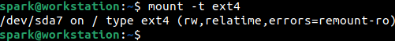
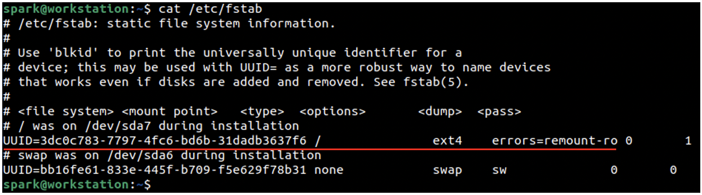
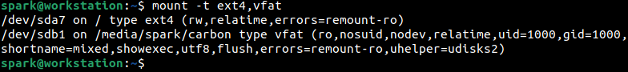
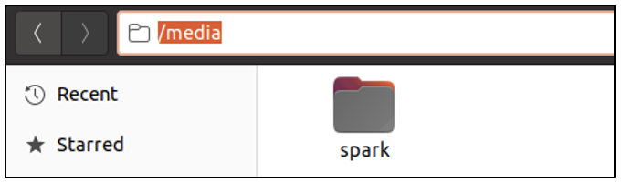
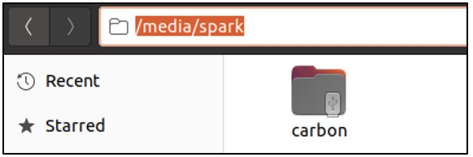
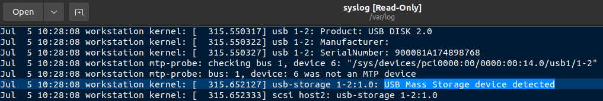
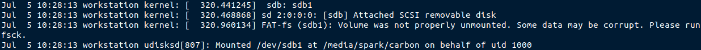
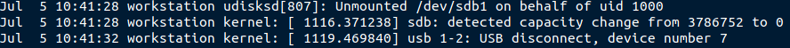
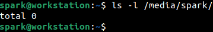
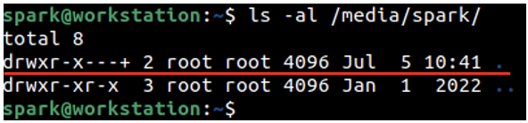

:orphan:
(linux-forensics-artifacts-generated-by-mounted-devices)=
# Linux Forensics: Artifacts Generated by Mounted Devices
 
On your Windows computer, the hard disk that contains the operating system files and user files is typically mounted at *C:*. The term *mount* refers to a storage media like hard disk, USB drive or CD-ROM; being placed in a usable state – for a user to create and modify files. When a USB drive is attached, it is typically mounted at *D:* or *E:*. Likewise, on a Linux computer, apart from the hard disk that stores system information, when external storage media are connected to the computer, they are typically mounted in the *media/* directory. In this blog post, we will discuss the forensic importance of artifacts created by mounted devices on a Linux system.

## How does storage media ‘mounting’ take place in Linux?

First, let us understand some facts surrounding ‘mount’ operation on Linux. Read *[this](a-note-on-linux-directory-structure-for-dfir)* post for a brief introduction to the Linux directory structure, to help understand the remainder of this blog post.

The hard disk that contains the system files and user files is typically formatted using the Fourth Extended File System, abbreviated as ext4. (Similar to how a hard disk on Windows is formatted using NTFS). 

Windows assigns names like *C:* to the hard disk having the operating system. Linux assigns names like *sda*. Every hard disk attached to a Linux computer has a corresponding file for it in *dev/* directory, you can expect to find a file with the name */dev/sda*. Now a hard disk may have many partitions. The partitions would be named as *sda1*, *sda2*, *sda3* and so on. If a second hard disk is attached to the same computer, it would be named as *sdb*. You will also find files for each partition within the *dev/* directory.

User *spark* is logged into the system. To get information about the hard disk currently attached to the computer, the `mount` command can be used, which also has many switches available for it. Here is one example:

`mount -t ext4`

This command prints the hard disks attached to the computer, that have been formatted as ext4. *-t* refers to the type of filesystem on the hard disk. In the following screenshot, we can see a single line of output corresponding to the single hard disk attached to *spark’s* computer. The various fields of information are as follows:

`[device-file-name] on [mountpoint] type [filesystem-type] (mount options)`

Let us dissect each field. 

- *[device-file-name]* refers to the name assigned to the hard disk by the Linux system. It is actually a file with the name *sda7* present within the *dev/* folder. This means the entire Linux operating system is present on the 7th partition on the disk *sda*.
- *[mountpoint]* refers to the location from where the hard disk is being made accessible. Here */* refers to the root directory. On Windows, the system hard disk is mounted at *C:*, on Linux, the system hard disk is mounted at root */*. Within this */* directory, you can find other directories like *bin/*, *boot/*, *etc/*, *var/*, *home/*, etc.
- *[filesystem-type]* refers to the file system with which the hard disk has been formatted. It is mostly ext4 on Linux systems, but it is possible to also find names like btrfs, xfs, zfs, etc. They are other filesystems like NTFS and ext4. If you attach a USB drive formatted as FAT, then you will find the filesystem type marked for it as vfat.
- *(mount options)* signify important information about how the mounted hard disk can be used. *rw* denotes that read and write operations can take place on this hard disk. *relatime* denotes how the access time of a file on the hard disk must be updated. Read *[this](understanding-linux-timestamps-for-dfir)* post for more information on access time in Linux. *errors* denote how the file system must be mounted in case errors have been encountered on the hard disk. Here the disk will be mounted as read-only *ro* if any errors have been found.

The hard disk that contains the operating system must be mounted every time the system is booted, it is referred to as a permanent mount point. The */etc/fstab* file also has information about permanent mount points on a Linux system. The following screenshot shows the contents of this file on *spark’s* computer. Note that the lines starting with # are comment lines – the other lines are valid. The line underlined in red is the first valid line. You can see the unique identifier of the hard disk, followed by its mount point, file system type and error-handling information. You can find another entry within this same file. It corresponds to the *swap* area, which is like the Windows page file.

Now you have an idea about how a permanent hard disk would be mounted on Linux and how you can view information about it using `mount`.

### Attaching a USB device

Let’s attach a USB device (formatted with FAT) to *spark’s* computer and observe how it gets mounted. We will use `mount` command again to print information about mounted devices formatted as ext4 and fat (represented as vfat in the command shown in the following screenshot).

The first line of output is the same as before. Note the second line of output. The USB drive is assigned the device file name */dev/sdb1*. We are accessing the first partition of disk *sdb*. It is mounted on */media/spark/carbon*. The file system type is identified correctly as vfat. You can also view many mount options. For this blog post, let’s just focus on the first mount option *ro*. It means we can only read content from this USB drive, we cannot write to it.

So the system hard disk was mounted at */*, but the USB drive is mounted at */media*. Why is it so? Removable devices like USB devices, hard disks and CD-ROMS are typically mounted within the *media/* directory on the Linux system. This directory has a subfolder for every user present on the system. Depending on the user that attached the external storage media, the disk is mounted in that user’s folder within *media/*.

Here within */media/spark* we can find a folder called *carbon*. This name *carbon* refers to the name assigned to the USB drive when it was formatted. Notice the small USB symbol in the file icon. If *spark* attaches another USB drive with the name *silver*, then it will be mounted at */media/spark/silver*.

On Windows machines, it is possible to mount file shares across the network. Similarly, on Linux systems too it is possible to mount file shares. However, file shares are typically mounted at *mnt/* folder. It is also possible for a user to temporarily mount a folder in *mnt/*

Now you have an idea about how you can find information about mounted hard disks, USB drives and file shares. 

## Forensic Artifacts generated by Mount operations

Let’s take a look at the forensic artifacts left on a Linux system by mount operations. Every time external media or file shares are attached or removed, you can find *[logs](log-sources-in-linux-systems)* regarding the operations within the */var/log/syslog* file.

From the following screenshot, you can infer that a USB device was attached to the system on 5th July at 10:28 hours. This timestamp is relevant to the time zone the device is operating in. *workstation* refers to the name of the computer. *kernel* refers to the program that has logged this message. Here the kernel has identified that a USB device had been attached to the computer.

In the following screenshot, you can see the name assigned to the hard disk: sdb. You can also see a message that the volume was not properly mounted. This could be why the USB drive was mounted as read-only. You can also find information about where the volume had been mounted, here */media/spark/carbon*.

From the following screenshot, we can see that the USB drive had been unmounted and disconnected on 5th July at 10:41 hours. 

In this way, it is possible to find information about all the devices that had been connected and disconnected from the system. Linux systems typically store logs for about 4-5 weeks within the */var/log* folder.

Once the USB drive is disconnected, within the */media/spark* folder you will not find the sub-folder *carbon/*. Once a disk has been removed, its corresponding folders will be deleted.

Now, every directory in Linux has hidden entries for itself and for its parent directory. Read *[this](dont-be-tricked-by-hidden-files-viewing-hidden-files-and-directories-in-linux)* post for more information about this.

In the following screenshot, the line underlined in red shows the information for the current directory */media/spark*. You can view the last modification time for the folder, which is 5th July 10:41 hours. This time corresponds with the time the USB drive was disconnected from the computer. 

Log entries from */var/log/syslog* and timestamp information from the */media/spark* folder help confirm that a USB device had been disconnected from the computer. If another USB device had been connected after this, then the *mtime* of */media/spark* will be updated for the same.

In this way, critical pieces of information from multiple locations on a system help corroborate an activity identified by the forensic investigator. 

If a file share had been mounted on the system, you can find information about the same within the *syslog* file. If a file share had been unmounted, the last modification timestamp of the *mnt/* folder may indicate it. Cyber adversaries may even create permanent entries within */etc/fstab* to mount malicious disks/shares. Timestamps and log entries together help to identify and corroborate artifacts generated by mount operations.

## Project Idea

Here is a project idea for you:

- Set up Ubuntu or Cent OS on a virtual machine
- Attach a USB device to the computer and disconnect it after some time
- Set up a NFS file share between two Linux virtual machines
- Can you identify relevant log entries within the */var/log* folder?
- What can you infer about the *mtime* of the contents of *media/* and *mnt/* folders?
- `mount` command when used without any switches displays a large chunk of output. It provides a lot of critical information. Research about it!

:::{seealso}
Want to learn practical Digital Forensics and Incident Response skills? Enrol in [MDFIR - Certified DFIR Specialist](https://www.mosse-institute.com/certifications/mdfir-certified-dfir-specialist.html)
:::