:orphan:
(linux-forensics-artifacts-in-a-users-home-directory)=
# Linux Forensics Artifacts in a Users home Directory
 
When you visit a person’s home, you get to know about their interests, hobbies, everyday activities, etc. Likewise, within a user’s *home/* directory on a Linux system, you can find many forensic artifacts that are indicative of that user’s recent activity on the system. In this blog post, we will explore some of the crucial artifacts within a user’s *home/* directory.

## Artifacts in a User’s *home/* Directory

When a user account is created, a *home/* directory is also created for that user. At the same time, two *[hidden directories](dont-be-tricked-by-hidden-files-viewing-hidden-files-and-directories-in-linux)* *.local/* and *.cache/* are created within *home/*. There are numerous sub-folders within these two directories. We will only explore the ones of significant forensic importance. The screenshots shown in this blog post were taken on a Linux machine running Ubuntu. User *spark* was logged on to the computer.

## 1. Recently Used Files

Within */home/[user]/.local/share* there is a file called *recently-used.xbel*, which stores information about which files were recently used on the machine. XBEL refers to XML Bookmark Exchange Language, which is a file format that stores every entry as a bookmark. The following screenshot shows the XML version information and a single bookmark entry, within the \<bookmark>
tag. It can be seen that *spark* has accessed the file *volatility-master.zip* in the */home/spark/Downloads* folder. The application that this file was used with is *Firefox*, that is underlined in red in the following screenshot. It could indicate that *spark* had downloaded this file via Firefox. You can also see the timestamps when this file was added and modified last. The timestamps are displayed relevant to the *[time zone](collecting-linux-system-information-for-dfir)
the device is operating in.

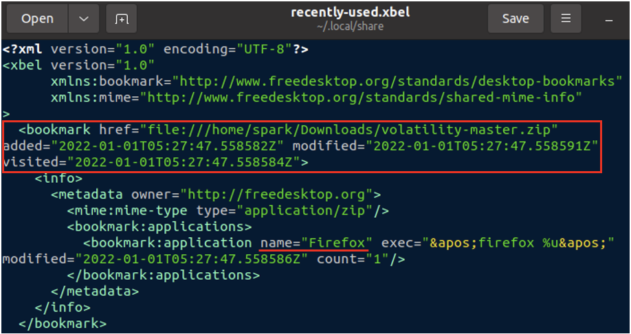

In this way, you can find numerous entries for all the files that had been recently used on a system. Once this file gets too large, it is moved to a backup file with the same name and the extension *.bak* added to it as, *recently-used.xbel.bak*, in the same location. So, *recently-used.xbel.bak* has older entries and *recently-used.xbel* has newer entries.

## 2. Deleted Files

Whenever a user deletes a file using the delete key or the ‘delete’ option in the file menu, a copy of the file is placed in the trash bin. In addition to that, information about the deletion operation is also stored within the */home/[user]/.local/share/Trash* directory, within two sub-directories *files* and *info* as shown in the following screenshot.

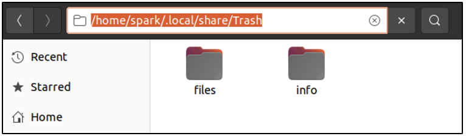

*/home/[user]/.local/share/Trash/files* has a copy of all the files and folders deleted by *spark*. From the following screenshot, we can see that *spark* had deleted a folder called *one/*.

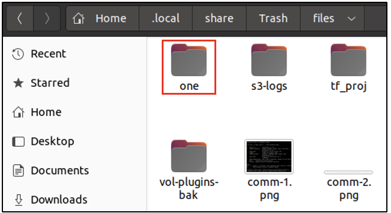

*/home/[user]/.local/share/Trash/info* has a file for every deleted file/folder with the extension *.trashinfo*. All the files with this extension are readable in a text editor. This file holds the timestamp (relevant to the timezone the device is operating in), of when a file/folder was deleted by the user. In the following screenshot, we can see a file holding information about when *spark* had deleted *one/*.

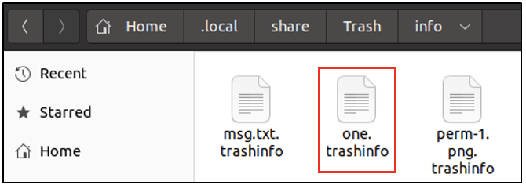

From the following screenshot, we can see the absolute path of where *one/* had previously existed on the system. It looks like *one/* was deleted on 3rd June 2022, at 11:03 hours. 

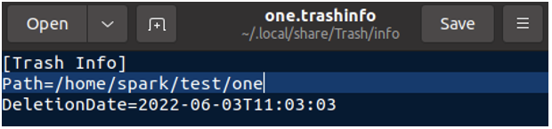

## 3. Thumbnails
Let’s say you have stored a PNG file on your Desktop. Ubuntu would display a quick preview of the file, even when you have not opened it. It is possible because of *thumbnails*. Thumbnails provide quick previews of image files, PDF files, etc. All the thumbnails specific for a user’s files are stored in a hidden directory within *home/* at */home/[user]/.cache/thumbnails*. This directory in turn has three sub-directories as shown below, where thumbnails are stored depending on its size.

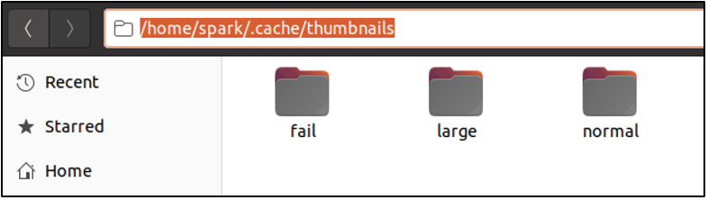

Within each folder, you will find numerous PNG files which are thumbnails for other files across the system.

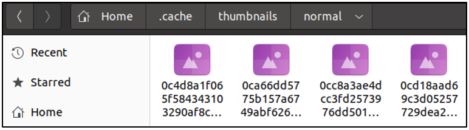

These thumbnails hold metadata about which file they store the preview for. This metadata can be read using `identify` command-line tool as shown in the following screenshot. The *-verbose* switch displays a lot of information. Snippets of the output for one thumbnail are shown in the following two screenshots.

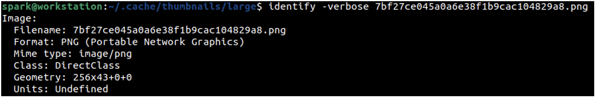

Here, we can see the timestamp of when the thumbnail was created and modified. You can also find the absolute path of the file for which this thumbnail exists. The thumbnail whose information we are viewing is for another PNG file, it appears to be a screenshot. 

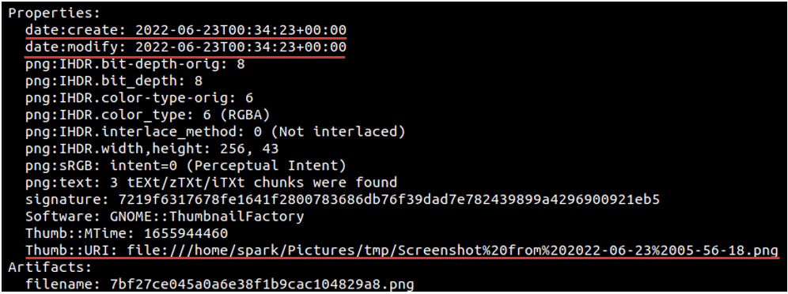

In some cases, you may find thumbnails of deleted files – of files that had previously existed on the system.

A Quick Introduction to Desktop Environments

On Linux systems, a Desktop Environment (DE) is the software bundle that makes it possible for the system to have a Graphical User Interface. A DE defines the visual appearance of your Linux system. There are various desktop environments available for use on Linux systems like GNOME, MATE, Cinnamon, Xfce, etc. On Ubuntu systems, by default GNOME desktop environment is used. To find out which DE is in use on your computer, find out the value stored in `$XDG_CURRENT_DESKTOP` *[environment variable](environment-variables-in-linux)*.

The following screenshot confirms that *spark’s* Ubuntu machine is using GNOME DE.

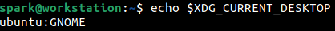

Most DE’s also store information within the *.local* and *.cache* directories, in a user’s *home/* directory, about the user’s activity.

## 4. Recently Used GUI Applications

Within */home/[user/.local/share/gnome-shell]*, there is an XML file *application_state.xml*, that has information about when GUI applications were last used. In the following screenshot, you can see that within the \<application> tag, you can find the name of the application and the time it was last seen on the GUI. The score field indicates how often an application had been used.

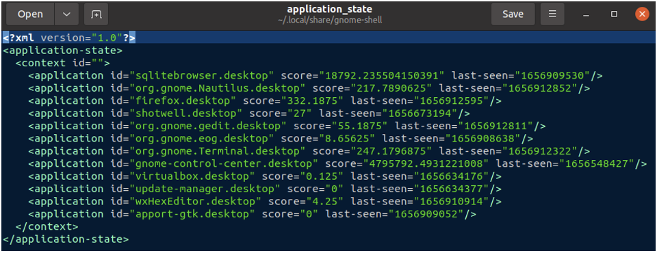

What can you infer from the screenshot shown above? Which applications were used frequently by *spark*? To find the user-friendly application names, simply Google the value in the *id* field!

## 5. Filesystem Tracker Database

Every desktop environment maintains a database *meta.db* of all the files belonging to the user. The database in present in */home/[spark]/.cache/tracker/meta.db*. It can viewed using applications like *DB Browser for SQLite*. Within this database, is a table called *nfo:FileDataObject*, which has information about the last accessed time for a file. There are many fields of information for a single row. The following two screenshots show the file name and its last accessed time in *[epoch format](timestamp-format-in-windows-linux-mac-os)*. The following screenshot shows that in row 19, there is information for a file *volatility-master.zip*.

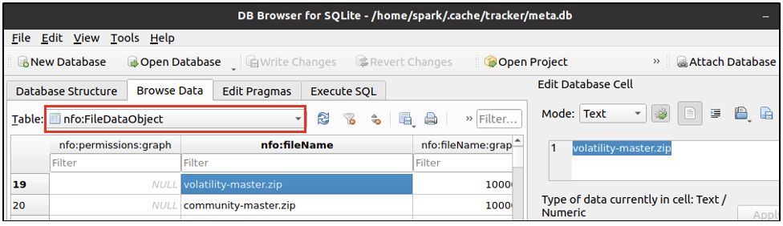

The following screenshot shows the last accessed time of the file and also the unique ID assigned to this entry - to the left of it. Here the unique ID is 100040.

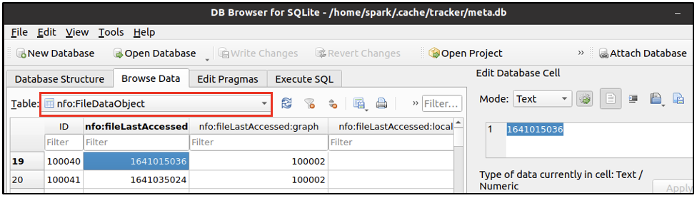

There is another table *nie:DataObject* within this database, that provides the absolute path of a file. Using the unique ID 100040, in the following screenshot, we can view the absolute path of the file *volatility-master.zip*.

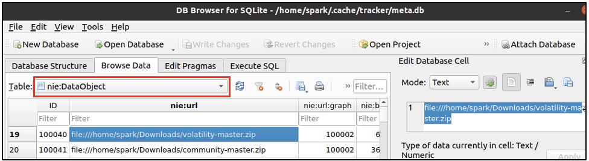

In this database, it is possible to find entries of deleted files – files that had previously existed on a system.

## Wrapping up

We have seen how crucial forensic artifacts exist within a user’s *home/* directory. It is possible to acquire information like:

- recently used files
- deleted files/folders
- thumbnails
- usage of GUI applications: frequency of use, last used timestamp
- file/folder information: absolute path, last used timestamp

## Project Idea

Here is a project idea for you:

- Set up Ubuntu on a virtual machine
- Work with the system for a while: create/edit/delete files using the default text editor *gedit*
- Within */home/[user]/.local/share/gedit* there is a file of forensic importance

What is this file's name? What information do you observe in this file?

:::{seealso}
Want to learn practical Digital Forensics and Incident Response skills? Enrol in [MDFIR - Certified DFIR Specialist](https://www.mosse-institute.com/certifications/mdfir-certified-dfir-specialist.html)
:::