:orphan:
(linux-forensics-enumerating-users-and-groups)=
# Linux Forensics Enumerating Users and Groups
 
Linux was designed to be used as multi-user operating systems. To blend in with legitimate users, attackers may also create malicious user accounts which provide backdoor access to the system, whenever the attacker wants. When a Linux computer is suspected to be involved in an incident, one of the important activities to perform is to enumerate the list of users and groups on the system. It helps to identify any user accounts that stand out as an anomaly. In this blog post, we will discuss some concepts surrounding user account enumeration on Linux systems.

## Viewing details of users on the system

Every user and group on a Linux system is assigned a user ID (UID) and group ID (GID). *[This](user-accounts-on-linux-systems)* blog post provides a brief overview about the different user account types on a Linux system.

The */etc/login.defs* file has information about the default UID and GID assigned to the various user accounts on the system.

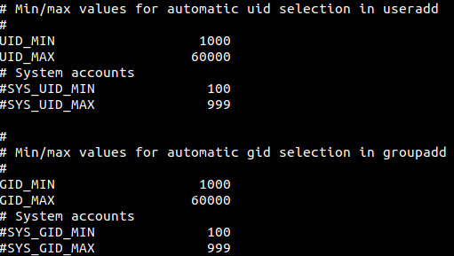

System accounts are typically assigned UIDs and GIDs from 100 to 999. User accounts are typically assigned UIDs and GIDs from 1000 to 60000. This holds unless explicitly stated when user accounts are created on a system. No two user accounts can have the same UID.

The */etc/passwd* file has details about every user account on a Linux system. The following two screenshots show snippets of output seen on user *spark’s* computer. There are multiple fields of output separated by a colon (:). The various fields are as follows: username, password (presence of *x* indicates that an encrypted password is present in */etc/shadow* file), UID, GID, comments, home directory, default shell.

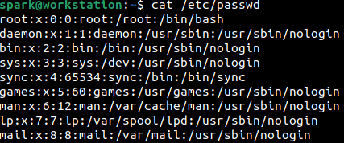

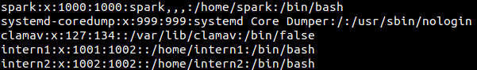

You can find entries relevant to service accounts, followed by entries relevant to regular user accounts on the system.

To view only the username and UID, then `cut` command can be used to display only fields (*-f*) 1 and 3, when the delimiter (-d) present is a colon. This can be seen in the following screenshot.

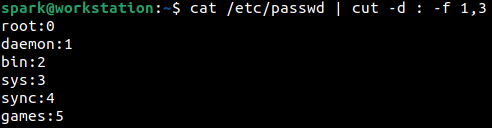

`awk` command can also be used to display only fields 1 and 3 in the output of */etc/passwd* file, as shown below.

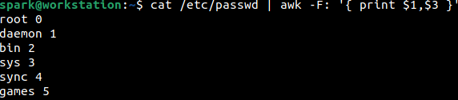

It is also possible to view information only about user accounts, i.e., accounts whose UID is greater than or equal to 1000. This can be done using `awk` command as seen in the following screenshot.

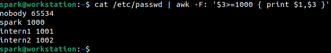

Why does an account exist for *nobody*? This account is created for use by Linux daemons to send signals to each other. This user account does not own any files and is not part of any group.

## Forensic Significance of */etc/passwd* file

Cyber adversaries may create their own user accounts on a Linux system to function as a backdoor, so that they may gain access to the system whenever they wish. Typically, system administrators will have the list of legitimate users on a system. It would be best to cross-reference that list against the contents of the */etc/passwd* file to look for outliers. Anything that stands out from the ordinary is worth looking into.

If an account is considered to be suspicious, then more information must be obtained about it. The following few commands highlight the information that can be found for a specific user account. Here, we will simply view the information for user *spark*.

## Creation time of */home* directory

The creation time of a user’s */home* directory indicates when the user account was created on the system. This information can be obtained using `stat` command. From the following screenshot, it can be seen that user *spark’s* account had been created on 1st January 2022 at 2:51 pm. 

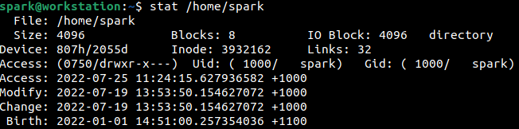

It is also possible to find *[log](log-sources-in-linux-systems)* entries indicating user account creation.

## Last password change time of a user

Using `chage` command, as shown below, it is possible to *list* the password aging information for a particular user. It is possible to identify when a user’s account password was changed last.

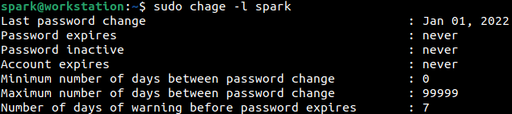

If an existing user’s account had been compromised and had the password changed recently, the output of this command may provide critical information.

## Login shell assigned to service accounts

In the output of */etc/passwd* file, you may have noticed that service accounts have shells like */usr/sbin/nologin* and */bin/false* associated with them. This is because service accounts are created typically to perform a specific task. They do not require shell login into the system.

Have an eye out for service accounts that have shells like */bin/bash* associated with them. It could indicate a compromised service account that an attacker has modified to use the shell.

## Enumerating Group Membership

You can find the list of groups on a Linux system by viewing the contents of */etc/group* file as shown below. The output has been truncated here.

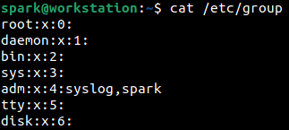

The various fields of information that you can see are group name, password, GID and group members. Look out for entries that stand out as suspicious.

To find out all the users a user is a member of, then `groups` command can be used. The following screenshot shows the list of groups that user *spark* is a part of.

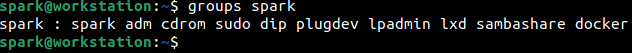

## Password information in */etc/shadow*

In the */etc/passwd* file if *x* is present in the password field; then a corresponding password value is present in the */etc/shadow* file. Notice in the following screenshots, that service accounts may have *!* or *\** in the password field. Regular user accounts will have the encrypted password starting with a *`$`* sign. There is a specific format with which the encrypted password is stored.

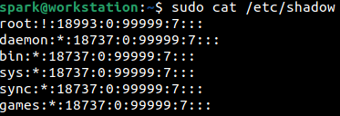

What do these mean? *!* means the account is locked and *\** means no password can be used to login to the account. This means you cannot login to service accounts using a user name and password. If a service account password field is empty or has a value starting with *`$`*, like a regular user account, it must be looked into.

## Sudoers File

The */etc/sudoers* file indicates the level of administrative privileges assigned to each user on the system. The `sudo -l` command prints the privileges assigned to the currently logged in user. Here, it appears that user *spark* has been given the privileges to run all commands with sudo privileges. 

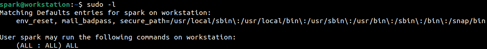

Explore the contents of the */etc/sudoers* file. Research how this file can be configured. Adversaries may utilise the capabilities defined in this file to exploit a system.