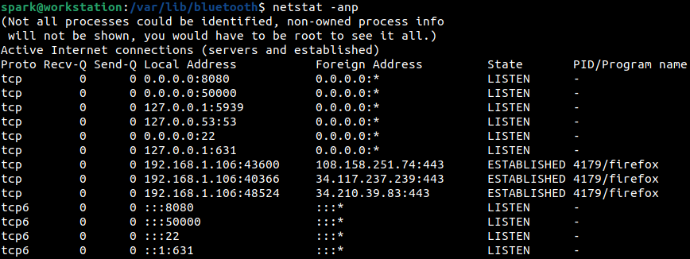

:orphan:
(linux-forensics-network-artifacts)=
# Linux Forensics Network Artifacts
 
Every Linux computer would be connected to the Internet at some point. When a Linux computer is suspected to be involved in an incident, it is critical to collect network artifacts and interpret the recent networking activity that had taken place on the system. In this blog post, we will discuss some crucial network artifacts that can be collected from a Linux system. 

## Crucial Network Artifacts

To gather network artifacts `netstat` command-line tool has been used in the following sections. If it is not installed in your system by default, you can install the package from the repository. On an Ubuntu machine, `netstat` is found within the *net-tools* package.

### Available Network Interfaces

As seen in the following screenshot, the *-i* switch displays the list of available network interfaces on the system. It provides insight into the possible ways this machine can be connected over a network. Here *enp3s0* refers to the ethernet interface, *wlp2s0* refers to the Wi-Fi interface, *lo* refers to the loopback interface, *veth80dc* refers to a virtual network interface (used by hypervisors like VMWare and VirtualBox), *docker0* refers to the virtual network interface created by the Docker installation on user *spark’s* machine. The naming convention of the interfaces can vary across Linux distributions.

*enp3s0* and *wlp2s0* are physical interfaces, while *lo*, *veth80dc* and *docker0* are virtual interfaces.

### Active Network Connections

The *-a* switch of `netstat` displays information about all the network connections associated with the system: tcp and udp. In the following screenshot, we can see information about the protocol, its state, local and foreign address where the connection is established or a service is listening. Only the first few lines of output have been shown here. Note how hostnames and protocols are specified with their names.

To view hostnames and protocols by their numerical representation, i.e. their IP address (eg, localhost is represented as 127.0.0.1) or port number, then *-n* switch can be used along with *-a*, as shown in the following screenshot.

To view the associated process name and process ID for all the listed network connections, then *-p* switch can also be passed to `netstat` as shown in the following screenshot. We can infer that a HTTPS connection has been established using Firefox. This means that the user had been using the web browser when this command was executed.

### Routing Table

To view the route table of this machine, then *-r* switch can be used with `netstat`; as shown in the following screenshot. When an incident occurs, it is helpful to study this output to infer if the adversary had set up any malicious entries.

### ARP Cache

The ARP (Address Resolution Protocol) cache can be viewed using the `arp -a` command as shown in the following screenshot. It is helpful to find IP address to MAC address resolution entries here. If ARP spoofing is suspected on a network, then investigation of the ARP cache may provide crucial information.

### DNS Resolution

The */etc/resolv.conf* file typically has information about the DNS server to use on the network.  Here *nameserver 127.0.0.53* indicates that DNS requests must be forwarded to the *systemd-resolved* service which handles name resolution requests. This file is worth investigating to see if an adversary has planted entries to point to their DNS server. You can also validate the configuration set up by the system administrator.

Before */etc/resolv.conf* was used, the */etc/hosts* file had information for DNS resolution.  It is a local table with IP address - hostname mappings. Typically, this file is checked first before DNS resolution attempts are made. It is critical to process this file for suspicious entries  made by an adversary.

### Connected Wi-Fi Networks

Within the */etc/NetworkManager/systemconnections* directory, you can find information about all the Wi-Fi networks the system has connected to in the past. For each Wi-Fi network a separate file is created, that can be read using `cat` command. Within each file, you can find information about the Wi-Fi SSID, MAC address and security information. 

### Firewall Rules and Firewall Logs

For a machine, view the existing firewall rules and the firewall configuration. The firewall configuration file may indicate if logging has been enabled for the firewall. If that’s the case, the firewall logs may present critical information about activity on the network. The firewall used varies across Linux distributions.

The TCP wrapper files */etc/hosts.allow* and */etc/hosts.deny* files also provide a layer of protection for the network. It is important to consider these files during an investigation. 

### Service-specific Logs

Most Linux systems in a production environment will be running numerous services like Apache, Nginx, SSH, FTP, etc. Look within the configuration files of these services for abnormal specifications. Assess if the services have been configured to store logs and process the logs.

### Bluetooth Artifacts

Within */var/lib/bluetooth* you can find information about devices paired via Bluetooth to a Linux machine. For every paired device, a directory for it is created within */var/lib/bluetooth* with its MAC address as the directory’s name. Creation time of a device’s directory indicates when the device was first connected to the system. Within the */var/lib/Bluetooth/cache* directory, you can find information about previously paired devices.

Now you have an idea about where you can find network related artifacts on a Linux system. Use a Linux computer or set up a Linux virtual machine. On that machine - use the internet, connect to a Wi-Fi network, connect a Bluetooth device and set up firewall rules. See how the network artifacts are generated. Linux Network Artifacts on a system are critical when investigating suspicious activity over a network.

