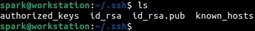
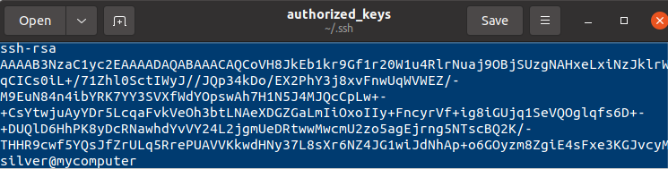
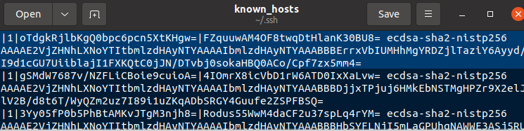
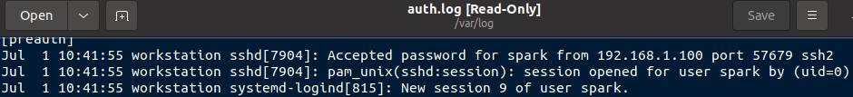

:orphan:
(linux-forensics-ssh-artifacts)=
# Linux Forensics: SSH Artifacts
 
When using Linux systems in an environment, it is highly likely that you will remotely login to a machine over SSH. Using SSH is also a common technique for cyber adversaries to gain access or pivot into machines on the network. Every interaction via SSH leaves some artifacts on a system. In this blog post, we will discuss where SSH related artifacts are present on a Linux system and how they may be useful during an investigation.

## Typical SSH Use-Case Scenario

One computer can be used as an SSH server and an SSH client. For the first case, the computer would have the SSH service running and is ready to accept incoming connections. The connection may be established either by password authentication or by exchanging keys, depending on the configuration in the server. For the second scenario, using the public key or password of the target computer, the client can connect to it. The command to connect using a public key would be:

`ssh -i [key_file] [user]@[IP]`

The client generates a public-private key pair, stores the private key and shares the public key with the server. When the client connects to a server using its public key, the server uses it to authenticate the client and allow access.

## Where can SSH artifacts be found?

On a Linux computer, SSH artifacts are typically found within a *[hidden](dont-be-tricked-by-hidden-files-viewing-hidden-files-and-directories-in-linux)* folder in the user’s *home/* directory, regardless of if the system is being used as an SSH server or SSH client. 

The following screenshot shows the SSH artifacts on *spark's* computer.

Now we will take a quick look at the artifacts and their significance in digital forensics. Currently, we are logged in as user *spark* on an Ubuntu machine.

1. **/home/[user]/.ssh/authorized_keys**

This file exists as a result of a computer operating as an SSH server. It contains the list of entries having SSH related information of computers that can connect to it. An entry is added to this file when a client shares its public key with the server. A single entry is of the following format:

`[key type] [base-64 encoded public key] [comment]`

The following screenshot shows a snippet of one entry. An RSA key is used here. The comment section by default contains the name of the user and the hostname of the machine where the key was created. Here the key was generated for user *silver* on the device *mycomputer* on the network. 

How did user *silver’s* key end up on *spark’s* computer? *silver* has generated an SSH key pair for communication with *spark’s* computer and shared the public key, which is stored within the *authorized_keys* file. 

Cyber adversary’s can store their own public key in this file, providing a backdoor for them to login to the system. The value in the comment field can give clues about the computer that has generated this key. However, it is also possible for adversaries to change the value in the comment field using a text editor.

2. **/home/[user]/.ssh/id_<>**

It was mentioned that a computer can also act as the SSH client to connect to other systems. The public-private key pair used to connect to other systems can also be found in this hidden folder. 

A public key generated typically has the name *id_\<algo>.pub*. The corresponding private key has the name *id_\<algo>*. Here *\<algo>* refers to the algorithm used to generate the SSH key pair. 

If a forensic investigator finds a suspicious public key in the *authorized_keys* file, that value can be matched with the value stored in *id_\<algo>.pub* across other machines on the network. You can find out which client has exchanged the public key with the server.

3. **/home/[user]/.ssh/known_hosts**

Whenever you attempt to login to a computer via SSH, key exchange happens with the provided public key. Then a user can login to the machine.

The *known_hosts* file contains the list of machines to which this computer has established an SSH session with, by exchanging keys. It does not imply that a user has logged into the machine. It only implies a successful key exchange. *[Logs](log-sources-in-linux-systems)* within the */var/log/auth.log* file on the server can confirm if the client had connected to it.

The following screenshot shows the public keys of hosts *spark* has connected to via SSH.

4. **/home/[user]/.ssh/config**

This file is used by the SSH client machine. It defines custom parameters of an SSH host to connect to. It defines information like the hostname, port number and public key file.

5. **/var/log/auth.log**

Within this log file, you can find entries about key exchange and SSH login attempts. The following screenshot shows a successful login to this computer via SSH from IP 192.168.1.100.

On a client machine, you can also find evidence of SSH connections in *[shell history](shell-history-in-linux)*.

## Wrapping up

To investigate suspicious SSH activity on a Linux system, 

**1. On the SSH server**

- Look within the */home/[user]/.ssh/authorized_keys* file
- Look within */var/log/auth.log* for evidence of SSH key exchange and login attempts

**2. On the SSH client**

- Look within the */home/[user]/.ssh/known_hosts* file to find the list of computers the client has exchanged public keys with
- Look within */home/[user]/.ssh/config* for any specific SSH server configuration to connect to
- Look within */home/[user]/.ssh/id<>* for public-private key pairs
- Look within */var/log/auth.log* for evidence of SSH key exchange and login attempts
- Look within the shell history for evidence of SSH activity

## Project Idea

Here is a project idea for you:

- Set up an SSH server on a virtual machine 
- Set up a public-private key pair for key based authentication
- Attempt to SSH into it from another virtual machine
- View the logs generated on both machines
- On the server, are you able to view the log signifying key exchange between the server and client?

:::{seealso}
Want to learn practical Digital Forensics and Incident Response skills? Enrol in [MDFIR - Certified DFIR Specialist](https://www.mosse-institute.com/certifications/mdfir-certified-dfir-specialist.html)
:::