:orphan:
(linux-systemd-journal-in-digital-forensics)=
# Linux Systemd Journal in Digital Forensics
 
Yes, ‘systemd’ – you read that right. It’s not a typo. On most modern Linux distributions, systemd is the software suite that is responsible for bringing up critical system processes and system services. It plays a major role in booting up the operating system. One of the components of systemd is a journal that logs information about a lot of activity on the system. In this blog post, we will discuss some facts about the Linux systemd journal and how it plays an important role in Digital Forensics.

## Getting to know the Systemd Journal

Most Linux distributions utilize systemd. To confirm this fact, type the command `ps –no-headers -o comm 1` in the terminal. Interpreting the options used by this command is left as an exercise for the reader. If the output displayed is ‘systemd’, as shown in the following screenshot, then you can be sure that the machine you are working on, is using systemd.

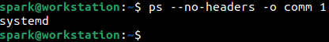

The journal is one component of systemd, that runs as a service on a Linux machine. The service is responsible for collecting and storing information about system services, kernel activity and user activity in the form of log messages. The configuration file for the systemd journal exists at `/etc/systemd/journald.conf` or within `/etc/systemd/journald.conf.d/*.conf`. It is typically configured to start logging data since device boot. 

As shown below, `last reboot` command can be used to confirm recent boot times into the system. The entries are displayed starting with the most recent entries. It appears that the system had last been booted at 10:07 hours on 20th July.

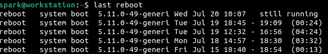

Let us check the status of the systemd journal service using the command `systemctl status systemd-journald`. This command requires root permissions to run, hence ‘sudo’ is used. It appears that the service has been activity since 10:07 hours on 20th July, which aligns with system boot time. 

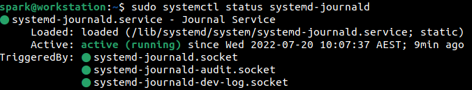

This means that the systemd journal service has been active on user *spark’s* computer since the system had been booted.

Every Linux machine is assigned a unique machine ID. That value can be found within the `/etc/machine-id` file.

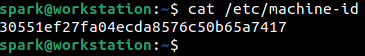

The systemd journal can be configured to store persistent logs or volatile logs. The value of `Storage=` parameter in the configuration file `/etc/systemd/journald.conf` indicates if the logs must be persistent or volatile. 

In the case of persistent logs, you can find them in the `/var/log/journal` folder. In the case of volatile logs, which disappear when a system is rebooted, you can find the logs at `/run/log/journal`. On user *spark’s* computer, the logs were configured to be persistent and could be found within the */var/log/journal* folder. At this location, there is a folder whose name is the unique machine id assigned to the system, as shown in the following screenshot. Within this folder the various log files, with the extension *.journal* can be found.

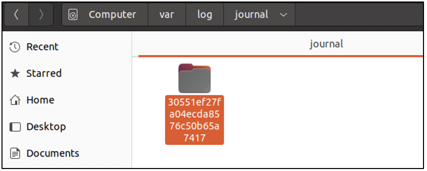

It is a good idea to acquire the logs and store them in another location for processing. On user *spark’s* computer the existing systemd journal logs were acquired and stored at */home/spark/Documents/journal*. Let us view the contents of this folder in the terminal. The following three screenshots show snippets of the output of `ls` command. Here’s what one can notice:

- There is one *system.journal* file
- There are other files whose names appear to be *system@[random characters].journal*
- There is one *user-1000.journal* file
- There are other files whose names appear to be *user-1000@[random characters].journal*
- There is also one file with the name *user-1001@[random characters].journal*

System logs and user-specific logs are stored in separate files. Let’s consider system logs. Logs will first be written into the *system.journal* file. Once this file reaches a specific size, that file is *rotated* - this means the existing contents of *system.journal* will be written into a file whose name appears to be *system@[random characters].journal* and the *system.journal* will be cleared to make way for new entries.

Next, let’s consider user logs. Logs files exist for every user on the system, the names of the log files have the numerical user id in them. So, *user-1000.journal* is for one user, *user-1001.journal* is for another user, and so on. Here too, the log files undergo rotation once they reach a specific size. You can find the corresponding username for a numerical user id, by looking at the contents of `/etc/passwd` file. On this computer, numerical user id 1000 corresponds to user *spark*.

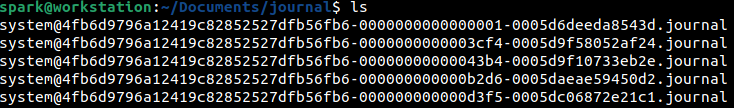

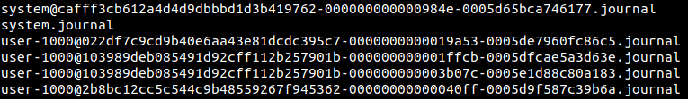

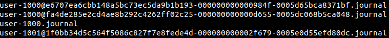

Consider the file name *system@4fb6d9796a12419c82852527dfb56fb6-0000000000000001-0005d6deeda8543d.journal*. Let’s break down what the sequence of random characters mean:

- *4fb6d979…..*: a sequence ID
- *0000000…..001*: the first sequence number in the log file
- *0005d6deeda8543d *: hexadecimal representation of the timestamp of the 1st log entry in this file

Let’s convert the hexadecimal timestamp to decimal, as shown in the following screenshot.

This value is presented in Linux epoch time format. You can read more about it *[here](timestamp-format-in-windows-linux-mac-os)*. The last six digits are stripped away and the value is fed into an epoch time converter as shown below.

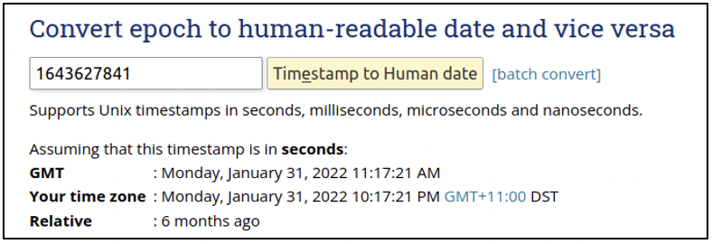

We can see the human-readable timestamp in GMT and AEST (the timezone *spark’s* computer is operating in). This means in the file *system@4fb6d9796a12419c82852527dfb56fb6-0000000000000001-0005d6deeda8543d.journal*, the first log entry has been made on 31st January 2022, 10:17 PM AEST. 

Depending on the usage of a computer, you can find journal files that date back weeks or even months.

## Performing Forensics on the Systemd Journal

The acquired logs with the *.journal* extension are all in binary format. They cannot be read with the `cat` command or in a text editor. There is a Linux command line tool called `journalctl` that can be used to process the contents of each *.journal* file.

Let us look at some interesting logs from *system.journal*. We can look at the contents of a journal file using the syntax:

`journalctl --file [.journal file name]`

The following screenshot shows that in the *system.journal* file we have entries from 19th July 2022 12:33 AEST to 19th July 2022 18:52 AEST. The oldest entries are displayed first.

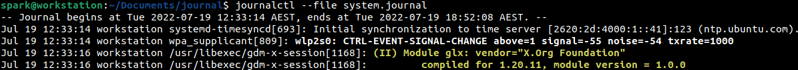

To view the newest entries first, the *--reverse* option can be issued to the `journalctl` command.

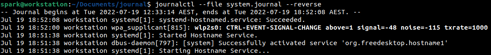

To view only the metadata of this journal file, but not the entries, the *--header* switch can be issued as shown in the following screenshot. You can view the Machine ID value, which corresponds to the value stored in the `/etc/machine-id` file.

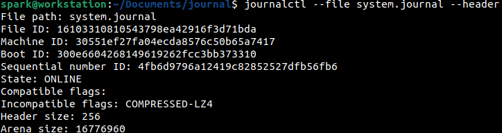

The second half of this output has the timestamps of the first log entry (head timestamp) and the last log entry (tail timestamp). The *Entry objects* field indicates the number of logs stored in this file, which is 5696 in this case.

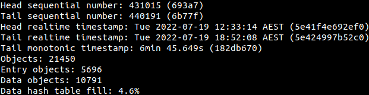

To help view and process the logs better, `journalctl` also provides capabilities to export the logs in either *json* format or *export* output formats. The contents of *system.journal* have been exported to *json* using, the following command. Now how the *-o* option has been used.

`journalctl --file system.journal -o json > system-journal.json`

The contents of the JSON file can be viewed in a text editor or processed using scripting languages.

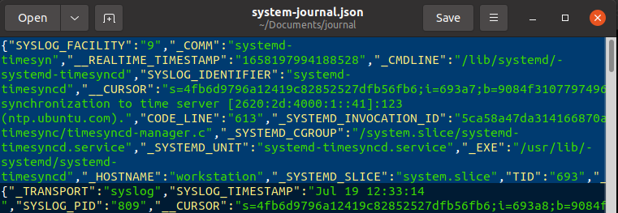

Now let us take a look at a couple of entries from the *system.journal* file. On the command line, we can use `grep` command to search for specific logs. In the following screenshot, we can see that the logs having the keyword *usb* were filtered out. 

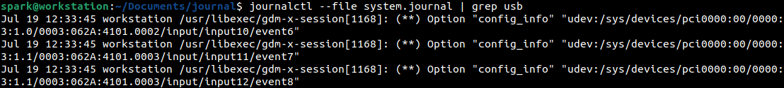

There were many entries and the truncated output can be seen here. From the following screenshot, we can infer that a USB device was attached to the computer on 19th July, at 12:56 hours.

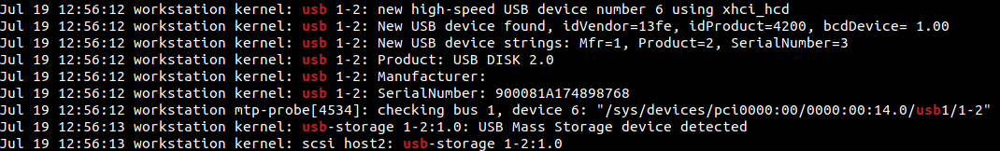

Next, a search was performed for entries containing the keyword ‘NetworkManager’ in it.

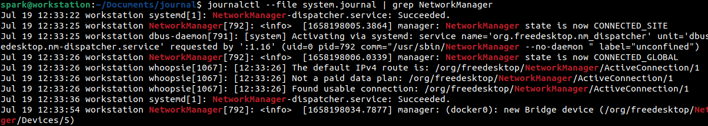

From the following screenshot, it can be inferred that the machine had loaded the configuration of a Wi-Fi network ‘X’, it had previously connected to. Note the *ssid* value.

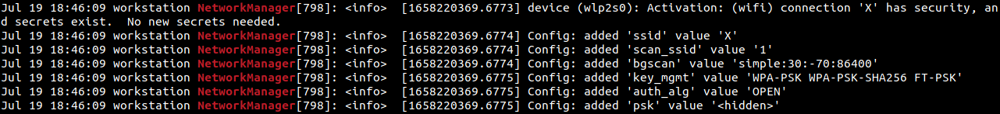

Soon after, there was another entry that the machine had connected to the Wi-Fi network ‘X’ successfully.

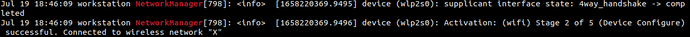

From the *system.journal* file we were able to infer that a USB device was connected to the computer and that the computer had connected to a Wi-Fi network. It is also possible to gather information about the activity of various system services like SSH, FTP; system powerup/powerdown events etc.

Next, let us look at a couple of log entries from user *spark’s* most recent journal, which is *user-1000.journal*.

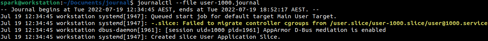

A search was performed for the *gnome-shell* keyword, to identify when the terminal has been used. From the following screenshot, it can be inferred that *spark* has started the GNOME shell on 19th July, at 12:35 hours.

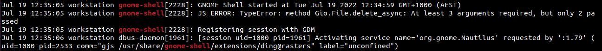

Then the log entries containing the keyword *sudo* were filtered out, to identify if any commands had been typed with root user permissions. From the following screenshot, it can be inferred that *spark* had typed the command */usr/bin/mkdir /mnt/part1* on 19th July, at 12:43 hours. Following this, few more log entries indicating commands typed with root user permissions were found.

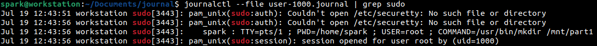

From a user’s logs, it is also possible to find information about any SSH connections established, applications that were used (web browsers, mail clients, text editors), etc.

## Wrapping up

In this blog post, we discussed about:
- Linux systemd journal
- Where systemd journal logs exist
- Filenames of systemd journal logs
- Processing the contents of a systemd journal log

It is also possible to configure the systemd journal to store logs in a remote location, which can then be fed into log ingesting tools.

## Project Idea

Here is a project idea for you:

- Set up Linux on a computer or use a virtual machine
- Identify if the machine uses systemd
- Perform some regular tasks on the system like using the terminal, browser, text editor, etc
- Acquire the journal logs relevant to the system and the user whose account you just used
- Process the log files using `journalctl` command
- Are you able to identify log entries corresponding to the activity you just performed on the computer?

The systemd journal provides great insight into all activity that had taken place on a system. The `journalctl` command also has options to ensure that a journal file has its integrity maintained and is not tampered with in any way. Try it out!

