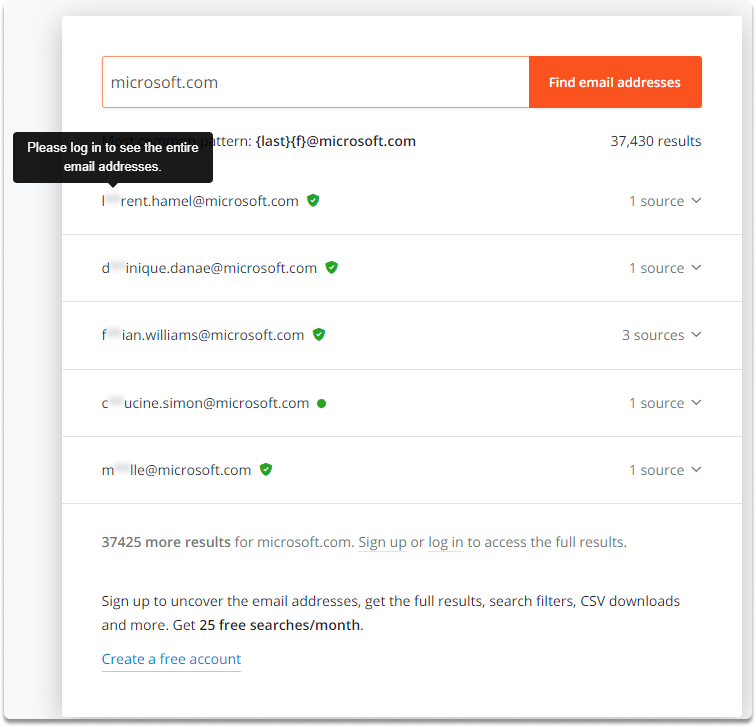
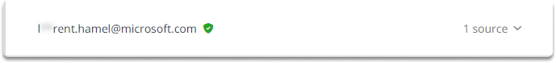
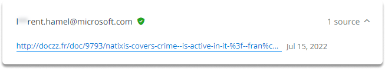
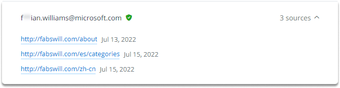

:orphan:
(make-email-address-enumeration-easier-with-hunter)=

# Make Email Address Enumeration Easier with Hunter

During your OSINT research, you'll frequently need to locate the email addresses of your subject. You‘ll also need to identify a company's email address syntax. How does the company formats the email addresses of its employees? In this blog post, we are going to perform a basic email OSINT with hunter to address these questions.

## Introduction

As we have discussed in our previous blog, there are many tools we can utilize for email research purposes. Hunter assists us in the enumeration of the company or individual email addresses, and syntax behind any domain.

Currently, there are already more than 100 million e-mails indexed on Hunter. You may obtain the principal email address syntax of your target company along with the most frequently used email address syntaxes. Let’s take a look at its performance of Hunter.

## Hands-on with Hunter

Let’s think about a scenario in which we are looking for an individual named Helmet Jonas and he works for Microsoft. Let’s start with searching the `microsoft.com` domain name and see what we get.

All you need to do is to type your POI on the search bar.

**Results**

When we search for the Microsoft.com domain name, we get 37.466 results in hunter. Let’s click on the email results.

Hunter blurs the initial portion of the email and simply asks you to create an account or log in to see the whole portion. Let’s have a look at the sources.

**Sources**

When you click on the first row’s source hunter tells us where it found the email.

Let’s take a look at the third row. Hunter lists three sources where they found the email.

It also asks us to sign up or log in to see the rest.

**Identifying the email syntax**

At the start of this blog, we pointed out the importance of the email pattern. Hunter shows us the email pattern above the first row of the email source result page.

We had 37.466 results at the beginning and now we have 37,430 email addresses matching the following pattern: `{last}{f}@microsoft.com`.

Remember that we are looking for Helmet Jonas. Since Hunter identifies the email pattern let’s look at the syntax closely:

- the last name: {last}
- the first name: {f}
- followed by @microsoft.com

This brings us to the following email address: jonas.helmet@microsoft.com.

## Final Words

After a successful sign up you can also view the titles of the email addresses, of various departments, such as human resources, executives, management, and marketing.

In this blog post, we explored how we can find out the email addresses behind a domain name. Successful identification of the syntax of the company's email addresses can give you a pivot point. You may then use some websites like LinkedIn to gather more names and then put together all your findings.

> **Want to learn practical Open-Source Intelligence skills? Enrol in MCSI’s [MOIS - Certified OSINT Expert Program](https://www.mosse-institute.com/certifications/mois-certified-osint-expert.html)**
