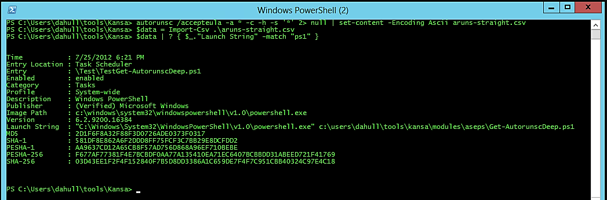

:orphan:
(make-your-incident-response-and-threat-hunting-easier-with-powershell-hunting-tools)=
# Make Your Incident Response and Threat Hunting Easier With Powershell Hunting Tools
 
**Kansa** is a framework for incident response using PowerShell. This framework can be used within an enterprise to collect data for incident response, breach hunts, and environment baseline creation. In this post, we'll examine some PowerShell-based tools designed to collect and scan large amounts of data for incident response and threat hunting.   

To begin, [Here's](https://github.com/davehull/Kansa) where you can download Kansa from GitHub.    

Kansa's primary function is to collect data from numerous hosts.   

It takes advantage of Windows Remote Management and PowerShell's ability to run tasks in parallel on multiple machines.     

Kansa was built with modularity in mind. A core script, collector modules, and analysis scripts are included. These analysis scripts can analyze the frequency of particular fields in a given data set.     

To enable these features, Kansa requires *LogParser*, a tool we've already discussed in the context of locating web shells.      

Here is a snapshot of Kansa extracting autoruns and filtering out those containing `ps1`:     

   

It is recommended that you download Kansa and familiarize yourself with this tool.    

If you are not using PS version 3 or a later version, you can use the Streams utility provided by Sysinternals to get rid of the alternative data streams that Powershell use to detect whether or not files were obtained via the internet.

After you have eliminated the ADSs, you will not have any difficulties while attempting to run the scripts:

```powershell
c:\ streams -sd <Kansa directory>
```

Open an elevated Powershell Prompt and run:   

```powershell
.\kansa.ps1 -Target $env:COMPUTERNAME -ModulePath .\Modules -Verbose    
```

In Kansa's lingo, hosts are referred to as targets. The Modules directory contains all of the collector scripts that will be invoked on hosts by the main script, which is named `Kansa.ps1`.    

The other files in the listing include obviously licenses, a description of what Kansa is, and a ToDo list; however, the majority of items are monitored via problems on GitHub.    

Kansa is distributed with the Apache Version 2.0 license, which covers the vast majority of the code that makes up the system.      

There is a very little amount of code that is protected by the Microsoft Limited Public License.   
If you have any questions or problems, please refer to the individual license files.      

As the situation warrants, we are going to investigate the Modules directory, investigate the collectors, and talk about various aspects of the `Kansa.ps1` file.    

The following elements can be seen in the listing for the `Modules` folder in the directory:   

```bash
ASEP

bin

Config

Disk

Log

Net

Process

default-template.ps1

Modules.conf
```

A configuration file known as `Modules.conf` determines which modules will be invoked by `Kansa.ps1` and the order in which they will be invoked.      

Why is it important to get the sequence right?

Incident responders who are collecting data from running systems want to collect the data in the "order of volatility," which means starting with the data that is the most volatile, such as the contents of memory, network connections, and running processes, and then moving on to items that are less dynamic, such as files on disk. This is because the actions of the investigator will affect the contents of RAM, and possibly network connections and running processes as well.

In the `Modules.conf` file, each line only contains one module.       
When a line is commented out, it stops that module from being executed.     


Let's go back to the directories that may be located in the `Modules` folder that begin with `ASEP`.         

In the event that you are unfamiliar with the term "ASEP," it is an acronym that stands for "Auto-Start Extension Point."        

These are areas within Windows that can be used to configure code to run either at the start of the system or in reaction to some event that has occurred within Windows.       

As a result, attackers frequently use these sites as a means of maintaining persistence in settings that use Windows.      

The following can be seen in the listing of the directory for the ASEP folder:   

```powershell
Get-Autorunsc.ps1

Get-PSProfiles.ps1

Get-SvcAll.ps1

Get-SvcFail.ps1

Get-SvcTrigs.ps1

Get-WMIEvtConsumer.ps1

Get-WMIEvtFilter.ps1

Get-WMIFltConBind.ps1
```

Each of these scripts is a collector, and `Kansa.ps1` may run one or more of them on targets depending on the `Modules.conf` file or if the `-ModulePath` parameter is used to specify the path of the module.      

I won't go into detail on all of the collector scripts because there are over 40 of them, but I will address some of them.    

The first script, `Get-Autorunsc.ps1`, has a dependency on Sysinternals' `Autorunsc.exe`, which is a fantastic utility for gathering data from a wide variety of well-known ASEP locations. This data can include the path to the executable or script, command line arguments, and cryptographic hashes such as `MD5`.    

Kansa is not restricted to the built-in commands of Windows or the cmdlets provided by PowerShell.     

If you want to collect data utilizing some third-party binary, all you have to do is copy that binary into the. Modulesbin_ directory and include a special comment on the second line of your collector module script. This comment tells Kansa to copy the given binary to your targets before running that collector. If you want to collect data utilizing some other binary, simply copy that binary into the. Modulesbin_ directory.     

This unique comment, which I will describe to as a directive, should be placed in the `Get-Autorunsc.ps1` file as follows:     

```powershell
BINDEP .\Modules\bin\Autorunsc.exe
```

The term "binary dependence" is abbreviated as `BINDEP` for convenience.   
If this directive is present, and `Kansa.ps1` is executed with the `-Pushbin` parameter, the script will understand that it has to copy `.\Modules\bin\Autorunsc.exe` to its targets and perform the necessary action accordingly.
It is possible that subsequent runs of Kansa will no longer need the `-Pushbin` parameter because these binaries are not often destroyed once they have been copied to remote computers; however, this behavior is module dependent.     

`Get-PSProfiles.ps1` - is responsible for retrieving copies of PowerShell profiles from both the predefined locations on the system and from the accounts of individual users.    

Attackers have inserted malicious code into these user profiles so that it will run whenever a user opens a PowerShell prompt. This allows the attackers to remain persistent in the system.     

At the moment, Autoruns does not actively collect any information concerning this ASEP.

`Get-SvcAll.ps1` - is a program that gathers data about all of the services that are running on targets.


The `Get-SvcFail.ps1` - script is responsible for gathering information regarding service recovery alternatives.  
The vast majority of services are set up to simply restart themselves as a form of disaster recovery; nevertheless, one of the possible recovery alternatives is to execute arbitrary code.    
At the moment, Autoruns does not actively gather data pertaining to this ASEP.     

`Get-SvcTrigs.ps1` - is responsible for gathering data regarding service triggers. No longer are Windows services restricted to only beginning automatically at system startup or manually by the user.      
They are also able to start and stop running based on the presence of Bluetooth or USB mass storage devices, or even in reaction to random events generated by Windows.
At the moment, Autoruns does not actively collect any information concerning this ASEP.     

`Get-WMIEvtConsumer.ps1` is responsible for collecting information regarding WMI Event Consumers. This information, when paired with WMI Event Filters and WMI Filter-to-Event Consumer Bindings, can be used to execute arbitrary code in response to Windows events.
Autoruns did not gather information on this ASEP until very recently, and even today it does not collect information about the Event Filter, which is what activates the Event Consumer. Malware developers have been utilizing WMI Event Consumers as a persistence mechanism for some time. 

**PSHunt** is a PowerShell Threat Hunting Module that was designed to scan remote endpoints for indicators of compromise, or survey them for more comprehensive information related to the state of those systems (active processes, autostarts, configurations, and/or logs). PSHunt can also be used to search for indicators of compromise on local endpoints.     

PSHunt is composed of a number of modules, functions, and folders, each of which performs a certain task.

The following is a list of PSHunt's modules:    

- Scanners
- Utilities
- Survey
- Analysis
- Discovery

You can download PSHunt from GitHub [here](https://github.com/Infocyte/PSHunt).     

**NOAH** is an agentless open source Incident Response system based on PowerShell named "No Agent Hunting" (NOAH) that helps security investigation responders collect a massive number of essential artifacts without deploying agents on the endpoints, hence saving valuable time. 

At Black Hat USA 2017 a presentation entitled "NOAH: UNCOVER THE EVIL WITHIN!
RESPOND IMMEDIATELY BY IMMEDIATELY COLLECTING ALL THE ARTIFACTS".
Here you can obtain the software from [GitHub](https://github.com/giMini/NOAH)   

## Conclusion   

As a corporate threat hunter, you should familiarize yourself with some, if not all, of these technologies.    

You want to hunt efficiently at scale, and PowerShell is an excellent hunting tool.     

## References

[Kansa](https://github.com/davehull/Kansa)      
[PSHunt](https://github.com/Infocyte/PSHunt)      
[NOAH](https://github.com/giMini/NOAH)    
[NOAH: BlackHat USA 2017](https://www.blackhat.com/us-17/arsenal/schedule/#noah-uncover-the-evil-within-respond-immediately-by-collecting-all-the-artifacts-agentlessly-7965)     

> **Want to learn practical Threat Hunting tactics and strategies? Enrol in [MTH - Certified Threat Hunter Certification](https://www.mosse-institute.com/certifications/mth-certified-threat-hunter.html)**